# 1 选择器

CSS(3)中提供的选择器手册（w3school）：http://www.w3school.com.cn/cssref/css_selectors.asp

## 1.1 基本选择器

| 选择器     | 例子                                                         |
| ---------- | ------------------------------------------------------------ |
| 类选择器   | .class                                                       |
| 标签选择器 | element                                                      |
| id选择器   | #id                                                          |
| 后代选择器 | element_1 element_2：选择 element_1 内部的全部 element_2 元素 |
| 子代选择器 | element_1>element_2：选择以 element_1 为父元素的全部 element_2 元素 |
| 群组选择器 | element_1,element_2：选择 element_1 和 element_2 ……          |
| 相邻选择器 | element_1+element_2：选择与 element_1 相邻的，并且元素类型为 element_2 的元素，相邻和E类型，两个条件都要满足，缺一不可 |
| 兄弟选择器 | element_1~element_2：选择element_1的兄弟元素，且元素类型为 element_2 |


## 1.2 属性选择器

| 例子        | 说明                                                         |
| ----------- | ------------------------------------------------------------ |
| [attr]      | 选择存在attr属性的元素，如果想要限制元素类型，则可以写成 E[attr]，下同 |
| [attr=val]  | 选择属性值完全等于val的元素，引号可加可不加                  |
| [attr*=val] | 选择属性值里包含val字符的元素                                |
| [attr^=val] | 选择属性值里以val字符开头的元素                              |
| [attr$=val] | 选择属性值里以val字符结尾的元素                              |


## 1.3 伪类选择器

### 1.3.1 超链接伪类选择器

| 例子      | 说明                      |
| --------- | ------------------------- |
| a:link    | 定义a元素未访问时的样式   |
| a:visited | 定义a元素访问后的样式     |
| a:hover   | 定义鼠标经过a元素时的样式 |
| a:active  | 定义鼠标点击激活时的样式  |

注意：

1. 在定义这四个伪类的时候，要按照 link、visited、hover、active 的顺序进行，即“爱恨原则”——“LoVe HAte”。
2. hover 伪类并不限用于 a 元素，它可以定义任何一个元素在鼠标经过时的样式。


### 1.3.2 相对于父元素的结构伪类

| 例子                | 说明                                                         |
| ------------------- | ------------------------------------------------------------ |
| E:first-child       | 查找E这个元素的父元素的第一个子元素E，如果第一个子元素不是E类型，则查找无效 |
| E:last-child        | 查找E这个元素的父元素的最后一个子元素E，如果最后一个子元素不是E类型，则查找无效 |
| E:nth-child(n)      | 查找E这个元素的父元素的第n个子元素E（注意索引是从1开始的，第一个的索引就是1，不要下意识以为第一个的索引是0），如果第n个子元素不是E类型，则查找无效；n也可以是关键字或表达式，见下 |
| E:nth-last-child(n) | 同E:nth-child(n) 相似，只是倒着计算                          |
| E:nth-child(even)   | 此处n就是取关键字even，表示偶数项的元素                      |
| E:nth-child(odd)    | 此处n就是取关键字odd，表示奇数项的元素                       |
| E:empty             | 选中没有任何子节点的E元素，注意，空格也算子元素              |
| E:target            | 结合锚点进行使用，处于当前锚点的元素会被选中                 |


上面的选择器我们可以发现到一个很大的缺点，就是在查找的过程中并没有将元素类型限制成我们想要查找的E类型。因此，一旦查找到的元素不是E类型的元素，则查找无效，这在变化多端的动态数据中是极其容易出现的。因此，CSS3又提供了更为实用的选择器：

| 例子             | 说明                                                         |
| ---------------- | ------------------------------------------------------------ |
| E:first-of-type  | 查找E元素的父元素的第一个E类型的元素，查找的时候只会查找满足E类型的元素，过滤掉其它类型的元素 |
| E:last-of-type   | 查找E元素的父元素的最后一个E类型的元素，查找的时候只会查找满足E类型的元素，过滤掉其它类型的元素 |
| E:nth-of-type(n) | 查找E元素的父元素的第n个E类型的元素，查找的时候只会查找满足E类型的元素，过滤掉其它类型的元素 |

需要重点说明的是关于 nth-child(n) 和 nth-of-type(n) 中的n，它遵循线性变化，取值范围为0~查找元素的长度。但是当 n≤0 时，选取是无效的。如当 n 是一个表达式，nth-of-type(-n+5) 表示查找 nth-of-type(5)、nth-of-type(4)、nth-of-type(3)、nth-of-type(2)、nth-of-type(1)，即查找前五个子元素 。


## 1.4 伪元素选择器

| 例子            | 说明                                                         |
| --------------- | ------------------------------------------------------------ |
| E::before       | 定义在一个元素之前插入 content 属性定义的内容和样式          |
| E::after        | 定义在一个元素之前插入 content 属性定义的内容和样式          |
| E::first-letter | 文本的第一个字母或字(不是词组)                               |
| E::first-line   | 文本第一行；如果设置了::first-letter，那么无法同时设置::first-line的样式 |
| E::selection    | 可改变选中文本的样式；它只能设置显示的样式，而不能设置内容大小 |


E::before、E::after：分别定义在一个元素之前和之后插入 content 属性定义的内容和样式。注意：

1. 是一个行内元素，需要通过以下三种方法转换成块元素：float、display:block、position（常用）；

2. 必须添加 content:""，就算不设置内容；

3. 在CSS2中是伪类——E:before、E:after，在CSS3中是伪元素——E::before、E::after。在新版本下，E:after、E:before会被自动识别为E::after、E::before。有时为了兼容处理，还是会写成E:after、E:before。


# 2 CSS优先级算法

## 2.1 优先级比较

! important > 内联样式 > id > class > 标签 > 通配符 > 继承 > 默认

## 2.2 权重计算

我们把特殊性分为5个等级，每个等级代表一类选择器，每个等级的值为其所代表的选择器的个数乘以这一等级的权值，最后把所有等级的值相加得出选择器的特殊值。

5个等级的定义如下：

1. 第一等：代表内联样式，如: style=””，权值为1000。
2. 第二等：代表ID选择器，如：#content，权值为0100。
3. 第三等：代表类，伪类和属性选择器，如.content，权值为0010。
4. 第四等：代表标签选择器和伪元素选择器，如div p，权值为0001。
5. 第五等：通用选择器（*），子选择器（>），相邻同胞选择器（+），权值为0000

来看以下的**例子**：

```html
<!DOCTYPE html>
<html>
    <head>
        <meta charset="UTF-8">
        <title></title>
    </head>
    <style>
		#content #in_block .user _info a{/*权重：100*2+10*1+1*1=211*/
			font-size: 21px;
			color: yellow;
		}
		#users_info #username{/*权重：100*2=200*/
		    font-size: 15px;
		    color: red;
		}
		#username{/*权重：100*1=100*/
		    font-size: 16px;
		    color: green; 
		}
		*{/* 权重为0 */
			font-size: 20px;
			color: blue;
		}
    </style>
    <body>
        <div class="contain" id="content" style="width: 200px;height: 200px;margin: 0 auto;background: #C4E3F3;">
            <div id="in_block" class="left_content">
                <div class="user_info" id="users_info">
                    <a id="username">注意我的字体大小和颜色</a>
                </div>
            </div>
        </div>
    </body>
</html>
```


# 3 CSS属性继承

在CSS中，对于一些可以继承的属性，可以只设置上级的CSS样式表树形，子级（下级）不用设置，会自动继承此CSS属性，可以减少CSS代码，便于维护。

那么CSS有哪些属性可以自动继承呢

## 3.1 有继承性的属性

**1、字体系列属性**

**font**：组合字体

**font-family**：规定元素的字体系列

**font-weight**：设置字体的粗细

**font-size**：设置字体的尺寸

**font-style**：定义字体的风格

**font-variant**：设置小型大写字母的字体显示文本，这意味着所有的小写字母均会被转换为大写，但是所有使用小型大写字体的字母与其余文本相比，其字体尺寸更小。

**font-stretch**：允许你使文字变宽或变窄。所有主流浏览器都不支持。

**font-size-adjust**：为某个元素规定一个 aspect 值，字体的小写字母 "x"的高度与"font-size" 高度之间的比率被称为一个字体的 aspect 值。这样就可以保持首选字体的 x-height。


**2、文本系列属性**

**text-indent**：文本缩进

**text-align**：文本水平对齐

**text-shadow**：设置文本阴影

**line-height**：行高

**word-spacing**：增加或减少单词间的空白（即字间隔）

**letter-spacing**：增加或减少字符间的空白（字符间距）

**text-transform**：控制文本大小写

**direction**：规定文本的书写方向

**color**：文本颜色


**3、元素可见性：**

**visibility**


**4、表格布局属性：**

**caption-side**

**border-collapse**

**empty-cells**


**5、列表属性：**

**list-style-type**

**list-style-image**

**list-style-position**

**ist-style**


**6、设置嵌套引用的引号类型：quotes**


**7、光标属性：cursor**


8、还有一些不常用的；speak，page等属性，暂不讲解；


**所有元素可以继承的属性：**

1、元素可见性：visibility

2、光标属性：cursor


**内联元素可以继承的属性:**

1、字体系列属性

2、除text-indent、text-align之外的文本系列属性


**块级元素可以继承的属性:**

text-indent、text-align


## 3.2 无继承性的属性

1、display

2、文本属性：

vertical-align

text-decoration

3、盒子模型的属性:宽度、高度、内外边距、边框等

4、背景属性：背景图片、颜色、位置等

5、定位属性：浮动、清除浮动、定位position等

6、生成内容属性:content、counter-reset、counter-increment

7、轮廓样式属性:outline-style、outline-width、outline-color、outline

8、页面样式属性:size、page-break-before、page-break-after


## 3.3 继承中比较特殊的几点

1. a 标签的字体颜色不能被继承

2. \<h1>-\<h6>标签字体的大下也是不能被继承的，因为它们都有一个默认值
3. **设置inherit属性可以强制让这个样式继承父级样式，这个属性存在于每个样式。**


# 4 CSS居中的方法

## 4.1 行内元素、块级元素、行内块元素

首先明确行内元素（inline）、块级元素（block）、行内块元素（inline-block）的区别和联系。

|          | 行内元素                                                     | 块级元素                                                     | 行内块元素                           |
| -------- | ------------------------------------------------------------ | ------------------------------------------------------------ | ------------------------------------ |
| 放置方式 | 与其他行内元素位于同一行                                     | 每个块元素独占一行（除非用一些方法来脱离文档流，如浮动 float 或定位） | 与其他行内元素或行内块元素位于同一行 |
| 宽高设置 | 不可以自定义宽高，只能通过文本或图片来决定宽高               | 可以自定义宽高，如果宽度不设置，默认为父容器的宽度（即 width: 100%） | 可以自定义宽高                       |
| 间距设置 | 左右间距可以设置，但是顶部和底部的间距不可设置               | 上下左右的间距都可以设置                                     | 上下左右的间距都可以设置             |
| 常见元素 | span、img、a、label、input、abbr（缩写）、em（强调）、big、cite（引用）、i（斜体）、q（短引用）、textarea、select、small、sub、sup，strong、u（下划线）、button | div、p、h1~h6、ul、ol、dl、li、dd、table、hr、blockquote、address、table、menu、pre，HTML5新增的header、section、aside、footer等 |                                      |

在CSS中，我们可以通过 **display** 对这三种元素进行转换：

|                        |                  |
| ---------------------- | ---------------- |
| display: block;        | 设置为块级元素   |
| display: inline;       | 设置为行内元素   |
| display: inline-block; | 设置为行内块元素 |


水平居中

1. 行内元素:

   ```css
   text-align: center;
   ```

   有时候` text-align: center` 也会和 `display: inline-block` 配合使用，实现行内多个块级元素的水平居中:

   ```css
   div{
       text-align: center;
   }
    
   #div1{
       display: inline-block;
   }
   #div2{
       display: inline-block;
   }
   ```

2. 块级元素-定宽

   ```
   margin: 0 auto;
   ```

   

3. 块级元素-不定宽

   1. `table`布局

   2. `position`+`transform`

      ```css
      position: absolute;
      left: 50%;
      transform: translateX(-50%);
      ```

      

​	垂直居中

1. 块级元素-定高

   ```css
   height: 100px;
   position: absolute;
   top: 50%;
   margin-top: -50px;
   ```

   

2. 块级元素-不定高

   - `position`+`transform`

     ```css
     position: absolute;
     top: 50%;
     transform: translateY(-50%);
     ```

   - `flex`

   - `

   - `

   

   

## 4.2 行内元素水平居中

行内元素的水平居中十分容易，只需要在容器加下面这行代码即可:

```css
div{
    text-align: center;	
}
```

有时候 text-align: center 也会和 display: inline-block 配合使用，实现行内多个块级元素的水平居中:

```css
div{
    text-align: center;
}
 
#div1{
    display: inline-block;
}
#div2{
    display: inline-block;
}
 
```


## 4.5 块元素垂直、水平居中


### 4.5.1 绝对定位+margin:auto：

适用：

```css
.son{
    position: absolute;
    top: 0;
    bottom: 0;
    left: 0;
    right: 0;
    margin: auto;
}
```


```css
.son{
	width: 100px;
	height: 100px;
    position: absolute;
    top: 50%;
    left: 50%;
    margin-top: -50px;
    margin-left: -50px;
}
```


```
.son{
    position: absolute;
    top: 50%;
    left: 50%;
    transform: translate(-50%, -50%);
}
```


### 4.5.2 伸缩盒子的对齐方式

将父盒子设置为伸缩盒子

```css
.father{
  width: 500px;
  height: 500px;
  display: flex;
  justify-content: center;
  align-items: center;
}
```

我们也可以单独设置某一个子元素居中：

**单独设置某一个子元素垂直居中：**

```css
div {
  width: 500px;
  height: 500px;
  border: 1px solid yellow;
  display: flex;
}
section {
  width: 100px;
  height: 100px;
  background: red;
}
section:first-of-type {
  align-self: center;
}
```


**单独设置某一个子元素水平居中：**

```css
div {
  width: 500px;
  height: 500px;
  border: 1px solid yellow;
  display: flex;
  flex-direction: column;
  /* justify-content: center; */
  /* align-items: center; */
}
section {
  width: 100px;
  height: 100px;
  background: red;
}
section:first-of-type {
  align-self: center;
}
```


# 5 CSS清除浮动

浮动在开发中非常常用，用来使浮动元素脱离文档流进行左浮或者右浮，直到碰到父级元素或者其他的浮动元素。

但是浮动也会产生一些问题，会对前后的标签产生影响，如我们想实现下面的效果：

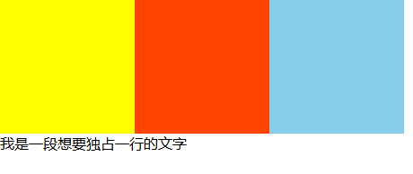

代码如下：

```html
<!DOCTYPE html>
<html>
	<head>
		<meta charset="utf-8">
		<title></title>
		<style type="text/css">
			*{
				padding: 0;
				margin: 0;
			}
			.dv{
				width: 150px;
				height: 150px;
				/* 添加左浮动 */
				float: left;
			}
			.div1{
				background-color: yellow;
			}
			.div2{
				background-color: orangered;
			}
			.div3{
				background-color: skyblue;
			}
		</style>
	</head>
	<body>
		<div class="box">
			<div class="dv div1"></div>
			<div class="dv div2"></div>
			<div class="dv div3"></div>
		</div>
		<p>我是一段想要独占一行的文字</p>
	</body>
</html>
```

但是执行结果如下：

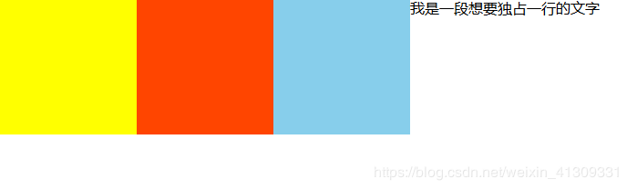

可以发现，本来应该独占一行的p内容，却和三个div同行了，这是由于三个div的浮动脱离了文档流导致的。


## 清除浮动的7种方法

1. **给父元素添加高度height**

   ```css
   .box{
   	height: 150px;
   }
   ```

   给父元素添加 height 解决了父元素无法自动获取高度的问题。

   但是这种方法只适合高度固定的布局，因为要给出精确的高度，如果高度和父级div不一样时，会产生问题。

   

2. **结尾添加 div/br 标签，样式为clear: both**

   ```css
   .div4{
   	clear: both;
   }
   ```

   不推荐使用，需要在布局中添加新的元素。

   

3. **触发BFC**

   ```css
   .box{
   	display: table;
   }
   ```

   不推荐使用，改变了父级div的属性，会产生一些新的问题。

   

4. **父级元素也一起浮动**

   不推荐使用，会产生新的浮动问题。

   

5. **父级元素添加overflow: auto**

   不能定义height，使用overflow:auto时，浏览器会自动检查浮动区域的高度。

   不推荐使用，容易出现滚动条。

   

6. **父级元素添加overflow: hidden**

   ```css
   .box{
   	overflow: hidden;
   }
   ```

   可以使用，但是不能定义height，使用overflow:hidden时，浏览器会自动检查浮动区域的高度

   

7. **（常用）伪类和zoom**

   ```css
   .clearFloat::after,.clearFloat::before{
   	content: "";
   	display: block;
   	line-height: 0px;
   	height: 0px;
   	clear: both;
   	visibility: hidden;
   }
   .clearFloat{
   	/* 解决IE兼容问题 */
   	zoom: 1;
   }
   ```

   推荐使用，常用语公共类，节省代码。

   我们解释一下上面的部分代码：

   - **visibility**：

   隐藏一个元素可以通过把display属性设置为"none"，或把visibility属性设置为"hidden"。但是请注意，这两种方法会产生不同的结果。

   visibility:hidden可以隐藏某个元素，但隐藏的元素仍需占用与未隐藏之前一样的空间。也就是说，该元素虽然被隐藏了，但仍然会影响布局。

   - **zoom**:1用于解决IE兼容问题。


# 6 颜色设置

HTML5中提供了两种颜色的设置：

## 6.1 RGBA

R：红色值，0~255之间，rgb(255,0,0) 代表纯红色；

G：绿色值，0~255之间，rgb(0,255,0) 代表纯绿色；

B：蓝色值，0~255之间，rgb(255,0,0) 代表纯蓝色；

A：Alpha，透明度，0~1之间，不可为负数。

## 6.2 HSLA

H：Hue，色调、色相。取值为0~360，过渡为“红橙黄绿青蓝紫红”，0和360代表红色，30代表橙色，60代表黄色，120代表绿色，180代表青色，240代表蓝色，300代表紫色。见下图：

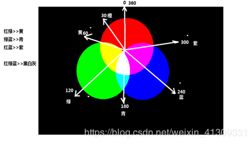

S：Saturation，饱和度，取值为0.0%~100.0%；

L：Lightness，亮度，取值为0.0%~100.0%，50%是默认值和平衡值。

A：Alpha，透明度，取值0~1之间。


## 6.3 透明度

在之前我们用 opacity 来设置透明度，也是可行的。但是 opacity 只能针对整个盒子设置透明度。子盒子及内容会继承父盒子的透明度；

rgba来控制颜色和透明度，相对于 opacity，不具有继承性。


# 7 阴影

## 7.1 文本阴影

语法：

```css
text-shadow: offsetX offsetY blur color;
```

其中，offsetX 和 offsetY 分别表示坐标轴坐标；blur 为模糊值。

可以同时为一个文本设置多种阴影：

```css
text-shadow: offsetX1 offsetY1 blur1 color1, offsetX2 offsetY2 blur2 color2;
```


## 7.2 边框阴影

语法：

```css
box-shadow: h v blur spread color inset
```

其中，

h 和 v 分别表示水平和垂直，用法与文本阴影的 offsetX 和 offsetY相同；

blur 表示模糊值，可选值，默认为0；

spread 表示阴影的尺寸，可以扩展或收缩阴影大小，可选值，默认为0；

color 表示颜色，可选值，默认为0；

inset 表示内阴影。一般配合设置两个阴影，以达到四个方向都有阴影，如：

```css
{box-shadow: -10px 10px 5px 0px rgba(0,0,150,0.2) inset,10px -10px 5px 0px rgba(0,0,150,0.2) inset;}
```


# 8 盒模型

`CSS`的盒子结构如下图：`content`+`padding`+`border`+`margin`.

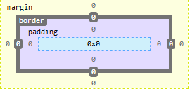

盒模型是页面渲染时,`dom`元素所采用的布局模型.可通过`box-sizing`进行设置.

我们在`CSS`中设置 宽高`width`和`height`,默认情况下,盒子的宽高指的是`content`的宽高,即`box-sizing`默认值为`content-box`.`content-box`往往会造成，当我给一个盒子添加 border 或 padding 的时候，页面结构产生错位。这是由于父盒子的宽度已经不够支撑四个子盒子的宽度总和了。这时候我们可能会将父盒子的宽度调大一点，但是这样子去调试往往是不符合需求的。

我们可以通过`box-sizing`设置盒模型来解决这个问题,`box-sizing`有以下两种属性值:

1. `box-sizing: content-box`:标准盒模型

   即默认情况下的盒模型,设置盒子的`width`和`height`仅仅是`content`的宽高.

   总宽度 = `margin + border + padding + width`.

2. `box-sizing: border-box`:怪异盒模型(或IE盒模型)

   设置的`width`属性值就是盒子的最终宽度,包含`padding`和`border`.也就是说,如果给盒子添加`padding`或`border`,那么真正放置内容的`content`会减小,但是它可以稳固页面的结构.

   总宽度 = `margin + width`.

3. `inherit`:从父元素继承`box-sizing`属性.

# 9 边框圆角

border-radius 可以用来设置边框圆角。后面的像素值表示半径，拿右上角作为例子来解释：（如图）

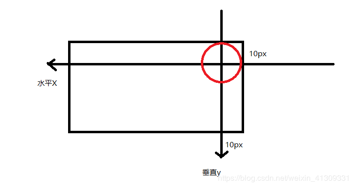

添加圆角的各种情况：

| 写法                                                   | 说明                                                         |
| ------------------------------------------------------ | ------------------------------------------------------------ |
| border-radius: 10px;                                   | 设置四个角的相同圆角值                                       |
| border-radius: 10px 20px;                              | 第一个值设置左上↖和右下↘，第二个值设置右上↗和左下↙           |
| border-radius: 10px 20px 30px;                         | 第一个值设置左上↖，第二个值设置右上↗和左下↙，第三个值设置右下↘ |
| border-radius: 10px 20px 30px 40px;                    | 分别设置左上，右上，右下，左下                               |
| border-radius: 50px/100px;                             | 设置 水平x/垂直y 方向的半径值                                |
| border-top-left: 10px;                                 | 指定位置添加圆角                                             |
| border-top-right: 10px;                                | 指定位置添加圆角                                             |
| border-bottom-left: 10px;                              | 指定位置添加圆角                                             |
| border-bottom-right: 10px;                             | 指定位置添加圆角                                             |
| border-top-left: 10px 20px;                            | 指定位置设置 水平x/垂直y 方向的半径值                        |
| border-top-right: 10px 20px;                           | 指定位置设置 水平x/垂直y 方向的半径值                        |
| border-bottom-left: 10px 20px;                         | 指定位置设置 水平x/垂直y 方向的半径值                        |
| border-bottom-right: 10px 20px;                        | 指定位置设置 水平x/垂直y 方向的半径值                        |
| border-radius:100px 80px 60px 40px/20px 30px 40px 50px | 设置四个角点的 水平x/垂直y 方向上的不同圆角值，一一对应      |


# 10 渐变

由于渐变效果不是单一的颜色，而是图像，因此应该写在 background 中。如

```css
{background: linear-gradient(to right,red 0%,blue 100%);}
```

## 10.1 线性渐变

线性渐变可以理解为就是沿着一条线去做颜色的渐变。

- 语法：

```css
linear-gradient(方向, 颜色1 位置百分比, 颜色2 位置百分比, 颜色3 位置百分比...)
```

- 说明：

方向可以是关键字，也可以是度数。例如 to top 就是 0deg，to right 就是 90deg，自然右上方就是 45deg，以此类推。

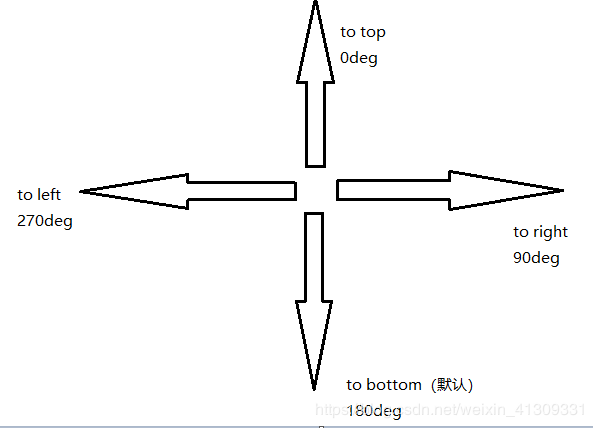


颜色1一般代表开始的颜色，位置百分比就是所在位置。如0%代表开始位置，100%代表结束位置，50%代表中间位置。


## 10.2 径向渐变

径向渐变就是由一点往周围渐变。

- 语法：

```
radial-gradient(形状 大小 at 坐标, 颜色1 位置百分比, 颜色2 位置百分比...)
```

- 说明：

形状—— circle 表示产生圆形的渐变；ellipse 表示自动适配当前的容器形状（默认）；

大小—— closest-side：最近边； farthest-side：最远边； closest-corner：最近角； farthest-corner：最远角（默认）。

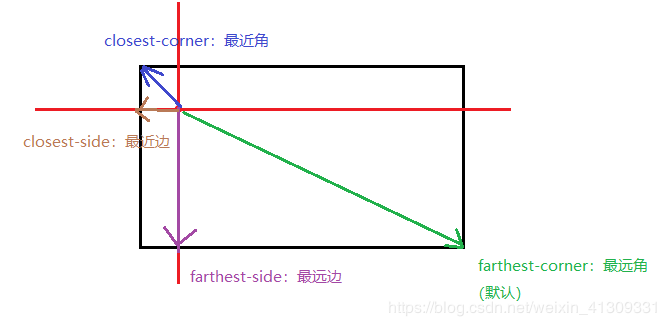

坐标：以左上角为坐标原点，设置X和Y坐标。注意，写横纵坐标前要加 at：

```css
{background: radial-gradient(circle farthest-corner at 0px 0px,red,red 30%,blue 70%,blue);}
```


## 10.3 重复渐变

重复渐变主要就是 repeating-radial-gradient() 和 repeating-linear-gradient()。我认为通过一个案例来记住它们更为有效：

```css
{background: repeating-radial-gradient(circle closest-side,
			#fff 0%,#fff 10%,
			#ff6700 10%,#ff6700 20%);}
```

这里其实就是设置了两个环的颜色之后，剩下的自动补充至100%。实现效果为：

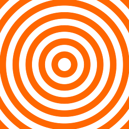

同样的，我们也可以做一个repeating-linear-gradient() 的案例：

```css
{background: repeating-linear-gradient(45deg,
			#fff 0%,#fff 10%,
			#ff6700 10%,#ff6700 20%);}
```

实现效果为：

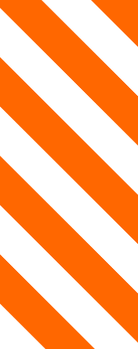


# 11 background 的使用

## background-color

添加背景色

## background-image

如果图片大于容器，默认图片从容器左上角原大小放置；

如果图片小于容器，默认图片原大小平铺

```
background-image: url("abc.jpg");
```

## background-repeat

设置背景**平铺**的方式：

**round**：将图片进行缩小后平铺

**space**：将图片间距放大后平铺

```
background-repeat：round;
```

## background-attachment

滚动页面时：

fixed：背景图片的位置固定不变

scroll：背景也会跟着滚动

 

滚动背景容器上的内容时：

fixed：背景图片不会跟随内容一起滚动

scroll：背景图片不会跟随内容一起滚动

local：背景图片会跟随内容一起滚动

## background-size

设置背景图片的大小：

100px 100px：设置宽度为100px，高度为100px；

100px auto：设置宽度为100px，高度等比例自适应；

50% 50%：设置百分比，参照父容器的内容区域宽高；

## background-size: contain

使容器包含背景图片，即背景图片需要完全在容器内显示出来，因此往往造成容器有空白区域，有两种情况：

1. 当背景图片比容器大时，图片会被等比例缩小；

2. 当背景图片比容器小时，图片会被等比例放大；

## background-size: cover

使背景图片覆盖整个容器，即整个容器不能有空白区域，因此往往造成图片溢出，有两种情况：

1. 当背景图片比容器大时，背景图片会被等比例缩小，填满整个容器；

2. 当背景图片比容器小时，背景图片会被等比例放大，填满整个容器；

## background-positon

设置背景的位置偏移，默认是以左上角作为原点，原点可通过 background-origin 改变

## background-origin

设置背景坐标的原点：

1. border-box:从border的位置开始填充背景，会与border重叠
2. padding-box:从padding的位置开始填充背景，会与padding重叠
3. content-box:从内容的位置开始填充背景

## background-clip

设置显示的内容：

1. border-box:其实是显示border及以内的内容
2. padding-box:其实是显示padding及以内的内容
3. content-box:其实是显示content及以内的内容

## background-position 案例

background-position 的用法很实用，比如之前我做一个轮播图的左右切换按钮：


做法简单来说就先设置容器宽高，然后用 background-image 插入背景，再通过background-position 来取我想要的那一部分。

那如果我现在要实现的是扩大按钮的响应范围，但是按钮图案本身不扩大呢？也就是说，我想要实现这个按钮：

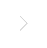

按钮周围的可响应区域扩大了，毕竟有时候一个图案按钮实在是太小了，用户在点击的时候不一定能准确点击到，PC端的还能忍受，但是在移动端就很坑人了。那么这个效果怎么实现呢？

在以前，我们可能会这么实现：

```html
<!DOCTYPE html>
<html lang="en">
<head>
    <meta charset="UTF-8">
    <title></title>
    <style>
		a{
			width: 100px;
			height: 100px;
			display: block;
			margin: 200px auto;
			position: relative;
		}
		div{
			width: 40px;
			height: 40px;
			background-image: url("abc.png");
			background-position: -83px -12px;
			position: absolute;
			left: 50%;
			top: 50%;
			margin-left: -20px;
			margin-top: -20px;
		}
    </style>
</head>
<body>
	<a href="">
		<div></div>
	</a>
</body>
</html>
```

即在a标签里面再加一个div标签。这样子虽然也能实现我想要的效果，但是它使得页面的层次结构增多了。我们可以使用 background-origin、background-clip 来实现同样的效果：

```html
<!DOCTYPE html>
<html>
	<head>
		<meta charset="UTF-8" />
		<title>demo</title>
	</head>
	<style type="text/css">
		a{
			width: 100px;
			height: 100px;
			display: block;
			margin: 200px auto;
			padding: 30px;
			/* 为了实现添加padding内容区域不断缩小的效果,需要先将盒模型改为border-box */
			box-sizing: border-box;
			background-image: url("test/abc.png");
			background-position: -83px -12px;
			background-origin: content-box;
			background-clip: content-box;
		}
	</style>
	<body>
		<a href=""></a>
	</body>
</html>
```

可以发现，不仅HTML的层次结构没有增加，而且CSS代码也少了很多。


# 12 边框图片

## border-image-source

制定边框图片的路径

## border-image-slice

指定四个方向上的裁切距离，如下图设置siice值为x，将图片裁切成一个九宫格：


而border-image-slice: x fill; 中fill用于对内容进行填充。

## border-image-width

设置边框图片的宽度，如果没有这个属性，则边框图片的默认宽度为容器border宽度。

注意边框图片本质上是背景，对容器内容的放置不会有影响，容器内容只受 border 和 padding 影响。**因此，一般来说会把容器 border 与边框图片的宽度 border-image-width 设为相同值。**

## border-image-outset

扩展边框

## border-image-repeat

1. 默认为stretch，拉伸；

2. repeat：按大小平铺；

3. round：将内容缩放，进行完整的平铺


## border-image案例

我们在聊天发QQ或微信的时候，发过去的消息框是这样的：

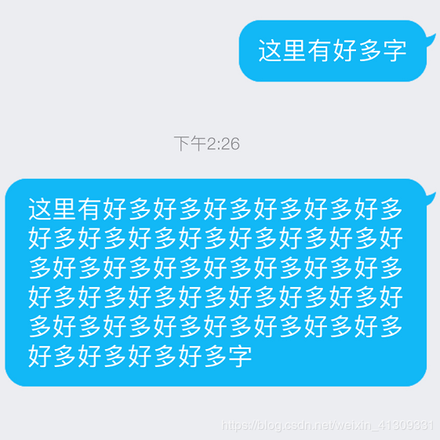

可见，背景会随着我们文字的增多而变宽或变长。但是，它的实现并不是一种变大的效果（变大往往会失真），我们可以看出四个圆角是没有变化的，我们说这四个区域是受保护的。

下面我们来模拟一下：

```html
<!DOCTYPE html>
<html lang="en">
<head>
    <meta charset="UTF-8">
    <title>Title</title>
    <style>
        *{
            padding: 0;
            margin: 0;
        }
 
        div{
            width: 150px;
            height: auto;
            border: 10px solid red;
            margin:100px auto;
	    	padding: 10px;
            color: #fff;
            /*添加边框图片*/
            border-image-source: url("abc.gif");
            /*设置受保护的区域大小*/
            border-image-slice: 10 fill;
            border-image-width: 10px;
            /*设置背景平铺效果  默认是stretch：拉伸*/
            border-image-repeat: stretch;
        }
    </style>
</head>
<body>
	<div class="div1">这里的字没那么多</div>
	<div class="div2">
		这里有好多好多好多好多好多好多好多好多好多好多好多好多好多好多好多好多好多好多好多好多好多好多好多好多好多好多好多好多好多好多好多好多好多好多好多好多好多好多好多好多好多好多好多好多好多好多好多好多好多好多好多好多好多好多好多好多好多好多好多好多好多好多好多好多好多好多好多好多好多字
	</div>
</body>
</html>
```

实现效果如下：

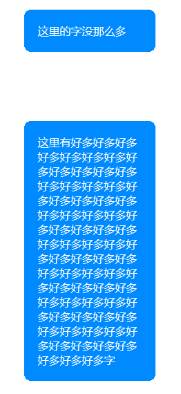


# 13 过渡 transition

| 过渡样式                   | 说明                                                        |
| -------------------------- | ----------------------------------------------------------- |
| transition-property        | 添加过渡效果的样式属性名称                                  |
| transition-duration        | 过渡效果的耗时，以秒（s）作为单位                           |
| transition-timing-function | 过渡时间函数，控制过渡的速度，匀速是linear                  |
| transition-delay           | 过渡效果的延迟，默认为0s                                    |
| step(x)                    | 把过渡分为指定的 x 步进行                                   |
| 简写                       | transition: property duration timing-function delay step(4) |

注意：

（1）过渡效果执行完毕之后，默认会还原到原始状态

（2）**过渡效果只能产生从某个值到另外一个具体的值的过渡，例如它无法从 display: none 过渡到 display: block ，可以从 height: 0px 过渡到height: 10px。**

（3）过渡存在一些兼容性的问题，最好添加前缀，如

            -moz-transition
            -webkit-transition
            -o-transition
## 案例

学习了过渡之后，我就可以对我之前做的仿小米官网静态页面进行改进，比如将下拉框用过渡样式来做，视觉效果比用 display: none / display: block 组合好很多。

关键代码：

```css
            width: 100%;
            height:0px;
            overflow: hidden;
            /*display: none;*/
            /*添加过渡效果:过渡效果只能产生从某个值到另外一个具体的值的过渡*/
            /*1.一定要设置为哪些css样式添加过渡效果*/
            /*transition-property: display;*/
            transition-property: height;
            /*2.一定要设置过渡效果的耗时*/
            transition-duration: 1s;
```


# 14 transform

- 常用功能：移动、缩放、旋转、斜切

- 执行完毕后会恢复到原始状态

## 14.1 移动：translate

说明：

1. 移动参照移动元素的左上角；

2. 参数为一个时，指水平x 移动；

3. 参数为两个时，指水平x、垂直y 移动；

4. 特指水平x移动：transform: translateX(xpx);

5. 特指垂直y移动：transform: translateY(ypx);

## 14.2 缩放：scale

说明：

1. 参数为1时不变化，参数大于1时放大，小于1时缩小；

2. 参数为一个时，表示x和y方向等比例缩放；

3. 参数为两个时，表示指定 x/y 方向缩放；

4. 特指x方向缩放：transform: scaleX(x);

5. 特指y方向缩放：transform: scaleY(y);

## 14.3 旋转：rotate

说明：

1. 参数为角度，正值为顺时针旋转，负值为逆时针旋转；

2. transform-origin 可以设置旋转轴心（两种方式：一种是 x y 值；一种是关键字如 left、right、top、bottom、left top 等）

## 14.4 斜切：skew

说明：

1. 参数为角度：如果角度为正，则往当前轴的负方向斜切，如果角度为负，则往当前轴的正方向斜切，如下图：（以transform: skew(60deg) 为例）

   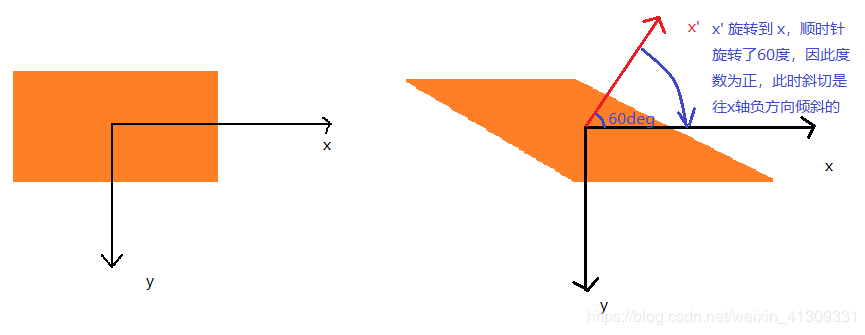

2. 参数为两个时，表示先在x斜切，再在y斜切；

3. 特指x或y方向斜切：transform: skewX(xdeg)、transform: skewY(ydeg);


## 14.5 添加多个transform属性

添加多个 transform是属性时，切记不能一行一行添加，如下：

```
transform: translate(100px,100px);
transform: rotate(30deg);
```

这段CSS代码执行结果是只旋转不移动的。原因是第一条样式已经被第二条样式覆盖了。正确的写法如下：

```
transform: translate(100px,100px) rotate(30deg);
```

并且还要注意，**当我们用 transform 的 rotate 进行旋转的，包括坐标系也会被旋转，这就决定了下面这两行代码实现效果是不同的：**

```
transform: translate(100px,100px) rotate(-90deg);
transform: rotate(-90deg) translate(100px,100px);
```

第一行是先向x移动，后旋转，此时是向右移动的；

第二行是先旋转，后移动，此时由于坐标系也旋转了，因此x已经指向上面了，因此是向上移动。


# 15 transform的3D变换

在CSS3中，我们可以用一个三维坐标系来表示一个3d空间：

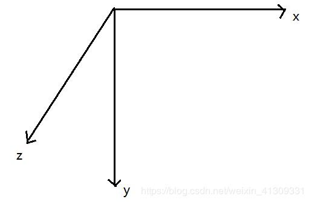

其中，z轴指向的是屏幕向外。

要实现3d的移动、缩放、旋转，也需要用到 transform样式。

## 三维移动

```
transform: translate3d(x, y, z);
```

其中x、y、z分别表示x、y、z方向上的偏移像素值。

也可以分开写：translateX(x)、translateY(y)、translateZ(z)

## 三维缩放

```
transform: scale3d(x, y, z);
```

其中x、y、z分别表示x、y、z方向上的缩放。缩放值与2d的类似，1不缩放，＜1缩小，＞1放大。

也可以分开写：scaleX(x)、scaleY(y)、scaleZ(z)

## 三维旋转

transform: rotate3d(x, y, z, angle);

这里的x，y，z决定的（x，y，z）其实就是一个向量，相信稍微学过一点数学的人都能理解。

angle代表角度，取正取负有一个很实用的方法：**左手原则，即用左手竖起大拇指，大拇指指向的方向与（x，y，z）向量指向的方向相同，四指环绕的方向即为正方向。**

也可以分开写：

| 写法           | 说明        |
| -------------- | ----------- |
| rotateX(angle) | 围绕X轴旋转 |
| rotateY(angle) | 围绕Y轴旋转 |
| rotateZ(angle) | 围绕Z轴旋转 |

## 立方体案例

在做立方体之前，先补两个知识：

- **transform-style**：使被转换的子元素（注意是子元素）保留其3d转换（需设置在父元素中），它有如下两个属性值：

| 属性        | 说明 |
| -------------- | ----------- |
| flat        | 子元素将不保留其 3D 位置-平面方式。 |
| preserve-3d | 子元素将保留其 3D 位置—立体方式。   |

- 景深、透视效果：

（1）**perspective(length)** ：为一个元素设置三维透视的距离。仅作用于元素的后代，而不是其元素本身。当perspective:none/0;时，相当于没有设perspective(length)。例如我要建立一个小立方体，长宽高都是200px。如果我将 perspective < 200px ，那就相当于站在盒子里面看的结果，如果perspective 非常大那就是站在非常远的地方看（立方体已经成了小正方形了），意味着**perspective 属性指定了观察者与z=0平面的距离**，使具有三维位置变换的元素产生透视效果
（2）**perspective-origin**：属性规定了镜头在平面上的位置，默认是放在元素的中心。如perspective-origin: 10px 10px; 表示从右下方观察。

根据3d移动和3d旋转，可以很容易的实现一个立方体，实现效果如下图：

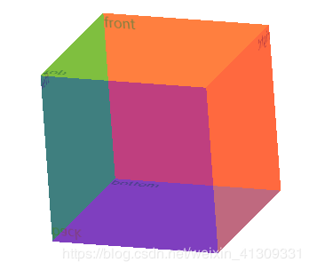

代码如下：

```html
<!DOCTYPE html>
<html lang="zh">
<head>
	<meta charset="UTF-8">
	<title></title>
	<style type="text/css">
		.box{
			width: 200px;
			height: 200px;
			margin: 100px auto;
			position: relative;
			/* 将立方体旋转一定角度便于观察 */
			transform: rotate3d(1,1,0,30deg);
			/*让子元素保留3d变换之后的效果*/
			transform-style: preserve-3d;
			/* 景深透视效果 */
			perspective: 0px;
			/* 设置景深透视的观察角度 */
			perspective-origin: 0px 0px;
		}
		.box > div{
			width: 200px;
			height: 200px;
			position: absolute;
			opacity: 0.5;
		}
		.front{
			background-color: red;
			transform: translateZ(100px);
		}
		.back{
			background-color: blue;
			transform: translateZ(-100px) rotateX(180deg);
		}
		.left{
			background-color: green;
			transform: translateX(-100px) rotateY(-90deg);
		}
		.right{
			background-color: orange;
			transform: translateX(100px) rotateY(90deg); 
		}
		.top{
			background-color: yellow;
			transform: translateY(-100px) rotateX(90deg);
		}
		.bottom{
			background-color: purple;
			transform: translateY(100px) rotateX(-90deg);
		}
	</style>
</head>
<body>
	<div class="box">
		<div class="front">front</div>
		<div class="back">back</div>
		<div class="left">left</div>
		<div class="right">right</div>
		<div class="top">top</div>
		<div class="bottom">bottom</div>
	</div>
</body>
</html>
```


# 16 animation动画

严格上过渡并不算是真正意义上自由的动画，因为它只是初始状态过渡到了最终状态的一个过程。可以理解为只有两个节点。

CSS3的 animation 样式提供了**关键帧**动画，通过关键字 **@keyframes** 配合 **animation** 可以设置多个节点（可理解为帧数）来精确控制一个或一组动画，常用来实现复杂的动画效果。

| 样式                           | 说明                                                      |
| ------------------------------ | --------------------------------------------------------- |
| animation-name                 | 指定动画名称                                              |
| animation-duration             | 设置动画的总耗时，单位为s                                 |
| animation-iteration-count      | 设置动画播放的次数，参数为数字或infinite（无穷），默认为1 |
| animation-direction: altermate | 设置交替动画，alternate属性代表来回交替                   |
| animation-delay                | 设置延迟，单位为s                                         |
| animation-timing-function      | linear 设置匀速                                           |
| animation-play-state           | 设置动画播放的状态，running是播放，paused是暂停           |

**animation-fill-mode:**

设置动画结束时的状态，它有三种属性：

（1）**forwards**:会保留动画结束时的状态，在有延迟的情况下，并不会立刻进行到动画的初始状态
（2）**backwards**:不会保留动画结束时的状态，在添加了动画延迟的前提下，如果动画有初始状态，那么会立刻进行到初始状态
（3）（默认）**both**:会保留动画的结束时状态，在有延迟的情况下也会立刻进入到动画的初始状态


@keyframes

@keyframes 指定动画的关键帧，用百分比来将动画分成多个节点（其中0%可用 from 代替，100%可用 to 代替）。我们来看一段它的代码：

```css
@keyframes flash_name{
	from{}
	50%{}
	to{}
}
```

其中 **flash_name** 就是指定的动画名称，它与 **animation-name** 对应。而from{}、50%{}、to{}表示三个节点，可分别在三个节点中添加样式。

## 案例

使用animation动画和transform移动实现无缝的图片滚动：

```html
<!DOCTYPE html>
<html lang="zh">
<head>
	<meta charset="UTF-8">
	<title></title>
	<style>
		*{
			margin: 0;
			padding: 0;
		}
		ul,li{
			list-style: none;
		}
		div{
			width: 800px;
			height: 150px;
			margin: 100px auto;
			overflow: hidden;
		}
		ul{
			width: 200%;
			animation-name: move;
			animation-duration: 4s;
			animation-iteration-count: infinite;
			/* animation-direction: alternate; */
			animation-timing-function: linear;
			animation-fill-mode: backwards;
		}
		div:hover ul{
			animation-play-state: paused;
		}
		li{
			float: left;
		}
		img{
			width: 200px;
			height: 150px;
		}
		@keyframes move{
			from{
				transform: translateX(0px);
			}
			to{
				transform: translateX(-800px);
			}
		}
	</style>
</head>
<body>
	<div class="box">
		<ul>
			<li><a href=""></a></li>
			<li><a href=""></a></li>
			<li><a href=""></a></li>
			<li><a href=""></a></li>
			<li><a href=""></a></li>
			<li><a href=""></a></li>
			<li><a href=""></a></li>
			<li><a href=""></a></li>
		</ul>
	</div>
</body>
</html>
```


## animation 动画库

animate.css 是CSS3的一个动画库，我这里先贴上一个 [animate.css网址](https://daneden.github.io/animate.css/)。可以通过这个网址下载 animate.css，也可以查看它的使用说明，甚至能对库里的动画效果进行演示。

animate.css 动画库的使用我自己认为还是很简单的，毕竟就是一个包含了很多动画效果的 css 文件，很好理解。在使用的时候，我简单地将其分为三步：

（1）调用库：

```html
<link rel="stylesheet" type="text/css" href="animate.css"/>
```

（2）添加类：

在 animate.css 中，每种动画都用不同类名区分，若我们想要对某个元素添加某种动画效果，就只需要给这个元素添加对应的类名（注意在通过类名选择动画时，类名除了动画效果本身的类名外，还要有个 **animated** 类名）即可。

当然了，为一个元素添加类名的方法那就多了去了，所以能实现各种方式来展现动画：

```html
<!DOCTYPE html>
<html lang="zh">
<head>
	<meta charset="UTF-8">
	<link rel="stylesheet" type="text/css" href="animate.css"/>
	<title></title>
	<style type="text/css">
		div{
			width: 100px;
			height: 100px;
			background-color: #FF6700;
			margin: 100px auto;
		}
	</style>
</head>
<body>
	<div id="demo"></div>
	<script type="text/javascript">
		div = document.querySelector("#demo");
		div.onclick = function(){
			div.classList.add("animated");
			div.classList.add("shake");
			//设置setTimeout,设置在点击元素后移除动画效果,这样2s后再次点击依旧有动画效果
			setTimeout(function(){
				div.classList.remove("shake");
			},2000);
		}
	</script>
</body>
</html>
```

（3）自行配置一些动画效果

我们可以自行更改库中的动画的一些参数，比如我嫌上例中 shake 动画摇得太快了，就可以在css样式中将他的 animation-duration 改得大一点：

```css
#demo{
	animation-duration: 5s;
}
```


# 17 多列布局

1. column-count

   设置列数

2. column-rule

   设置列间隙样式（和边框的样式一样）

3. column-gap：

   设置列间隙大小

4. column-width：

   设置列宽，遵循取大优先原则，即：
   - 如果column-width比默认计算的宽度要大，则取column-width，但此时若有空余空间，则会将宽度撑大被填满，意味着最终的宽度可能大于colum-width

   - 如果column-width更小，则取默认计算的宽度

5. max-height：

   设置每一列的最大高度，若内容超过这个高度，则换列，意味着列数可能会大于column-count

6. column-span：

   设置跨列显示：

   - 1：不跨列

   - all：跨列


# 18 伸缩盒子（弹性盒子）

传统的布局方式基于盒子模型，依赖于 display、position 和 float 等。CSS3新增了伸缩布局，使得我们对块级元素的布局排列变得十分灵活，适应性非常强，其强大的伸缩性，在响应式开中可以发挥极大的作用。

1. **display: flex**：一个容器设置了 display: flex 属性，则容器内的**直接子元素**都会自动变成**伸缩项（flex item）**

2. **justify-content：设置子元素在主轴方向上的排列方式**

    | 属性              | 说明                                                         |
    | ----------------- | ------------------------------------------------------------ |
    | flex-start        | 让子元素从父元素的起始位置开始排列                           |
    | flex-end          | 让子元素从父元素的结束位置开始排列                           |
    | center            | 让子元素从父元素的中间位置开始排列                           |
    | **space-between** | 左右对齐父元素的开始和结束位置，中间的平均放置，使得各子元素间距相同 |
    | **space-around**  | 将留白平均分给每个子元素的两边，相当于margin: 0 auto;        |

3. **flex-wrap：控制子元素是否换行显示：**

   | 属性         | 说明                                           |
   | ------------ | ---------------------------------------------- |
   | nowrap       | 不换行（收缩），默认                           |
   | wrap         | 换行                                           |
   | wrap-reverse | 换行且翻转（即从上到下换行翻转为从下到上换行） |

4. **flex-direction：设置子元素的排列方向（设置主轴方向）：**

   | 属性           | 说明               |
   | -------------- | ------------------ |
   | row            | 水平方向，从左到右 |
   | row-reverse    | 水平方向，从右到左 |
   | column         | 垂直方向，从上到下 |
   | column-reverse | 垂直方向，从下到上 |

5. **flex-flow：是 flex-wrap 和 flex-direction 的结合。**如 flex-wrap: wrap; flex-direction: row; 相当于 flex-flow: wrap row;

6. **flex-grow：当有留白时，设置当前子元素应占据留白的比例值，用来扩展子元素的宽度。**（默认为0，即默认情况下子元素不会去占据剩余空间）----写在子元素

   ```
   比例计算：当前子元素的 flex-grow 值 / 当前子元素的全部兄弟元素（包括当前子元素在内）的全部 flex-grow 总和。
   ```

   

7. **flex-shrink：当父容器不足以容纳所有子元素时，定义子元素收缩比例。**（默认为1，即默认情况下，子元素会平均收缩）----写在子元素

   ```
   比例计算：当前子元素的 flex-shrink 值 / 当前子元素的全部兄弟元素（包括当前子元素在内）的全部 flex-shrink 总和。
   ```

   

8. **flex：flex 是 flex-grow  flex-shrink flex-basis 的简写。**默认值为 flex:0 1 auto;

   语法：

   ```
   flex: number：这个语法指定了一个数字，代表了这个伸缩项目该占用的剩余空间比例
   flex: auto：属性值被设为auto的伸缩项目，会根据主轴自动伸缩以占用所有剩余空间
   ```

9. **align-items：设置子元素在侧轴方向上的对齐方式（写在父元素）**

   | 属性       | 说明           |
   | ---------- | -------------- |
   | center     | 侧轴上居中对齐 |
   | flex-start | 侧轴顶部对齐   |
   | flex-end   | 侧轴底部对齐   |
   | stretch    | 侧轴上拉伸     |
   | baseline   | 设置文本基线   |

10. **align-self：设置单个元素在侧轴上的对齐方式**

## 案例

下面我就用伸缩布局实现下图的这个网页布局：

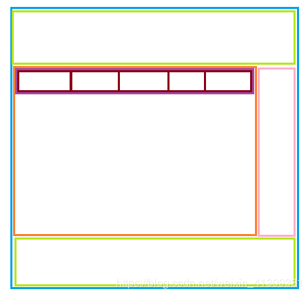

代码如下：

```html
<!DOCTYPE html>
<html>
	<head>
		<meta charset="utf-8">
		<title></title>
		<style>
			*{
				padding: 0;
				margin: 0;
			}
			.box{
				width: 100%;
				height: 700px;
				background-color: #ccc;
				margin: 10px auto;
				/* 将整个容器设为伸缩盒子 */
				display: flex;
				flex-direction: column;
			}
			header{
				width: 100%;
				height: 100px;
				background-color: salmon;
			}
			footer{
				width: 100%;
				height: 100px;
				background-color: skyblue;
			}
			main{
				width: 100%;
				background-color: sandybrown;
				/* 让当前的main元素占据全部剩余空间 */
				flex: 1;
				/* 设置main为伸缩盒子 */
				display: flex;
			}
			main > article{
				width: 500px;
				background-color: bisque;
				/* 让article占据5/6 */
				flex: 5;
			}
			main > aside{
				/* 让aside占据1/6 */
				flex: 1;
				background-color: #FF6700;
			}
			ul{
				list-style: none;
				width: 100%;
				/* 将ul设置为伸缩盒子 */
				display: flex;
			}
			li{
				height: 50px;
				background-color: springgreen;
				border-right: 1px solid #ccc;
				line-height: 50px;
				text-align: center;
				/* 让每个li平均占据 */
				flex: 1;
			}
			li:last-of-type{
				border-right: none;
			}
		</style>
	</head>
	<body>
		<div class="box">
			<header></header>
			<main>
				<article>
					<ul>
						<li>动漫首页</li>
						<li>番剧列表</li>
						<li>国剧经典</li>
						<li>日漫经典</li>
						<li>七月新番</li>
					</ul>
				</article>
				<aside></aside>
			</main>
			<footer></footer>
		</div>
 
	</body>
</html>
```

实现效果如下：

当缩放容器宽高时，容器内的子元素会按比例伸缩。

且在去动漫菜单中的某一项或几项时，剩下的菜单项会自动平均占据空间。

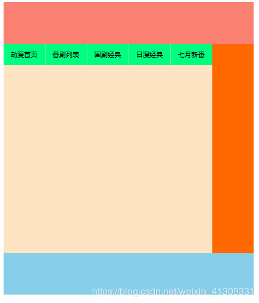


# 19 响应式开发

## 19.1 什么是响应式开发

​		现在的设备（特别是移动设备），各种尺寸层出不穷，一个能在PC端完美展示的站点，放在移动端可能就会“形象坍塌”。一个能在iphone5完美展示的站点，放在iPhone11也会“不堪入目”。响应式开发应运而生，它说白了就是做出来一个网站，可以兼容不同大小的设备（这里说的大小更多指的是设备的宽度），可以通过“媒体查询”检测设备信息，来设置不同的CSS样式，决定不同的网页布局方式。总而言之，就是为了用户体验，让网站对不同设备做出不同响应。


## 19.2 网页布局方式

​		在开发中，我们常用到以下的一些网页的布局方式：（几种布局方式并不是独立存在的，实际开发过程中往往是相互结合使用的。）

| 网页布局       | 说明                                                         |
| -------------- | ------------------------------------------------------------ |
| 固定宽度布局   | 为网页设置一个固定的宽度，通常以px做为长度单位，常见于PC端网页。 |
| 流式布局       | 为网页设置一个相对的宽度，通常以百分比做为长度单位。         |
| 栅格化布局     | 将网页宽度人为的划分成均等的长度，然后排版布局时则以这些均等的长度做为度量单位，通常利用百分比做为长度单位来划分成均等的长度。 |
| **响应式布局** | 通过检测设备信息，决定网页布局方式，即用户如果采用不同的设备访问同一个网页，有可能会看到不一样的内容，一般情况下是检测设备屏幕的宽度来实现。 |


## 19.3 响应式开发原理——媒体查询

​		在响应式布局中，怎么做到检测设备信息？我们利用媒体查询可以检测到屏幕的尺寸（主要检测宽度），并设置不同的CSS样式，就可以实现响应式的布局。

### 媒体查询的CSS语法

```css
@media mediatype and|not|only (media feature) {
    CSS-Code;
}
```

也可以针对不同的媒体引入不同的.css外部文件：

```html
<link rel="stylesheet" media="mediatype and|not|only (media feature)" href="mystylesheet.css">
```

### mediatype（媒体类型）

| 媒体类型   | 说明                                   |
| ---------- | -------------------------------------- |
| all        | 用于所有设备                           |
| print      | 用于打印机和打印预览                   |
| **screen** | **用于电脑屏幕，平板电脑，智能手机等** |
| speech     | 应用于屏幕阅读器等发声设备             |

### media feature（媒体功能）

| 媒体功能          | 说明                                 |
| ----------------- | ------------------------------------ |
| device-height     | 定义输出设备的屏幕可见高度           |
| device-width      | 定义输出设备的屏幕可见宽度           |
| max-device-height | 定义输出设备的屏幕可见的最大高度     |
| max-device-width  | 定义输出设备的屏幕最大可见宽度       |
| min-device-width  | 定义输出设备的屏幕最小可见宽度       |
| min-device-height | 定义输出设备的屏幕的最小可见高度     |
| max-height        | 定义输出设备中的页面最大可见区域高度 |
| max-width         | 定义输出设备中的页面最大可见区域宽度 |
| min-height        | 定义输出设备中的页面最小可见区域高度 |
| min-width         | 定义输出设备中的页面最小可见区域宽度 |

在媒体功能中，**min-width** 和 **min-device-width** 有什么区别呢？

device是设备的意思，我们知道在移动端适配中，往往会将width和device-width画上等号，即：

```html
<meta name="viewport"
          content="width=device-width, user-scalable=no, initial-scale=1.0, maximum-scale=1.0, minimum-scale=1.0">
```

实际上，min-width 它是指当前可视区域（页面）的最小宽度，因此当我们改变页面宽度时，pc端和移动端都能正常地做出响应，效果一致。

而 min-device-width 是指输出设备的屏幕宽度。移动端我们知道 width=device-width，而PC端当拖动来改变浏览器大小的时候，当前PC终端设备的屏幕宽度并不会变化，意味着媒体查询条件不会响应。

因此，可以认为 min-device-width 以及其它加 device 的媒体功能只对移动终端有效。

### 媒体查询书写建议

1）如果是判断最小值 (min-width)，那么就应该按照宽度从小到大写——bootstrap框架就是判断最小值，从小到大写：

```css
@media screen and (min-width:768px){
	body{
		background-color: blue;
	}
}
@media screen and (min-width:992px){
	body{
		background-color: green;
	}
}
@media screen and (min-width:1200px){
	body{
		background-color: pink;
	}
}
```

之所以要这么写原因很简单，我们来实现一个案例，案例需求如下：

| 宽度         | background-color |
| ------------ | ---------------- |
| <768px       | red              |
| 768px~992px  | blue             |
| 992px~1200px | green            |
| >1200px      | pink             |

媒体查询正确的书写顺序如上，以下是错误的顺序代码：

```html
<!DOCTYPE html>
<html>
	<head>
		<meta charset="utf-8">
		<meta name="viewport" content="width=device-width, initial-scale=1.0">
		<title></title>
		<style>
			body{
				background-color: red;
			}
			@media screen and (min-width:1200px){
				body{
					background-color: blue;
				}
			}
			@media screen and (min-width:992px){
				body{
					background-color: green;
				}
			}
			@media screen and (min-width:768px){
				body{
					background-color: pink;
				}
			}
		</style>
	</head>
	<body>
		
	</body>
</html>
```

你会发现，实现结果为：改变页面宽度大于768px时，background-color 为粉色，并且不论怎么调大宽度，background-color 都为粉色。这正是因为媒体查询顺序书写错误造成的BUG。

媒体查询从上到下判断条件时，如果处在下面的媒体查询条件也满足，则会把上面的满足条件的媒体查询样式覆盖。

（2）如果是判断最大值 (max-width)，那么就应该从大到小写：（原因与min-width情况类似，稍微想一下就能知道了）

```css
@media screen and (max-width:1200px){
	body{
		background-color: pink;
	}
}
@media screen and (max-width:992px){
	body{
		background-color: green;
	}
}
@media screen and (max-width:768px){
	body{
		background-color: blue;
	}
}
```


# BFC

