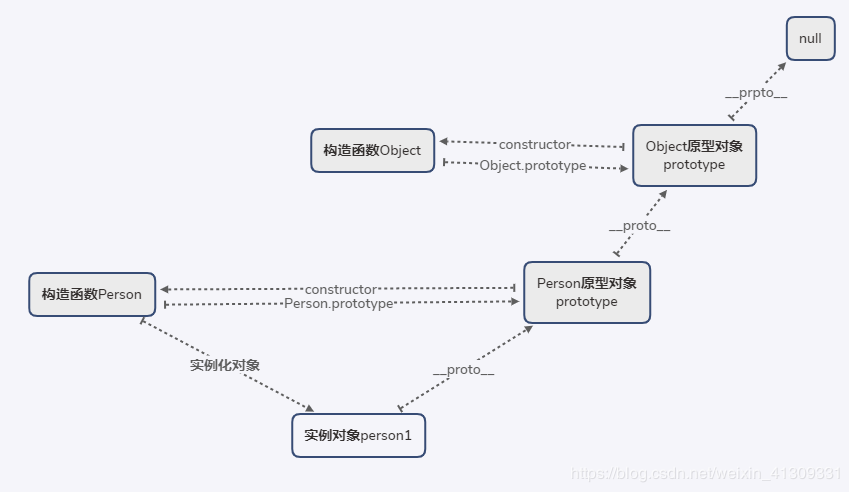
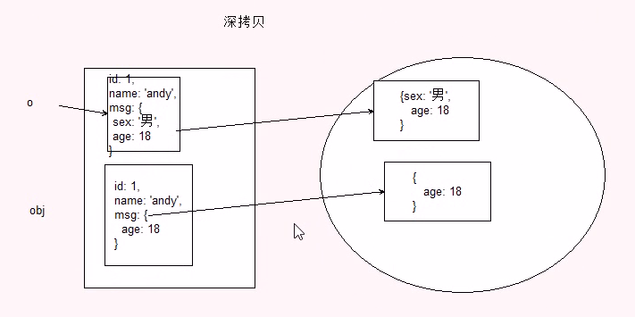
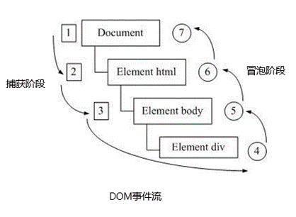
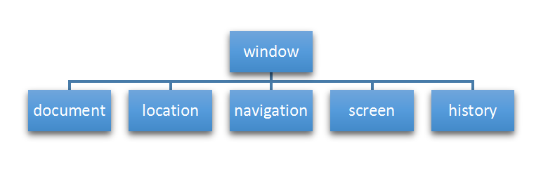

# JavaScript

一个完整的JavaScript实现：

1. 核心：ECMAScript

   - ECMAScript实现可能的宿主环境：web浏览器、Node、Adobe Flash
   - ECMAScript规定了下列组成部分：
     - 语法
     - 类型
     - 语句
     - 关键字
     - 保留字
     - 操作符
     - 对象

2. 文档对象模型：DOM

   - DOM（Document Object Model）是针对XML但经过扩展可用于HTML的应用程序编程接口（API，Application Programming Interface）。DOM把整个页面映射为一个多层节点结构。

3. 浏览器对象模型：BOM

   BOM（Browser Object Model）提供与浏览器交互的方法和接口。没有标准可以遵循，每个浏览器都有自己的实现。

   - window对象
   - location对象
   - navigator对象
   - screen对象
   - history对象


## 1 正则表达式

**正则表达式（ Regular Expression ）**是用于匹配字符串中字符组合的模式。

- 在 JavaScript中，正则表达式也是对象。
- 正则表达式通常被用来检索、替换那些符合某个模式（规则）的文本，例如验证表单：用户名表单只能输入英文字母、数字或者下划线， 昵称输入框中可以输入中文(匹配)。此外，正则表达式还常用于过滤掉页面内容中的一些敏感词(**替换**)，或从字符串中获取我们想要的特定部分(**提取**)等 。
- 一个正则表达式可以由简单的字符构成，比如 /abc/，也可以是简单字符和特殊字符的组合，比如 /ab*c/ 。其中特殊字符也被称为**元字符**，在正则表达式中是具有特殊意义的专用符号，如 ^ 、$ 、+ 等。
- 正则表达式里面不需要加引号 不管是数字型还是字符串型
- 正则表达式学习网址： https://developer.mozilla.org/zh-CN/docs/Web/JavaScript/Guide/Regular_Expressions
- 正则表达式测试网址：http://tool.oschina.net/regex

### 1. 1 使用场景

1. `RegExp`的`exec`和`test`方法

   - exec

     - 语法：

       ```js
       // reg:RegExp实例
       // str:要匹配正则表达式的字符串
       reg.exec(str)
       ```

     - 返回值:

       如果匹配成功，`exec()` 方法返回一个数组,包含额外的属性`index`和`input`，并更新正则表达式对象的 `lastIndex`属性。完全匹配成功的文本将作为返回数组的第一项，从第二项起，后续每项都对应正则表达式内捕获括号里匹配成功的文本。

       如果匹配失败,`exec()`方法返回`null`,并将`lastIndex`重置为0

     - 例子

       ```js
       var re = /quick\s(brown).+?(jumps)/ig;
       var result = re.exec('The Quick Brown Fox Jumps Over The Lazy Dog.');
       ```

       结果如下表:

         <table>
           <thead>
               <tr>
                 <th>对象</th>
                 <th>属性/索引</th>
                 <th>描述</th>
                 <th>例子</th>
               </tr>
           </thead>
           <tbody>
               <tr>
                   <td rowspan="4">result</td>
                   <td>[0]</td>
                   <td>匹配的全部字符串</td>
                   <td>Quick Brown Fox Jumps</td>
               </tr>
               <tr>
                   <td>[1],...[n]</td>
                   <td>括号中的分组捕获</td>
                   <td>result[1] = Brown result[2] = Jumps</td>
               </tr>
               <tr>
                   <td>index</td>
                   <td>匹配到的字符位于原始字符串的基于0的索引值</td>
                   <td>4</td>
               </tr>
               <tr>
                   <td>input</td>
                   <td>原始字符串</td>
                   <td>The Quick Brown Fox Jumps Over The Lazy Dog</td>
               </tr>
               <tr>
                   <td rowspan="5">re</td>
                   <td>lastIndex</td>
                   <td>下一次匹配开始的位置</td>
                   <td>25</td>
               </tr>
               <tr>
                   <td>ignoreCase</td>
                   <td>是否使用了 "i" 标记使正则匹配忽略大小写</td>
                   <td>true</td>
               </tr>
               <tr>
                   <td>global</td>
                   <td>是否使用了 "g" 标记来进行全局的匹配</td>
                   <td>true</td>
               </tr>
               <tr>
                   <td>multiline</td>
                   <td>是否使用了 "m" 标记使正则工作在多行模式（也就是，^ 和 $ 可以匹配字符串中每一行的开始和结束（行是由 \n 或 \r 分割的），而不只是整个输入字符串的最开始和最末尾处。）</td>
                   <td>false</td>
               </tr>
               <tr>
                   <td>source</td>
                   <td>正则匹配的字符串</td>
                   <td>quick\s(brown).+?(jumps)</td>
               </tr>
           </tbody>
         </table>
       
     
   - test
   
     - 语法:
   
       ```js
       // reg:RegExp实例
       // str:要匹配正则表达式的字符串
       reg.test(str)
       ```
   
     - 返回值:
   
       `test()`用于检测字符串是否符合该规则,匹配成功返回`true`,否则返回`false`
   
     - 例子:
   
       ```js
       var rg = /abc/;
       console.log(rg.test('abc')); //true
       console.log(rg.test('aabcd')); //true
       console.log(rg.test('abcd')); //true
       console.log(rg.test('abbc')); //false
       ```
   
   
   
2. `String`的`match` `matchAll` `replace` `search` `split`方法

   - `match`

     - 语法:

       ```js
       str.match(reg)
       ```

     - 返回值:

       - 如果使用g标志，则将返回与完整正则表达式匹配的所有结果，不会返回捕获组。

       - 如果未使用g标志，则仅返回第一个完整匹配及其相关的捕获组（`Array`）。 在这种情况下，返回的项目将具有如下所述的其他属性:

         - `groups`: 一个捕获组数组 或`undefined`（如果没有定义命名捕获组）。
         - `index`: 匹配的结果的开始位置
         - `input`: 搜索的字符串.

         事实上,如果正则表达式不包含`g`,`str.match(reg)`将返回与`reg.exec(str)`相同的结果.

     - 例子:

       ```js
       var str = 'For more information, see Chapter 3.4.5.1';
       var re = /see (chapter \d+(\.\d)*)/i;
       var found = str.match(re);
       
       console.log(found);
       
       // logs [ 'see Chapter 3.4.5.1',
       //        'Chapter 3.4.5.1',
       //        '.1',
       //        index: 22,
       //        input: 'For more information, see Chapter 3.4.5.1' ]
       
       // 'see Chapter 3.4.5.1' 是整个匹配。
       // 'Chapter 3.4.5.1' 被'(chapter \d+(\.\d)*)'捕获。
       // '.1' 是被'(\.\d)'捕获的最后一个值。
       // 'index' 属性(22) 是整个匹配从零开始的索引。
       // 'input' 属性是被解析的原始字符串。
       ```

       

   - `matchAll`

     - 语法:

       ```js
       // reg:正则表达式对象,且必须是设置了全局`g`的形式,否则会抛出异常`TypeError`
       str.matchAll(reg)
       ```

     - 返回值:

       返回一个迭代器,可用`for`或`Array.from`来遍历

     - 说明:

       1. 对比`reg.exec()`和`str.matchAll()`:

          在 `matchAll` 出现之前，通过在循环中调用 `reg.exec()` 来获取所有匹配项信息（`reg` 需使用 `/g` 标志）：

          ```js
          const reg = RegExp('foo[a-z]*','g');
          const str = 'table football, foosball';
          let match;
          while ((match = reg.exec(str)) !== null) {
              console.log(`Find: ${match[0]} start: ${match.index} end: ${reg.lastIndex}`);
              // Find: football start: 6 end: 14
              // test.html:93 Find: foosball start: 16 end: 24
          }
          ```

          如果使用 `matchAll` ，就可以不必使用 while 循环加 exec 方式（且正则表达式需使用 `/g` 标志）。使用 `matchAll` 会得到一个迭代器的返回值，配合 `for...of`, `array spread`, 或者 `Array.from()` 可以更方便实现功能：

          ```js
          const reg = RegExp('foo[a-z]*','g');
          const str = 'table football, foosball';
          const match = str.matchAll(reg);
          for (const item of match) {
          	console.log(`Find ${item[0]} start: ${item.index} end: ${item.index + item[0].length}`);
          	// Find: football start: 6 end: 14
              // test.html:93 Find: foosball start: 16 end: 24
          }
          const arr = Array.from(str.matchAll(reg), m => m[0]);
          console.log(arr); // ["football", "foosball"]
          ```

       2. `matchAll`内部做了一个`reg`的复制,所以不像`reg.exec`,`lastIndex`在字符串扫描时不会改变

          ```js
          const regexp = RegExp('[a-c]','g');
          regexp.lastIndex = 1;
          const str = 'abc';
          Array.from(str.matchAll(regexp), m => `${regexp.lastIndex} ${m[0]}`);
          // Array [ "1 b", "1 c" ]
          ```

       3. `matchAll` 的另外一个亮点是更好地获取捕获组。因为当使用 `match()` 和 `/g` 标志方式获取匹配信息时，捕获组会被忽略：

          ```js
          var regexp = /t(e)(st(\d?))/g;
          var str = 'test1test2';
          
          str.match(regexp);
          // Array ['test1', 'test2']
          ```

          使用 `matchAll` 可以通过如下方式获取分组捕获:

          ```js
          let array = [...str.matchAll(regexp)];
          
          array[0];
          // ['test1', 'e', 'st1', '1', index: 0, input: 'test1test2', length: 4]
          array[1];
          // ['test2', 'e', 'st2', '2', index: 5, input: 'test1test2', length: 4]
          ```

   

   - `replace`

     - 语法:

       ```js
       // reg:一个RegExp对象或者其字面量.该正则所匹配的内容会被第二个参数的返回值替换
       // substr:一个将被newSubstr替换的字符串.仅第一个匹配项会被替换.
       // newSubstr:用于替换掉第一个参数在原字符串中的匹配部分的字符串。该字符串中可以内插一些特殊的变量名。
       // replaceFunction:一个用来创建新子字符串的函数，该函数的返回值将替换掉第一个参数匹配到的结果
       str.replace(reg|substr, newSubstr|replaceFunction)
       ```

     - 返回值:

       该方法并不改变调用它的字符串本身，而只是返回一个新的替换后的字符串。

     - 第二个参数说明:

       - `newSubstr`可插入下面的特殊变量名: 

         | 变量名    | 代表的值                                                     |
         | --------- | ------------------------------------------------------------ |
         | `$$`      | 插入一个`"$"`                                                |
         | `$&`      | 插入匹配的子串                                               |
         | $`        | 插入当前匹配的子串左边的内容                                 |
         | `$'`      | 插入当前匹配的子串右边的内容                                 |
         | `$n`      | 当第一个参数是`RegExp`对象且包含捕获组,`$n`对应第`n`个捕获组匹配的子串 |
         | `$<name>` | 这里*`Name`* 是一个分组名称。如果在正则表达式中并不存在分组（或者没有匹配），这个变量将被处理为空字符串。 |

       - `replaceFunction`

         第二个参数可以指定为一个函数,函数的返回值作为替换的字符串.注意,每执行一次匹配,该函数就会执行一次(所以当第一个参数是正则表达式,并且设置了全局匹配`g`,那么`replaceFunction`会被多次调用,每次匹配都用被调用),如下,第一个`aa`被替换为0,第二个`aa`被替换为1

         ```js
         const str = 'aabbaaccdd';
         const reg = /aa/g;
         let i = 0;
         function fn (match) {
         	return i++;
         }
         console.log(str.replace(reg, fn)); // 0bb1ccdd
         ```

         以下是该函数的参数:

         | 变量名              | 代表的值                                                     |
         | ------------------- | ------------------------------------------------------------ |
         | `match`             | 匹配的子串(对应于上述的`$&`)                                 |
         | `p1,p2,...`         | 对应上述的`&1,&2,...`                                        |
         | `offset`            | 匹配到的子字符串在原字符串中的偏移量.(比如,如果原字符串是`abcd`,匹配到的子字符串是`bc`,那么偏移量就是1) |
         | `string`            | 被匹配的原字符串                                             |
         | `NamedCaptureGroup` | 命名捕获组匹配的对象                                         |

     - 例子:

       1. 下面的例子将会使 `newString` 变成 `'abc - 12345 - #$*%'`：

          ```js
          function replacer(match, p1, p2, p3, offset, string) {
            // p1 is nondigits, p2 digits, and p3 non-alphanumerics
            return [p1, p2, p3].join(' - ');
          }
          var newString = 'abc12345#$*%'.replace(/([^\d]*)(\d*)([^\w]*)/, replacer);
          console.log(newString);  // abc - 12345 - #$*%
          ```

       2. 交换字符串中的两个单词:

          ```js
          var re = /(\w+)\s(\w+)/;
          var str = "John Smith";
          var newstr = str.replace(re, "$2, $1");
          // Smith, John
          console.log(newstr);
          ```

       3. 使用行内函数来修改匹配到的字符:

          ```js
          function upperToHyphenLower(match){
          	return '-' + match.toLowerCase();
          }
          console.log('borderTop'.replace(/[A-Z]/g, upperToHyphenLower)); // border-top
          ```

          因为我们想在最终的替换中进一步转变匹配结果(比如这里使用`toLowerCase`方法进行转换),所以我们必须使用一个函数.如果我们不使用一个函数进行匹配,那么`toLowerCase()`方法不会起效.如:

          ```js
          var newString = propertyName.replace(/[A-Z]/g, '-' + '$&'.toLowerCase());  // won't work
          ```

          这是因为 `'$&'.toLowerCase()` 会先被解析成字符串字面量（这会导致相同的'$&')而不是当作一个模式

          

   - `search`

     - 语法:

       ```js
       str.search(reg)
       ```

     - 返回值:

       如果匹配成功，则 `search()` 返回正则表达式在字符串中首次匹配项的索引;否则，返回 `-1`。

       事实上,`search`相对于`match`,就像`test`相对于`exec`.当仅仅想知道字符串中是否存在某个`pattern`时,可使用`search`和`test`,而当想获取更多的匹配信息时,可使用`match`和`exec`(会更慢一些).

     - 例子:

       ```js
       var str = "hey JudE";
       var re = /[A-Z]/g;
       var re2 = /[.]/g;
       console.log(str.search(re)); // 4
       console.log(str.search(re2)); // -1
       ```

       

   - `split`

     - 语法:

       ```js
       // separator:分隔符
       // limit:限制返回数组的项数最大值
       str.split([separator[, limit]]);
       ```

     - 返回值:

       1. `separator`为字符串,返回`str`以`separator`作为分隔符切割的子字符串的数组;
       2. `separator`为正则表达式,返回`str`匹配`separator`作为分隔符切割的子字符串的数组;如果分隔符是包含捕获括号的正则表达式，则每次分隔符匹配时，捕获括号的结果（包括任何未定义的结果）将被拼接到输出数组中。
       3. 如果`str`没有找到`separator`或者省略了`separator`.则返回包含`str`的数组;

     - 例子:

       ```js
       const str = 'aabbccbbddee';
       console.log(str.split()); // ['aabbccbbddee']
       console.log(str.split('')); // ["a", "a", "b", "b", "c", "c", "b", "b", "d", "d", "e", "e"]
       console.log(str.split('', 4)); // ["a", "a", "b", "b"]
       console.log(str.split(/b+/)); // ["aa", "cc", "ddee"]
       console.log(str.split(/(b+)/)); // ["aa", "bb", "cc", "bb", "ddee"]
       console.log('ca,bc,a,bca,bca,bc'.split(['a','b'])); // ["c", "c,", "c", "c", "c"]
       ```


### 1.2 创建正则表达式

1. 通过 RegExp 对象的构造函数创建：

   在脚本运行过程中，用构造函数创建的正则表达式会被编译。如果正则表达式将会改变，或者它将会从用户输入等来源中动态地产生，就需要使用构造函数来创建正则表达式。

   ```
   var 变量名 = new RegExp(/表达式/);
   ```

2. 通过字面量创建

   脚本加载后，正则表达式字面量就会被编译。当正则表达式保持不变时，使用此方法可获得更好的性能。

   ```javascript
   var 变量名 = /表达式/;
   ```

### 1.3 特殊字符

#### 量词符

| 字符  | 用法                                                         |
| :---: | ------------------------------------------------------------ |
|   *   | 匹配前一个表达式 0 次或多次.等价于 `{0,}`<br />例如，`/bo*/` 会匹配` "A ghost boooooed" `中的 `'booooo' `和 `"A bird warbled"` 中的 `'b'`，但是在 `"A goat grunted"` 中不会匹配任何内容 |
|   +   | 匹配前面一个表达式 1 次或者多次.等价于 `{1,}`<br />例如，`/a+/` 会匹配 `"candy"` 中的` 'a'` 和 `"caaaaaaandy"` 中所有的` 'a'`，但是在 `"cndy" `中不会匹配任何内容 |
|   ?   | 1. 匹配前面一个表达式 0 次或者 1 次.等价于 `{0,1}`<br />例如，`/e?le?/` 匹配 `"angel"` 中的 `'el'`、`"angle" `中的` 'le'` 以及` "also' `中的 `'l'`;<br />2. 如果紧跟在任何量词`*` `+` `?`或者`{}`的后面,会使量词变得非贪婪(匹配尽量少的字符),和缺省使用的贪婪模式(匹配尽可能多的字符)相反.<br />如,对`"123abc"`使用`/\d+/`会匹配`"123"`,而使用`/\d+?/`则只会匹配到`"`"`<br />3. 还用于先行断言 |
|  {n}  | n 是一个正整数，匹配了前面一个字符刚好出现了 n 次。<br/>比如， /a{2}/ 不会匹配“candy”中的'a',但是会匹配“caandy”中所有的 a，以及“caaandy”中的前两个'a'。 |
| {n,}  | n是一个正整数，匹配前一个字符至少出现了n次。<br />例如, /a{2,}/ 匹配 "aa", "aaaa" 和 "aaaaa" 但是不匹配 "a"。 |
| {n,m} | n 和 m 都是整数。匹配前面的字符至少n次，最多m次。如果 n 或者 m 的值是0， 这个值被忽略。<br />例如，/a{1, 3}/ 并不匹配“cndy”中的任意字符，匹配“candy”中的a，匹配“caandy”中的前两个a，也匹配“caaaaaaandy”中的前三个a。注意，当匹配”caaaaaaandy“时，匹配的值是“aaa”，即使原始的字符串中有更多的a。 |


#### 边界符

| 字符 | 用法                                                         |
| :--: | ------------------------------------------------------------ |
|  ^   | 1. 匹配输入的开始,如果多行标志被设置为`true`，那么也匹配换行符后紧跟的位置.<br />如`/^A/` 并不会匹配`"an A"`中的`'A'`，但是会匹配 `"An E"`中的` 'A'`<br />2. 反向字符集合 |
|  $   | 匹配输入的结束.如果多行标志被设置为 `true`，那么也匹配换行符前的位置。<br />例如，`/t$/` 并不会匹配 `"eater" `中的` 't'`，但是会匹配 `"eat"` 中的` 't'` |

**如果 ^ 和 $ 在一起，表示必须是精确匹配**：

```js
var reg1 = /^abc$/; // 精确匹配 要求必须是 abc字符串才符合规范
console.log(reg1.test('abc')); // true
console.log(reg1.test('abcd')); // false
console.log(reg1.test('aabcd')); // false
console.log(reg1.test('abcabc')); // false
```


#### 括号

1. 小括号-捕获括号:

   | 字符  | 用法                                                         |
   | :---: | ------------------------------------------------------------ |
   |  (x)  | 像下面的例子展示的那样，它会匹配 `x`并且记住匹配项。其中括号被称为*捕获括号*。<br />模式 `/(foo) (bar) \1 \2/` 中的 '`(foo)`' 和 '`(bar)`' 匹配并记住字符串 "foo bar foo bar" 中前两个单词。模式中的 `\1` 和 `\2` 表示第一个和第二个被捕获括号匹配的子字符串，即 `foo` 和 `bar`，匹配了原字符串中的后两个单词。注意 `\1`、`\2`、...、`\n` 是用在正则表达式的匹配环节，详情可以参阅后文的 [\n](https://developer.mozilla.org/zh-CN/docs/Web/JavaScript/Guide/Regular_Expressions$edit#special-backreference) 条目。而在正则表达式的替换环节，则要使用像 `$1`、`$2`、...、`$n` 这样的语法，例如，`'bar foo'.replace(/(...) (...)/, '$2 $1')`。`$&` 表示整个用于匹配的原字符串。 |
   | (?:x) | 匹配 'x' 但是不记住匹配项。这种括号叫作*非捕获括号*，使得你能够定义与正则表达式运算符一起使用的子表达式。<br />如 `/(?:foo){1,2}/`。如果表达式是 `/foo{1,2}/`，`{1,2}` 将只应用于 'foo' 的最后一个字符 'o'。如果使用非捕获括号，则 `{1,2}` 会应用于整个 'foo' 单词 |

2. 中括号:

   |  字符  | 用法                                                         |
   | :----: | ------------------------------------------------------------ |
   | [xyz]  | 一个字符集合。匹配方括号中的任意字符，包括[转义序列](https://developer.mozilla.org/zh-CN/docs/Web/JavaScript/Guide/Grammar_and_types)。你可以使用破折号（-）来指定一个字符范围。对于点（.）和星号（*）这样的特殊符号在一个字符集中没有特殊的意义。他们不必进行转义，不过转义也是起作用的。<br/>例如，[abcd] 和[a-d]是一样的。他们都匹配"brisket"中的‘b’,也都匹配“city”中的‘c’。/[a-z.]+/ 和/[\w.]+/与字符串“test.i.ng”匹配。 |
   | [^xyz] | 一个反向字符集。也就是说， 它匹配任何没有包含在方括号中的字符。你可以使用破折号（-）来指定一个字符范围。任何普通字符在这里都是起作用的。<br />例如，`[^abc]` 和 `[^a-c] `是一样的。他们匹配"brisket"中的‘r’，也匹配“chop”中的‘h’。 |

3. 大括号:量词符


#### 转义符

| 字符 | 用法                                                         |
| :--: | ------------------------------------------------------------ |
|  \   | 1. 在非特殊字符前,表示下一个字符是特殊字符,如`\s`匹配空白字符,而不是匹配小写字母`s`;<br />2.在特殊字符前,表示下一个字符是普通字符,即转义,如`\*`匹配`*`字符;<br />3.在字符串字面量中,`\`是转义字符,所以如果要在这种模式下添加反斜杠,需要双重转义.<br />如`/[a-z]\s/i` 和 `new RegExp("[a-z]\\s", "i")` 创建了相同的正则表达式<br />再如`/[a-z]:\\/i` 和 `new RegExp("[a-z]:\\\\","i")` 会创建相同的表达式 |

关于转义:

1. 转义特殊字符为对应的字面值,如匹配`a*b`,使用`/a\*b/`;

2. 转义斜杆`/`,如果正则表达式文字需要匹配斜杠`/`,需要进行转义,因为`/`在正则中是终止符.如匹配`C:/`,使用`/[A-Z]:\//`;

3. 转义反斜杠`\`,如果正则表达式文字需要匹配反斜杠`\`,需要进行转义.如匹配`C:\`,使用`/[A-Z]:\\/`;

4. 在`RegExp`构造函数中,在字符串中使用正则表达式,请记住反斜杠是字符串文字中的转义，因此要在正则表达式中使用它，需要在字符串文字级别转义它。 `/a\*b/` 和`new RegExp("a\\*b")`创建的表达式是相同的

5. 将用户输入转义为正则表达式中的一个字面字符串:

   ```js
   function escapeRegExp(inputString) {
       //$&表示整个被匹配的字符串
       return inputString.replace(/[.*+?^&{}()|[\]\\]/g, "\\$&");
   }
   ```


#### 断言

|  字符   | 用法                                                         |
| :-----: | ------------------------------------------------------------ |
| x(?=y)  | 匹配'x'仅仅当'x'后面跟着'y'.这种叫做先行断言。<br />例如，/Jack(?=Sprat)/会匹配到'Jack'仅当它后面跟着'Sprat'。/Jack(?=Sprat\|Frost)/匹配‘Jack’仅当它后面跟着'Sprat'或者是‘Frost’。但是‘Sprat’和‘Frost’都不是匹配结果的一部分。 |
| (?<=y)x | 匹配'x'仅当'x'前面是'y'.这种叫做后行断言。<br />例如，/(?<=Jack)Sprat/会匹配到' Sprat '仅仅当它前面是' Jack '。/(?<=Jack\|Tom)Sprat/匹配‘ Sprat ’仅仅当它前面是'Jack'或者是‘Tom’。但是‘Jack’和‘Tom’都不是匹配结果的一部分。 |
| x(?!y)  | 仅仅当'x'后面不跟着'y'时匹配'x'，这被称为正向否定查找。<br />例如，仅仅当这个数字后面没有跟小数点的时候，/\d+(?!\.)/ 匹配一个数字。正则表达式/\d+(?!\.)/.exec("3.141")匹配‘141’而不是‘3.141’ |
| (?<!y)x | 仅仅当'x'前面不是'y'时匹配'x'，这被称为反向否定查找。<br />例如, 仅仅当这个数字前面没有负号的时候，`/(?<!-)\d+/` 匹配一个数字。<br/>`/(?<!-)\d+/.exec('3')` 匹配到 "3".<br/>`/(?<!-)\d+/.exec('-3')` 因为这个数字前有负号，所以没有匹配到。 |


#### 预定义类

|         字符          | 用法                                                         |
| :-------------------: | ------------------------------------------------------------ |
|          \b           | 匹配一个词的边界.<br />如`/\blu/`匹配`lujiafeng`中的`lu`<br />`/lu\b/`匹配`lujiafeng`中的`lu` |
|          \B           |                                                              |
|          \d           | 匹配一个数字`。``等价于[0-9]`。                              |
|          \D           | 匹配一个非数字字符`。``等价于[^0-9]`。                       |
|          \f           | 匹配一个换页符 (U+000C)                                      |
|          \n           | 匹配一个换行符 (U+000A)。                                    |
|          \r           | 匹配一个回车符 (U+000D)。                                    |
|          \s           | 匹配一个空白字符，包括空格、制表符、换页符和换行符。等价于`[ \f\n\r\t\v\u00a0\u1680\u180e\u2000-\u200a\u2028\u2029\u202f\u205f\u3000\ufeff]`。<br />例如, `/\s\w*/` 匹配"foo bar."中的' bar'。 |
|          \S           | 匹配一个非空白字符。等价于 `[^ `\f\n\r\t\v\u00a0\u1680\u180e\u2000-\u200a\u2028\u2029\u202f\u205f\u3000\ufeff`]`。<br />例如，`/\S\w*/` 匹配"foo bar."中的'foo'。 |
|          \t           | 匹配一个水平制表符 (U+0009)。                                |
|          \v           | 匹配一个垂直制表符 (U+000B)。                                |
|          \w           | 匹配一个单字字符（字母、数字或者下划线）。等价于 `[A-Za-z0-9_]`。<br />例如, `/\w/` 匹配 "apple," 中的 'a'，"$5.28,"中的 '5' 和 "3D." 中的 '3'。 |
|          \W           | 匹配一个非单字字符。等价于 `[^A-Za-z0-9_]`。<br />例如, `/\W/` 或者 `/[^A-Za-z0-9_]/` 匹配 "50%." 中的 '%'。 |
| \n(这里的n指的是数字) | 在正则表达式中，它返回最后的第n个子捕获匹配的子字符串(捕获的数目以左括号计数)。<br />比如 `/apple(,)\sorange\1/` 匹配"apple, orange, cherry, peach."中的'apple, orange,' 。 |
|          \0           | 匹配 NULL（U+0000）字符， 不要在这后面跟其它小数，因为 `\0<digits>` 是一个八进制转义序列。 |
|         [\b]          | 匹配一个退格(U+0008)。（不要和\b混淆了。）                   |


#### 其他

| 字符  | 用法                                                         |
| :---: | ------------------------------------------------------------ |
|   .   | 1. （小数点）默认匹配除换行符之外的任何单个字符。<br />例如，`/.n/` 将会匹配 `"nay, an apple is on the tree"` 中的` 'an'` 和` 'on'`，但是不会匹配 `'nay'`。<br />2. 如果 ``s` ("dotAll") `标志位被设为 `true`，它也会匹配换行符。 |
| `x|y` | 匹配‘x’或者‘y’。                                             |


### 1.4 通过标志进行高级搜索

正则表达式有六个可选参数 (`flags`) 允许全局和不分大小写搜索等。这些参数既可以单独使用也能以任意顺序一起使用, 并且被包含在正则表达式实例中。

| 标志 | 描述                                                  |
| ---- | ----------------------------------------------------- |
| `g`  | 全局搜索                                              |
| `i`  | 不区分大小写搜索                                      |
| `m`  | 多行搜索                                              |
| `s`  | 允许`.`匹配换行符                                     |
| `u`  | 使用`unicode`码的模式进行匹配                         |
| `y`  | 执行粘性`(sticky)`搜索,匹配从目标字符串的当前位置开始 |


## 变量提升

- JavaScript 中，函数及变量的声明都将被提升到函数的最顶部。

- JavaScript 中，变量可以在使用后声明，也就是变量可以先使用再声明。

  ```javascript
  a = 1
  console.log(a)
  var a
  ```

  上面的代码等同于下面的代码：

  ```JavaScript
  var a
  a = 1
  console.log(a)
  ```

  

- JavaScript 只有声明的变量会提升，初始化的不会。

  ```JavaScript
  var x = 1
  var y = 2
  console.log(x, y)//1 2
  ```

  ```JavaScript
  var x = 1
  console.log(x, y)//1 undefine
  var y = 2
  ```

  再来看一个函数的例子：
  
  ```js
  fn()
  
  function fn(){
  	console.log(111)
  }
  //可以正常执行，输出111.
  //函数声明被提升
  ```
  
  ```js
  fn()
  
  var fn = function() {
  	console.log(111)
  }
  //报错，fn未定义
  //函数初始化未被提升
  ```
  
  


## 2 面向对象

JavaScript面向对象(JavaScript Object Oriented Programming)

### 2.1 两大编程思想

#### 2.1.1 面向过程(POP)

​	**面向过程**就是分析出解决问题所需要的步骤，然后用函数把这些步骤一步一步实现，使用的时候再一个一个的依次调用就可以了。

- **举例**：将大象放入冰箱，面向过程的做法是：打开冰箱，装进大象，关上冰箱。

- **优点**：性能比面向对象高，适合跟硬件联系很紧密的东西，例如单片机就采用的面向过程编程。

- **缺点**：没有面向对象易维护、易复用、易扩展

#### 2.1.2 面向对象(OOP)

​	**面向对象**是把事务分解成为一个个对象，然后由对象之间分工与合作。

- **举例**：将大象放入冰箱，先找出对象——大象、冰箱，再找出对象的功能：

1. 对象一——大象：
   - 进去
2. 对象二——冰箱：
   - 打开
   - 关闭
3. 使用大象和冰箱的功能

- **优点**：易维护、易复用、易扩展，由于面向对象有封装、继承、多态性的特性，可以设计出低耦合的系统，使系统 更加灵活、更加易于维护 

- **缺点**：性能比面向过程低


### 2.2 面向对象编程

什么是OOP？

Object Oriented Programming，就是面向对象的编程，还有OOD（面向对象的设计），OOA（面向对象的分析）。

面向对象编程具有灵活、代码可复用、容易维护和开发的优点，更适合多人合作的大型软件项目。

#### 2.2.1 三大特性和五大原则

##### 2.2.1.1 三大特性

1. 封装

   - 所谓封装，也就是把客观事物封装成抽象的**类**，并且类可以把自己的数据和方法只让可信的类或者对象操作，对不可信的进行**信息隐藏**。

   - 封装是面向对象的特征之一，是对象和类概念的主要特性。 简单的说，一个类就是一个封装了数据以及操作这些数据的代码的逻辑实体。

   - 在一个对象内部，某些代码或某些数据可以是私有的，不能被外界访问。通过这种方式，对象对内部数据提供了不同级别的保护，以防止程序中无关的部分意外的改变或错误的使用了对象的私有部分。

2. 继承：
   - 所谓继承是指可以让某个类型的对象获得另一个类型的对象的属性的方法。它支持按级分类的概念。
   - 继承是指这样一种能力：**它可以使用现有类的所有功能，并在无需重新编写原来的类的情况下对这些功能进行扩展**。 
   - 通过继承创建的新类称为“子类”或“派生类”，被继承的类称为“基类”、“父类”或“超类”。
   - 继承的过程，就是从一般到特殊的过程。
   - 要实现继承，可以通过“继承”（Inheritance）和“组合”（Composition）来实现。继承概念的实现方式有二类：实现继承与接口继承。实现继承是指直接使用基类的属性和方法而无需额外编码的能力；接口继承是指仅使用属性和方法的名称、但是子类必须提供实现的能力；

3. 多态：
   - 所谓多态就是指一个类实例的**相同方法**在**不同情形**有**不同表现形式**。
   - 多态机制使具有不同内部结构的对象可以共享相同的外部接口。这意味着，虽然针对不同对象的具体操作不同，但通过一个公共的类，它们（那些操作）可以通过相同的方式予以调用。

##### 2.2.1.2 五大基本原则 

1. 单一职责原则SRP(Single Responsibility Principle)
   是指一个类的功能要单一，不能包罗万象。如同一个人一样，分配的工作不能太多，否则一天到晚虽然忙忙碌碌的，但效率却高不起来。

2. 开放封闭原则OCP(Open－Close Principle) 
   一个模块在扩展性方面应该是开放的而在更改性方面应该是封闭的。比如：一个网络模块，原来只服务端功能，而现在要加入客户端功能，那么应当在不用修改服务端功能代码的前提下，就能够增加客户端功能的实现代码，这要求在设计之初，就应当将服务端和客户端分开，公共部分抽象出来。
   
3. 替换原则(the Liskov Substitution Principle LSP) 
   子类应当可以替换父类并出现在父类能够出现的任何地方。比如：公司搞年度晚会，所有员工可以参加抽奖，那么不管是老员工还是新员工，也不管是总部员工还是外派员工，都应当可以参加抽奖，否则这公司就不和谐了。
   
4. 依赖原则(the Dependency Inversion Principle DIP) 具体依赖抽象，上层依赖下层。假设B是较A低的模块，但B需要使用到A的功能，这个时候，B不应当直接使用A中的具体类： 而应当由B定义一抽象接口，并由A来实现这个抽象接口，B只使用这个抽象接口：这样就达到了依赖倒置的目的，B也解除了对A的依赖，反过来是A依赖于B定义的抽象接口。通过上层模块难以避免依赖下层模块，假如B也直接依赖A的实现，那么就可能造成循环依赖。一个常见的问题就是编译A模块时需要直接包含到B模块的cpp文件，而编译B时同样要直接包含到A的cpp文件。
   
5. 接口分离原则(the Interface Segregation Principle ISP) 
   模块间要通过抽象接口隔离开，而不是通过具体的类强耦合起来


### 2.2 面向对象的思维特点

1. 抽取（抽象）对象共用的属性和行为组织(封装)成一个类(模板)

2. 对类进行实例化, 获取类的对象

面向对象编程我们考虑的是有哪些对象，按照面向对象的思维特点,不断的创建对象,使用对象,指挥对象做事情。

### 2.3 对象

在 JavaScript 中，对象是**一组无序的相关属性和方法的集合**，**万物皆对象**，例如字符串、数值、数组、函数等。这即是说，对象是由属性和方法组成的：

- 属性：事物的**特征，**在对象中用**属性**来表示（常用名词）

- 方法：事物的**行为，**在对象中用**方法**来表示（常用动词）

## 三、类与对象

### 3.1 类的创建

```javascript
class Star{
    
}
var ldh = new Star();
```

1. 类抽象了对象的公共部分，它泛指某一大类；
2. 通过class关键字创建类，类名我们还是习惯性定义**首字母大写**；
3. 生成实例时 **new** 不能省略，类必须使用 **new** **实例化对象**；
4. **在 ES6 中类没有变量提升**，所以必须先定义类，才能通过类实例化对象.

### 3.2 类中的构造函数constructor

```javascript
// 创建一个明星类
class Star{
	constructor(name,age){
		this.name = name;
		this.age = age;
	}
}
// 利用类创建对象
var ldh = new Star("刘德华","18");
```

1. constructor() 方法是类的**构造函数（默认方法）**，**用于传递参数，返回实例对象；**
2. constructor 函数 只要 **new 生成实例时,就会自动调用这个函数**, 如果我们不写这个函数,类也会自动生成这个函数；
3. 注意语法规范,：
   - 创建类，类名后面不要加小括号；
   - 生成实例 类名后面加小括号；
   - 构造函数不需要加function；

### 3.3 类添加方法

```javascript
class Person {
  constructor(name,age) {   // constructor 构造器或者构造函数
      this.name = name;
      this.age = age;
    }
   say() {
      console.log(this.name + '你好');
   }
   sing() {
      console.log("我会唱歌");
   }
}    
```

1. **类里面所有的函数不需要写function；**
2. **多个函数方法之间不需要添加逗号分隔；**

### 3.4 类的继承

#### 3.4.1 extends关键字

子类可以继承父类的一些属性和方法。

```javascript
class Father {
      constructor(surname) {
        this.surname= surname;
      }
      say() {
        console.log('你的姓是' + this.surname);

       }
}
class Son extends Father{  // 这样子类就继承了父类的属性和方法

}
var damao= new Son('刘');
damao.say();  
```

#### 3.4.2 super关键字

super 关键字用于访问和调用对象父类上的函数。

- 子类在构造函数中使用super，必须放在this声明前面（**必须先调用父类的构造方法，再使用子类的构造方法**）；
- 可以调用父类的**构造函数**，也可以调用父类的**普通函数**：

##### super调用父类的构造函数

```javascript
 class Father {
    constructor(surname) {
        this.surname = surname;
     }
    saySurname() {
      console.log('我的姓是' + this.surname);
    }
}
// 子类继承父类的属性和方法
class Son extends Father { 
    constructor(surname, fristname) {
         super(surname);   // 调用父类的constructor(surname),必须写在子类的this声明之前
         this.fristname = fristname;
     }
    sayFristname() {
         console.log("我的名字是：" + this.fristname);

    }
}
var damao = new Son('刘', "德华");
damao.saySurname();//我的姓是刘
damao.sayFristname();//我的名字是：德华   

```

##### super调用父类的普通函数

```javascript
class Father {
     say() {
         return '我是爸爸';
     }
 }

class Son extends Father { // 这样子类就继承了父类的属性和方法
     say() {
          //super调用父类的方法say
          return super.say() + '的儿子';
     }
}
var damao = new Son();
console.log(damao.say());    
```

#### 3.4.3 类继承中的就近原则

- 继承中,如果实例化子类输出一个方法,先看子类有没有这个方法,如果有就先执行子类的；

- 如果子类里面没有,就去查找父类有没有这个方法,如果有,就执行父类的这个方法；

如上例代码中，damao对象是优先调用了类Son中的say()方法。

### 3.5 类中this的指向问题

- 构造函数中的this指向的是构建的实例；

- 类中添加的方法中的this指向的是调用的对象；
- **类里面的共有的属性和方法一定要加this使用.**

```html
<body>
    <button>点击</button>
    <script>
        var that;//定义全局变量
        var _that;
        class Star {
            constructor(uname, age) {
                // constructor 里面的this 指向的是 创建的实例对象
                that = this;
                console.log(this);//ldh

                this.uname = uname;
                this.age = age;
                // this.sing();
                this.btn = document.querySelector('button');
                this.btn.onclick = this.sing;//btn这个按钮调用了sing这个函数，因此此时sing()里面的this指向的是btn这个按钮
            }
            sing() {
                console.log(this);//btn

                console.log(that.uname); // that里面存储的是constructor里面的this，输出结果为“刘德华”
            }
            dance() {
                // 这个dance里面的this 指向的是实例对象 ldh 因为ldh 调用了这个函数
                _that = this;
                console.log(this);

            }
        }

        var ldh = new Star('刘德华');
        console.log(that === ldh);//true
        ldh.dance();//ldh
        console.log(_that === ldh);//true
    </script>
</body>
```


## 四、创建对象的各种方法

### 4.1 原始模式

```JavaScript
//1.原始模式，对象字面量方式
var person = {
    name: 'Jack',
    age: 18,
    sayName: function() {
		alert(this.name);
    }
};

//2.原始模式，Object构造函数方式
var person = new Object();
person.name = 'Jack';
person.age = 18;
person.sayName = function () {
    alert(this.name);
};
```


### 4.2 工厂模式

看上面的原始模式，显然，当我们要创建批量的person1、person2……时，每次都要敲很多代码，资深copypaster都吃不消！然后就有了批量生产的工厂模式：

```javascript
function factoryPerson(name, age) {
    var person = new Object();
    person.name = name;
    person.age = age;
    person.sayName = function() {
        alert(this.name)
    };
    return person;
}
var person1 = factoryPerson('李琳琦', 18);
console.log(person1 instanceof Object);//ture
console.log(typeof(person1));//Object
```

工厂模式就是批量化生产，简单调用就可以进入造人模式。指定姓名年龄就可以造一堆小宝宝，解放双手。**但是由于是工厂暗箱操作的，所以你不能识别这个对象到底是什么类型（instanceof 测试为 Object）**，另外每次造人时都要创建一个独立的temp对象，代码臃肿。


### 4.3 构造函数

在 ES6之前， JS 中并没用引入类的概念，对象不是基于类创建的，而是用一种称为**构造函数**的特殊函数来定义对象和它们的特征。

```JavaScript
function Person(name, age) {
  this.name = name;
  this.age = age;
  this.sayName = function() {
    alert(this.name);
  };
}

var person1 = new Person('Linqi',18)
console.log(person1 instanceof Object)//true
console.log(person1 instanceof Person)//true
console.log(typeof(person1));//Object

Person('Linqi', 18)
console.log(window.name);//Linqi
```
**构造函数**是一种特殊的函数，主要用来初始化对象，即为对象成员变量赋初始值，它总与 **new** 一起使用。我们可以把对象中一些**公共的属性和方法**抽取出来，然后封装到这个函数里面。

在 JS 中，使用构造函数时要注意以下两点：

1. 构造函数用于创建某一类对象，其首字母要大写

2. 构造函数要和 new 一起使用才有意义

#### 4.3.1 new关键字

**new** 在执行时会做四件事情：

1. 在内存中创建一个新的空对象。

2. 让 this 指向这个新的对象。

3. 执行构造函数里面的代码，给这个新对象添加属性和方法。

4. 返回这个新对象（所以构造函数里面不需要 return ）。

#### 4.3.2 静态成员与实例成员

构造函数中的属性和方法我们称为成员, 成员可以添加。

```javascript
function Person(name, age) {
  this.name = name;
  this.age = age;
  this.sayName = function() {
    alert(this.name);
  };
}

var person1 = new Person('Linqi',18)
console.log(Person.age)//undefine，不可以用构造函数访问实例成员

Person.sex = 'fale'//定义静态成员
console.log(Person.sex)//fale，可以用构造函数访问静态成员
console.log(person1.sex)//undefine，不可以用实例访问静态成员
```

1. **实例成员：**

- **实例成员就是构造函数内部通过this添加的成员**，如上例代码中 name、age、sayName就是实例成员。

- 实例成员只能通过实例化的对象来访问；

2. **静态成员：**

- 静态成员是在构造函数本身上添加的成员，如上例代码中的sex就是静态成员；

- 静态成员只能通过构造函数来访问；


### 4.4 构造函数+原型

```JavaScript
function Person(name, age) {
  this.name = name;
  this.age = age;
}

Person.prototype.sayName = function() {
  this.sayName = function() {
    alert(this.name);
  };
}
var person1 = new Person('Linqi', 18)

Person.prototype.hobbies = ['sleep', 'weibo']

console.log(person1)
// age: 18
// name: "Linqi"
// __proto__:{
//   hobbies: (2) ["sleep", "weibo"]
//   sayName: ƒ ()
//   constructor: ƒ Person(name, age)
//   __proto__: Object
// }


console.log(person1.__proto__)
// hobbies: (2) ["sleep", "weibo"]
// sayName: ƒ ()
// constructor: ƒ Person(name, age)
// __proto__: Object
```

做法是将需要独立的属性方法放入构造函数中，而可以**共享的部分则放入原型**中，这样做可以最大限度节省内存而又保留对象实例的独立性。


## 五、原型链



### 5.1 构造函数原型 prototype

构造函数方法很好用，但是存在浪费内存的问题。

如上例代码中两个不同的对象ldh和zxy调用sayName()方法，指向的是不同的地址。


因此，我们可以把像sayName这样的**公共方法**定义在构造函数的原型对象prototype上，构造函数通过原型分配的函数是所有对象所**共享的**。

```javascript
Star.prototype.sing = function() {
	console.log('我会唱歌');
}
```

- 什么是**构造函数的原型**？

  JavaScript规定，**每一个构造函数都有一个prototype属性**，**prototype就是一个对象**，我们也称为**原型对象**，**这个对象的所有属性和方法，都会被构造函数所拥有**。

- 原型的作用是什么？

  共享方法。

### 5.2 对象原型 \__proto__

所有对象都会有一个属性 \__proto\_\_指向构造函数的 prototype 原型对象，之所以我们对象可以使用构造函数prototype原型对象的属性和方法，就是因为对象有\_\_proto__原型的存在。

- 对象原型\__proto__和构造函数原型对象prototype是等价的；

  ```javascript
  console.log(ldh.__proto__ === Star.prototype);//true
  ```

- \__proto__对象原型的意义就在于为对象的查找机制提供一个方向，或者说一条路线，但是它是一个非标准属性，因此实际开发中，**不可以使用这个属性**，它只是内部指向原型对象 prototype；

- 方法的查找规则：

  - 方法的查找规则: 首先先看ldh 对象身上是否有 sing 方法,如果有就执行这个对象上的sing；
  - 如果没有sing 这个方法,因为有\__proto__ 的存在，就去构造函数原型对象prototype身上去查找sing这个方法
  - 对对象实例添加一个属性后，这个属性屏蔽了原型对象中保存的同名属性。即使将实例属性设置为null，也只会在实例中设置这个属性，而不会恢复其指向原型的连接。不过，使用delete操作符则可以完全删除实例属性，从而让哦我们能够重新访问原型中的属性。

### 5.3 constructor

对象原型（ \__proto__）和构造函数（prototype）原型对象里面都有一个属性 constructor 属性 ，constructor 我们称为构造函数，因为它指回构造函数本身。

**constructor 主要用于记录该对象引用于哪个构造函数，它可以让原型对象重新指向原来的构造函数：**

一般情况下，对象的方法都在构造函数的原型对象中设置。我们可以通过下面的方式给原型对象prototype设置方法：

```javascript
Star.prototype.sing = function(){
	console.log("唱歌");
}
Star.prototype.dance = function(){
	console.log("跳舞");
}
```

然而，如果像这样有多个对象的方法，我们可以给原型对象采取对象形式赋值的方式来设置方法：

```javascript
Star.prototype = {
	sing: function(){
		console.log("唱歌");
	},
	dance: function(){
		console.log("跳舞");
	}
}
```

但是这样就会覆盖构造函数原型对象原来的内容，这样修改后的原型对象 constructor  就不再指向当前构造函数了。此时，我们可以在修改后的原型对象中，添加一个 constructor 指向原来的构造函数。看下面的例子：

```javascript
Star.prototype = {
	constructor: Star,//添加一个 constructor 指向原来的构造函数
	sing: function(){
		console.log("唱歌");
	},
	dance: function(){
		console.log("跳舞");
	}
}
```

### 5.4 JavaScript 的成员查找机制(规则)

1. 当访问一个对象的属性（包括方法）时，首先查找这个对象自身有没有该属性。
2. 如果没有就查找它的原型（也就是 \__proto__指向的 prototype 原型对象）。
3. 如果还没有就查找原型对象的原型（Object的原型对象）。
4. 依此类推一直找到 Object 为止（null）。
5. \__proto__对象原型的意义就在于为对象成员查找机制提供一个方向，或者说一条路线。

```javascript
function Star(uname, age) {
	this.uname = uname;
	this.age = age;
}
Star.prototype.sing = function() {
	console.log('我会唱歌');
}
Star.prototype.sex = '女';

var ldh = new Star('刘德华', 18);
ldh.sex = '男';
console.log(ldh.sex);//男
```

### 5.5 原型对象 this 指向

- 构造函数中的 this 指向我们实例对象；
- 原型对象里面放的是方法，这个方法中 this 指向的是这个方法的调用者，也就是这个实例对象；

### 5.6 扩展内置对象

可以通过原型对象，对原来的内置对象扩展自定义的方法。比如给数组增加自定义求和的功能。

```javascript
Array.prototype.sum = function() {
	var sum = 0;
	for (var i = 0; i < this.length; i++) {
		sum += this[i];
	}
	return sum;
};

var arr=[1,2,3];
console.log(arr.sum());//6
var arr1 = new Array(11,22,33);
console.log(arr1.sum());//66
```

**注意：数组和字符串内置对象不能给原型对象覆盖操作：Array.prototype = {} ，只能是 Array.prototype.xxx = function(){} 的方式。**


### 5.7 判断属性存在于实例或原型中

1. 使用hasOwnProperty方法可以检测一个属性是存在于实例中，还是存在于原型中。如果是实例的属性则返回true，否则返回false。如：

```javascript
function Person(name, age) {
  this.name = name
  this.age = age
}
Person.prototype.height = 180
var person1 = new Person('刘德华', 18)
console.log(person1.hasOwnProperty("name")) //true
console.log(person1.hasOwnProperty("age")) //true
console.log(person1.hasOwnProperty("height")) //false
```


2. 使用in操作符会在通过对象能够访问给定属性时返回true，无论该属性存在于实例中还是原型中。如：

```javascript
function Person(name, age) {
  this.name = name
  this.age = age
}
Person.prototype.height = 180
var person1 = new Person('刘德华', 18)
console.log("name" in person1) //true
console.log("age" in person1) //true
console.log("height" in person1) //true
```


### 5.8 构造函数+原型模式

现在我们可以来解释为什么使用构造函数+原型模式的组合来创建对象了。

原型模式很强大，但它并不是没有缺点，来看下面的例子：

```javascript
function Person() {}
Person.prototype = {
  constructor: Person,
  friends: ['张学友', '彭于晏']
}
var person1 = new Person('刘德华', 18)
var person2 = new Person('成龙', 18)
person1.friends.push('郭德纲')
console.log(person1.friends)//["张学友", "彭于晏", "郭德纲"]
console.log(person2.friends)//["张学友", "彭于晏", "郭德纲"]
```


我们修改了person1.friends引用的数组，由于friends数组存在于Person.prototype而不是person1中，所以person2.friends也会收到同样的影响。这就是原型模式下的最大问题，由共享的本性所导致的问题。

而当我们组合使用构造函数和原型模式，问题迎刃而解：

```javascript
    function Person() {
      this.friends = ['张学友', '彭于晏']
    }
    Person.prototype = {
      constructor: Person,
      sayName: function () {
        console.log(this.name)
      }
    }
    var person1 = new Person('刘德华', 18)
    var person2 = new Person('成龙', 18)
    person1.friends.push('郭德纲')
    console.log(person1.friends) //["张学友", "彭于晏", "郭德纲"]
    console.log(person2.friends) //["张学友", "彭于晏"]
```


在这个例子中，实例属性都是在构造函数中定义的，而由所有实例共享的属性constructor和方法sayName则是在原型中定义的。修改了person1中的friends不会影响到person2的friends。


## 六、组合继承

我们来简单回顾一下构造函数、原型和实例的关系：每个构造函数都有一个原型对象，原型对象都包含一个指向构造函数的指针，而实例都包含一个指向原型对象的内部指针，那么，假如我们让原型对象等于另一个类型的实例，这就形成了原型链。实现原型链有一种基本模式，其代码大致如下：

```javascript
    function SuperType(){
      this.property = true
    }
    SuperType.prototype.getSuperValue = function(){
      return this.property
    }
    function SubType(){
      this.subproperty = false
    }
    //继承了SuperType
    SubType.prototype = new SuperType()
    SubType.prototype.getSubValue = function(){
      return this.subproperty
    }
    var instance = new SubType()
    console.log(instance.getSuperValue())//true
```


看着代码可能有点乱，但其实按照上篇博客，将原型链图画出来，关系就很明了了。让我来偷个懒用一下《高程》的图：


### 如何确定原型和实例的关系

\1. 使用instanceof操作符，只要用这个操作符来测试实例与原型链中出现过的构造函数，结果就会返回true。如：

```javascript
    console.log(instance instanceof Object) //true
    console.log(instance instanceof SuperType) //true
    console.log(instance instanceof SubType) //true
```


由于原型链的关系，我们可以说instance时Object、SuperType或SubType中任何一个类型的实例。因此结果都返回了true。

\2. 使用isPrototypeOf()方法。同样，只要是原型链中出现过的原型，都可以说是该原型链所派生的实例的原型。因此：

```javascript
    console.log(Object.prototype.isPrototypeOf(instance)) //true
    console.log(SuperType.prototype.isPrototypeOf(instance)) //true
    console.log(SubType.prototype.isPrototypeOf(instance)) //true
```


ES6之前并没有给我们提供 extends 继承。我们可以通过**构造函数+原型对象**模拟实现继承，被称为**组合继承**。

### 6.1 借用构造函数继承父类型属性

#### 6.1.1 call方法

功能：调用这个函数, 并且修改函数运行时的 this 指向   

语法：fun.call(thisAr g, arg1, arg2, ...) 

- thisArg：当前调用函数 this 的指向对象；
- arg1，arg2：传递的其他参数。

#### 6.1.2 核心原理

通过 call() 把父类型的 this 指向子类型的 this ，这样就可以实现**子类型继承父类型的属性**。   

```javascript
// 借用父构造函数继承属性
// 1. 父构造函数
function Father(uname, age) {
	// this 指向父构造函数的对象实例
	this.uname = uname;
	this.age = age;
}
// 2 .子构造函数 
function Son(uname, age, score) {
	// this 指向子构造函数的对象实例
	Father.call(this, uname, age);
	this.score = score;
}
var son = new Son('刘德华', 18, 100);
console.log(son);
```


### 6.2 借用原型对象继承父类型方法

上面通过构造函数继承了父类型的属性，那么父类型的方法能否也通过构造函数继承过来呢？

一般情况下，对象的方法都在构造函数的**原型对象prototype**中设置，通过构造函数无法继承父类方法。  

- 错误的实现方法：Son.prototype = Father.prototype

```javascript
function Father(name, age) {
  this.name = name
  this.age = age
}
Father.prototype.say = function() {
  console.log('说话')
}
function Son(name, age) {
  Father.call(this, name, age)
}
Son.prototype = Father.prototype//不可以这么设置
Son.prototype.exam = function() {
  console.log('我还要考试')
}
console.log(Father.prototype)//此时打印出的Father的原型对象中也出现了exam方法
```

这样直接赋值会有问题,如果修改了子原型对象,父原型对象也会跟着一起变化。如上栗中我给子构造函数 Son 的原型对象添加一个方法 exam，此时父构造函数 Father 的原型对象也会添加这个方法，怎么我做爸爸的也要考试了！？

- 正确的实现方法：

```javascript
Son.prototype = new Father();
```

**原理**：通过 new Father() 创建了一个Father构造函数的实例，让Son的原型对象指向这个实例。而Father实例对象中又有对象原型\__proto__指向Father原型对象。因为父类实例化之后另外开辟空间，就不会影响原来父类原型对象。此时就实现了Son继承Father原型对象中添加的方法。


**注意，如果利用对象的形式修改了原型对象,需要利用constructor 指回原来的构造函数：**

```javascript
Son.prototype.constructor = Son;
```

综上所述上栗的代码应修改为：

```JavaScript
//父构造函数
function Father(name, age) {
  this.name = name
  this.age = age
}
//为父构造函数原型对象添加方法say
Father.prototype.say = function() {
  console.log('说话')
}
//子构造函数
function Son(name, age) {
  Father.call(this, name, age)
}
// Son.prototype = Father.prototype//不可以这么设置
Son.prototype = new Father()//将子构造函数的原型对象指向父构造函数的一个实例
Son.prototype.constructor = Son//将子构造函数的原型对象的constructor指回Son

//为子构造函数原型对象添加方法exam
Son.prototype.exam = function() {
  console.log('我还要考试')
}

console.log(Son.prototype)
console.log(Father.prototype)//此时打印出的Father的原型对象中不会exam方法
var son = new Son('刘德华的儿子', 10)//创建子构造函数的实例
son.say()//son可以调用父构造函数原型对象中的方法
```


### 6.3 类的本质

1. class本质还是function；
2. 类的所有方法都定义在类的prototype属性上；
3. 类创建的实例,里面也有\__proto__ 指向类的prototype原型对象；

4. 所以ES6的类它的绝大部分功能，ES5都可以做到，新的class写法只是让对象原型的写法更加清晰、更像面向对象编程的语法而已；
5. 所以ES6的类其实就是**语法糖**(语法糖就是一种便捷写法，简单理解, 有两种方法可以实现同样的功能, 但是一种写法更加清晰、方便，那么这个方法就是语法糖。)


## 七、函数进阶

### 7.1 函数的定义方式

1. 自定义函数（命名函数）

   ```javascript
   function fn() {};
   ```

2. 函数表达式（匿名函数）

   ```javascript
   var fun = function() {};
   ```

3. new Function('参数1','参数2', '函数体');

   ```javascript
   var f = new Function('a', 'b', 'console.log(a + b)');
   ```

- 第三种方式执行效率低，也不方便书写，因此较少使用

- 所有函数都是 Function 的实例(对象)  

- 函数也属于对象

### 7.2 函数的调用方式

1. 普通函数

   ```javascript
   function fn() {
   	console.log('人生的巅峰');
   }
   fn();   
   fn.call();
   ```
   
2. 对象的方法

   ```javascript
   var o = {
   	sayHi: function() {
   		console.log('人生的巅峰');
   	}
   }
   o.sayHi();
   ```

3. 构造函数

   ```javascript
   function Star() {};
   new Star();
   ```

4. 绑定事件函数

   ```javascript
   btn.onclick = function() {};   // 点击了按钮就可以调用这个函数
   ```

5. 定时器函数

   ```JavaScript
   setInterval(function() {}, 1000);  //这个函数是定时器自动1秒钟调用一次
   ```

6. 立即执行函数

   ```JavaScript
   (function() {
   	console.log('人生的巅峰');
   })();
   ```


### 7.3 函数内this的指向

函数this的指向，是当我们调用函数的时候确定的。调用方式的不同决定了this 的指向不同。

| 调用方式     | this指向                                   |
| ------------ | ------------------------------------------ |
| 普通函数调用 | window                                     |
| 构造函数调用 | 实例对象，原型对象里面的方法也指向实例对象 |
| 对象方法调用 | 该方法所属对象                             |
| 事件绑定方法 | 绑定事件对象                               |
| 定时器函数   | window                                     |
| 立即执行函数 | window                                     |


### 7.4 改变函数内this的指向

JavaScript 为我们专门提供了一些函数方法来帮我们更优雅的处理函数内部 this 的指向问题，常用的有call()、 bind()、apply() 三种方法。

#### 7.4.1 call()

- 作用：call() 方法调用一个对象。简单理解为调用函数的方式，但是它可以改变函数的 this 指向。

- 语法：

  ```
  fun.call(thisArg, arg1, arg2, ...)
  ```

- 说明：

  - thisArg：在 fun 函数运行时指定的 this 值

  - arg1，arg2：传递的其他参数

  - 返回值就是函数的返回值，因为它就是调用函数

  - 因此当我们想改变 this 指向，同时想调用这个函数的时候，可以使用 call，比如上面说过的继承


#### 7.4.2 apply()

- 作用：apply() 方法调用一个函数。简单理解为调用函数的方式，但是它可以改变函数的 this 指向。

- 语法：

  ```
  fun.apply(thisArg, [argsArray])
  ```

- 说明：

  - thisArg：在fun函数运行时指定的 this 值

  - argsArray：传递的值，必须包含在**数组**里面；

  - 返回值就是函数的返回值，因为它就是调用函数

  - 可以看出apply()和call()没有什么太大的不同， apply 主要跟数组有关系，比如使用 Math.max() 求数组的最大值

    ```javascript
    var max = Math.max.apply(Math, arr);
    var min = Math.min.apply(Math, arr);
    ```

    如：
    
    ```JavaScript
    var max = Math.max([1,2,3]);
    console.log(max)//null
    ```
    
    ```javascript
    var max = Math.max.apply(Math, [1,2,3]);
    console.log(max)//3
    ```
    
    

#### 7.4.3 bind()

- 作用：bind() 方法**不会调用函数**。但是能改变函数内部this 指向 。

- 语法：

  ```
  fun.bind(thisArg, arg1, arg2, ...) 
  ```

- 说明：

  - thisArg：在 fun 函数运行时指定的 this 值

  - arg1，arg2：传递的其他参数

  - 返回由指定的 this 值和初始化参数改造的**原函数拷贝**

  - 因此当我们只是想改变 this 指向，并且不想调用这个函数的时候，可以使用 bind

- 案例：实现点击一个按钮，3秒内不可再次点击的效果。

  ```javascript
  var btns = document.querySelectorAll('button')
  for(var i=0; i<btns.length; i++) {
      btns[i].onclick = function() {
          this.disabled = true
          setTimeout(function() {
              this.disabled = false
          }.bind(this),2000)//如果不指定this，那么this就是window，window当然没有disabled属性
      }
  }
  ```


### 7.5 高阶函数

**高阶函数**是对其他函数进行操作的函数，它**接收函数作为参数**或**将函数作为返回值输出**。

- 接受函数作为参数

  ```javascript
  function fn(a, b, callback) {
      console.log(a + b);
      callback && callback();
  }
  fn(1, 2, function() {
      console.log('我是最后调用的');
  });
  ```

- 将函数作为返回值输出

  ```javascript
  function fn(){
      return function() {}
  }
  fn();
  ```


### 7.6 闭包

#### 7.6.1 变量作用域

变量根据作用域的不同分为两种：**全局变量**和**局部变量**。

1. 函数内部可以使用全局变量。

2. 函数外部不可以使用局部变量。

3. 当函数执行完毕，本作用域内的局部变量会销毁。

#### 7.6.2 什么是闭包

闭包（closure）指**有权访问另一个函数作用域中变量的函数**。  -----  JavaScript 高级程序设计

创建闭包的常用方式，就是在一个函数内部创建另一个函数：

```javascript
 function fn1(){    
　　　　var num = 10;
　　　　function fn2(){
　　　　　　console.log(num); // 10
　　　　}
       fn2();
　}
  fn1();
```

#### 7.6.3 在chrome中调试闭包

1.  打开浏览器，按 F12 键启动 chrome 调试工具。

2.  设置断点。

3.  找到 **Scope** 选项（Scope 作用域的意思）。

4.  当我们重新刷新页面，会进入断点调试，Scope 里面会有两个参数（global 全局作用域、local 局部作用域）。

5.  当执行到 fn2() 时，Scope 里面会多一个 **Closure** 参数 ，这就表明产生了闭包。


#### 7.6.4 闭包的作用

闭包的主要作用: **延伸了变量的作用范围。**

```javascript
function fn(){
    var num=10;
    return function(){
        console.log(num);
    }
}
var f = fn();//这里相当于f=function(){console.log(num)}
f();//这里即调用了匿名函数
```


#### 7.6.5 闭包案例

##### 点击li输出索引号

在之前，我们是通过给li添加index属性来实现的：

```javascript
window.onload = function(){
	var lis = document.querySelectorAll("li");
	for (var i=0;i<lis.length;i++){
		lis[i].index = i;
		lis[i].onclick = function(){
			console.log(this.index);
		}
	}
};
```

现在，我们可以通过闭包来实现：

```javascript
window.onload = function(){
	var lis = document.querySelectorAll("li");
	for (var i=0;i<lis.length;i++){
		(function(i){
			lis[i].onclick = function(){
				console.log(i);
			}
		})(i);
	}
};
```

通过立即执行函数(function(){})() 传入参数i，每一次循环都会产生一个立即执行函数。


##### 定时器中的闭包

需求：3秒之后打印出li的所有内容

代码：

```javascript
window.onload = function(){
	var lis = document.querySelectorAll("li");
	for (var i=0;i<lis.length;i++){
		(function(i){
			setTimeout(function(){
				console.log(lis[i].innerHTML);
			},3000);
		})(i);
	}
};
```


##### 计算打车价格

需求：

1. 打车起步价13元(3公里内), 之后每多一公里增加5块钱.
2. 用户输入公里数就可以计算打车价格
3. 如果有拥堵情况,总价格多收取10块钱拥堵费

代码实现：

```javascript
var carPrice = (function(){
	//起步价
	var start = 13;
	//总价
	var total = 0;
	return {
		price: function(n){
			if (n<=3){
				total = start;
			} else {
				total = (n-3)*5 + start;
			}
			return total;
		},
		yd: function(flag){
			return flag ? total + 10 : total;
		}
	}
})();

console.log(carPrice.price(5));
console.log(carPrice.yd(true));

console.log(carPrice.price(2));
console.log(carPrice.yd(false));
```


### 7.7 递归函数

#### 7.7.1 什么是递归

- 如果一个函数**在内部可以调用其本身**，那么这个函数就是**递归函数**。

- 递归函数的作用和循环效果一样

- 由于递归很容易发生“栈溢出”错误（stack overflow），所以必须要加退出条件 

#### 7.7.2 递归求解问题

##### 求1~n的阶乘

```javascript
function fn(n){
	if(n == 1){
		return 1;
	} else {
		return n*fn(n-1);
	}
}
console.log(fn(3));
```


##### 求斐波那契数列

```javascript
//斐波那契数列:1 1 2 3 5 8 13 21 34 55 89
//n表示数列索引值
function fn(n){
	if( n == 1 || n == 2){
		return 1;
	}
	return fn(n-1) + fn(n-2);
}
console.log(fn(11));
```


##### 根据id返回对应的数据对象

```JavaScript
var data = [
  {
    id: 1,
    name: '家电',
    goods: [
      {
        id: 11,
        gname: '冰箱',
        goods: [
          {
            id: 111,
            ggname: '海尔'
          },
          {
            id: 112,
            ggname: '美的'
          }
        ]
      },
      {
        id: 12,
        gname: '洗衣机'
      }
    ]
  },
  {
    id: 2,
    name: '服饰'
  }
]

function getById(json, id) {
  var o ={}
  json.forEach(function(item) {
    if (item.id == id){
      o = item
    } else if (item.goods && item.goods.length > 0) {
      o = getById(item.goods, id)
    }
  })
  return o
}
console.log(getById(data, 1))
console.log(getById(data, 2))
console.log(getById(data, 11))
console.log(getById(data, 12))
console.log(getById(data, 111))
console.log(getById(data, 112))
```


## ES5中常用的方法

ES5 中给我们新增了一些方法，可以很方便的操作数组或者字符串，这些方法主要包括：

- 数组方法

- 字符串方法

- 对象方法

### 数组方法

#### 创建数组的基本方式

1. 使用Array构造函数：

   ```js
   var arr = new Array()
   arr[0] = 1;
   arr[1] = 2;
   
   // 一个参数表示创建length为num的数组
   var arr = new Array(3)
   
   //多个参数表示创建包含这几项的数组
   var arr = new Array('red','yellow','blue')
   ```

2. 字面量：

   ```js
   var arr = [];
   ```

#### 8.1.2 检测数组

```js
if (value instanceof Array){
//instanceof的问题在于它假定只有一个全局执行环境，若网页中包含多个框架，那实际上就存在两个以上不同的全局执行环境，从而有不同版本的Array构造函数
}
```

```js
if (Array.isArray(value)){

}
```

#### 8.1.3 栈方法

|   方法   |     说明     |        返回值        |
| :------: | :----------: | :------------------: |
| `push()` |  添加到末尾  | 返回修改后数组的长度 |
| `pop()`  | 移除最后一项 |     返回移除的项     |


#### 8.1.4 队列方法

|    方法     |            说明            |        返回值        |
| :---------: | :------------------------: | :------------------: |
|  `shift()`  |       移除数组第一项       |     返回移除的项     |
| `unshift()` | 在数组的第一项添加任意个项 | 返回修改后数组的长度 |


#### 8.1.5 排序方法

**reserve**()为反转数组

**sort**()：

1. 默认情况下，sort方法按照升序排列数组项，该方法会调用每个数组项的**toString**方法，然后比较得到的字符串，再确定如何排序。**即使数组中的每一项都是数值，sort方法得到的也是字符串。**

2. sort方法可以接受一个**比较函数**作为参数，比较函数返回两个参数，**如果第一个参数应该在第二个参数之前，返回负数；如果第一个参数应该在第二个参数之后，返回正数；如果两个参数相等，则返回0**；

   来看下面的这个例子：

   ```js
   function compare(value1, value2) {
       if (value1 < value2){
          return -1
       } else if (value1 > value2) {
          return 1
       } else {
          return 0
       }
   }
   var values = [0,1,5,10,15]
   values.sort(compare)
   console.log(values)//0,1,5,10,15
   ```

   我们也可以将compare函数写成这样：

   ```js
   function compare(value1,value2) {
   	return value1 - value2
   }
   ```

   注意，如果你想通过sort实现降序，那么你可以把compare函数写成这样：

   ```js
   function compare(value1, value2) {
   	return value2 - value1
   }
   ```

sort()和reserve()都返回排序之后的数组

#### 8.1.6 操作方法

**concat**()：不会影响原数组

```js
var arr1 = [1,2,3]
var arr2 = arr1.concat(4,5,[6,7])
console.log(arr1)//1,2,3
console.log(arr2)1,2,3,4,5,6,7
```


**slice**()：

- 不会影响原数组
- 能够基于当前数组的一或多个项创建一个新的数组
- 可以接受一个参数，返回以该参数为索引到当前数组末尾的所有项
- 可以接受两个参数，返回起始到结束位置之间的项，但是不包括结束位置的项。

```js
var arr1 = [1,2,3,4,5]
var arr2 = arr1.slice(1)
var arr3 = arr1.slice(1,4)

console.log(arr1)//1,2,3,4,5
console.log(arr2)//2,3,4,5
console.log(arr3)//2,3,4
```


**splice**()：

splice方法的本质就是：第一个参数为起始位置，第二个参数为删除的项数，第三个参数为插入的项；

根据这个原理，splice可以实现三种功能：删除，插入，替换

注意：splice是会影响原数组的


#### 8.1.7 位置方法

**indexOf**()和**lastIndexOf**()

indexOf方法和lastIndexOf方法接受两个参数——要查找的项和表示查找起点位置的索引（可选）。其中，indexOf从数组的开头开始向后查找，而lastIndexOf从数组的结尾开始向前查找。

这两个方法都返回要查找的项在数组中的位置，或者在没找到的情况下返回-1。

```js
var arr = [1,2,3,4,5,4,3,2,1]

console.log(arr.indexOf(4))//3
console.log(arr.lastIndexOf(4))//5
console.log(arr.indexOf(4,4))//5
console.log(arr.lastIndexOf(4,4))//3
```

在比较第一个参数与数组中的每一项时，会使用全等操作符，也就是说，要求查找的项必须严格相等，就像使用===一样。看下面的例子：

```js
var person = {name:'李琳琦'}
var people = [{name:'李琳琦'}]

console.log(people.indexOf(person))//-1

var morePeople = [person]

console.log(morePeople.indexOf(person))//0
```


####  8.1.8 迭代方法

|   名称    |                           参数                            |             返回值              |                             说明                             |
| :-------: | :-------------------------------------------------------: | :-----------------------------: | :----------------------------------------------------------: |
|  forEach  |                   `item`,`index`,`arr`                    |           `undefined`           |                                                              |
|   some    |                   `item`,`index`,`arr`                    |            `boolean`            | `some` 方法查找数组中是否有满足条件的元素,如果找到第一个满足条件的元素,则`return true`终止循环. 不再继续查找 |
|   every   |                   `item`,`index`,`arr`                    |            `boolean`            | `every`方法查找数组中是否所有元素都满足条件,如果都满足,返回`true`,有一个不满足则返回`false`并终止循环 |
|  filter   |                   `item`,`index`,`arr`                    |        返回过滤后的数组         | `filter`方法创建一个新的数组，新数组中的元素是通过检查指定数组中符合条件的所有元素,主要用于筛选数组,filter中的回调函数有一个要求: 必须返回一个**boolean**值true: **当返回true时, 函数内部会自动将这次回调的 currentValue 加入到新的数组中**false: **当返回false时, 函数内部会过滤掉这次的 currentValue** |
|    map    |                   `item`,`index`,`arr`                    |          返回新的数组           | `map`方法也是创建一个数组，新数组中的元素是通过回调函数的返回值决定的 |
|   find    |                   `item`,`index`,`arr`                    |         匹配的`item`值          |    `find`用于筛选原数组中符合条件的某一项,找到则终止循环     |
| findIndex |                   `item`,`index`,`arr`                    | 匹配的`index`值，找不到则返回-1 | `findIndex`类似于find,用于筛选原数组中符合条件的某一项的索引,找到则终止循环 |
|  reduce   | （`preValue`,`curValue`,`index`,`arr`）=> {}，`initValue` |    最后一次迭代的`return`值     | reduce() 常用于对数组中所有的元素进行汇总，上述代码中 **preValue 指的是前一次遍历中的 return 值**，**可以设置它的初始值（如上述代码中初始值为0 ）** |


##### forEach和some方法的区别：

1. **forEach：**

   ```javascript
   var arr = ['red', 'green', 'blue', 'pink'];
   // 1. forEach迭代 遍历
   arr.forEach(function(value) {
   	if (value == 'green') {
   		console.log('找到了该元素');
   		return true; // 在forEach 里面 return 不会终止迭代
   	}
   	console.log(11);
   })
   ```

​	看上面的这一段代码，输出结果为：11、找到了该元素、11（2次）

​	证明在forEach遍历中，一定要遍历完所有的元素，才可以终止迭代。

2. **some：**

   ```javascript
   arr.some(function(value) {
   	if (value == 'green') {
   		console.log('找到了该元素');
   		return true; //  在some 里面 遇到 return true 就是终止遍历 
   	}
   	console.log(11);
   
   });
   ```

   这段代码输出结果为：11、找到了该元素。

   在some 里面，**遇到 return true 就是终止遍历，迭代效率更高。**
   
   

##### 迭代方法能否改变原数组??

以`forEach`为例

1. 原数组的`item`是基本数据类型:

   ```js
   const array = [1, 2, 3, 4];
   array.forEach(item => {
   	item = item * 3
   })
   console.log(array); // [1,2,3,4]未改变原数组
   ```

2. 原数组的`item`是引用类型,改变`item`的属性值

   ```js
   const objArr = [{
       name: 'a',
       age: 22
   }, {
       name: 'b',
       age: 33
   }]
   objArr.forEach(item => {
       if (item.name === 'a') {
           item.age = 88
       }
   })
   console.log(objArr); // [{name: "a", age: 88},{name: "b", age: 33}] 数组改变
   ```

3. 原数组的`item`是引用类型,对整个`item`赋值

   ```js
   const objArr = [{
       name: 'a',
       age: 22
   }, {
       name: 'b',
       age: 33
   }]
   objArr.forEach(item => {
       if (item.name === 'a') {
           item = {name: 'c', age: 88};
       }
   })
   console.log(objArr); // [{name: "a", age: 22},{name: "b", age: 33}] 数组未改变
   ```

4. 在迭代中通过`index`来操作 数组

   ```js
   const objArr = [{
       name: 'a',
       age: 22
   }, {
       name: 'b',
       age: 33
   }];
   const numArr = [1,2,3,4];
   objArr.forEach((item, index, arr) => {
       if (item.name === 'a') {
           objArr[index] = {name: 'c', age: 99};
       }
   })
   numArr.forEach((item, index, arr) => {
   	if (item === 2){
   		arr[index] = 9;
   	}
   });
   console.log(objArr); // [{name: "c", age: 99},{name: "b", age: 33}] 数组改变
   console.log(numArr); // [1,9,3,4] 数组改变
   ```

   在`forEach`的迭代中拿到的`item`,是`forEach`新建的元素,与原数组的元素没有关系.

   `JavaScript`分基本数据类型和引用数据类型,对于基本数据类型`number,string,Boolean,null,undefined`,它们在栈内存中直接存储变量与值.

   而`Object`属于引用数据类型,栈中只保存了对象的变量以及对应的堆地址,真正的数据是保存在堆内存中.所以操作`Object`是直接操作了原数组对象本身.

   顺带一提,`for...of...`的迭代同理:

   ```js
   const arr = [1,2,3,4];
   for (let item of arr) {
       item = item * 2;
   }
   console.log(arr); // [1,2,3,4] 数组未改变
   ```


### 8.2 字符串方法

#### 8.2.1 trim()

- 语法：

  ```javascript
  str.trim()
  ```

- 说明：

  - trim()  方法会从一个字符串的**两端**删除空白字符；
  - trim() 方法并不影响原字符串本身，它返回的是一个新的字符串。

- 举例：

  ```javascript
  var str = '   an  dy   ';
  var str1 = str.trim();
  console.log(str1);//an  dy
  console.log(str);//   an  dy   
  ```


### 8.3 对象方法

#### 8.3.1 Object.keys()

- 语法：

  ```javascript
  Object.keys(obj)
  ```

- 说明：

  - Object.keys() 用于获取对象自身所有的属性；
  - 效果类似for...in...；
  - 返回一个由属性名组成的数组。

- 举例：

  ```javascript
  var obj = {
  	id: 1,
  	pname: '小米',
  	price: 1999,
  	num: 2000
  };
  var arr = Object.keys(obj);//[id, pname, price, num]
  console.log(arr);
  arr.forEach(function(value) {
  	console.log(value);
  })
  ```

  

#### 8.3.2 Object.defineProperty()——Vue中常用

- 语法：

  ```javascript
  Object.defineProperty(obj, prop, descriptor)
  ```

- 说明：

  - Object.defineProperty() 定义对象中新属性或修改原有的属性。(了解)
  - obj：必需。目标对象 
  - prop：必需。需定义或修改的属性的名字
  - descriptor：必需。目标属性所拥有的特性
    - 以对象形式{ } 书写descriptor：
      - value: 设置属性的值  默认为undefined
      - writable: 值是否可以重写。true | false  默认为false
      - enumerable: 目标属性是否可以被枚举。true | false 默认为 false
      - configurable: 目标属性是否可以被删除或是否可以再次修改特性 true | false  默认为false

- 举例：

  假如有一个对象：

  ```javascript
  var obj = {
  	id: 1,
  	pname: '小米',
  	price: 1999
  };
  ```

  在以前我们添加或修改属性的方式如下：

  ```javascript
  obj.num = 1000;//添加
  obj.price = 99;//修改
  ```

  在ES5中的Object.defineProperty()方法中，可以这么修改：

  ```javascript
  Object.defineProperty(obj, 'num', {
  	value: 1000,
  	enumerable: true
  });
  console.log(obj);
  Object.defineProperty(obj, 'price', {
  	value: 9.9
  });
  ```

  descriptor中其他特性：

  ```javascript
  Object.defineProperty(obj, 'address', {
  	value: '中国山东蓝翔技校xx单元',
  	// 如果writable值为false 不允许修改这个属性值 默认值也是false
  	writable: true,
  	// enumerable 如果值为false 则不允许遍历, 默认的值是 false
  	enumerable: true,
  	// configurable 如果为false 则不允许删除这个属性，不允许再次修改第三参数中的特性，默认为false
  	configurable: true
  });
  ```

  

## 九、拷贝

- 浅拷贝只是拷贝一层，更深层次对象级别的只拷贝引用地址
- 深拷贝拷贝多层，每一级别的数据都会拷贝

### 9.1 浅拷贝

```js
let obj = {
  id: 1,
  name: '李琳琦',
  message: {
    age: 18
  }
}

let o = {}

// for in 实现浅拷贝
for (k in obj) {
  o[k] = obj[k]
}

//通过对象o修改深层属性值
o.message.age = 20
console.log(o)//age=20
console.log(obj)//age=20
```

- 浅拷贝可以通过for...in...的方式来实现

- 浅拷贝只是拷贝一层，更深层次的只是拷贝引用地址，因此通过其中任何一个对象修改深层属性的属性值时，每个对象的属性值都会被改变（注意，修改第一层的属性值是互不影响的）

  

- 在**ES6**中，我们还可以通过另一种更加推荐的方式来实现浅拷贝：

  ```js
  let obj = {
    id: 1,
    name: '李琳琦',
    message: {
      age: 18
    }
  }
  let o = {}
  // Object.assign 实现浅拷贝
  Object.assign(o, obj)
  ```

  - **Object.assign**接受两个参数，一个是拷贝的对象，一个是被拷贝的对象
  - **Object.assign**的实现结果和for...in...的实现结果是一模一样的


### 9.2 深拷贝

- 深拷贝拷贝多层，每一级别的数据都会拷贝 

- 实现的思路是封装一个深拷贝的函数，通过if判断类型，递归调用函数

- 分别判断数组、对象、普通数据类型，注意数组的判断要放在对象的判断之前，因为数组也是对象

- 修改深层属性的属性值，原对象不会受影响

  

```js
// 深拷贝拷贝多层, 每一级别的数据都会拷贝.
var obj = {
    id: 1,
    name: 'andy',
    msg: {
        age: 18
    },
    color: ['pink', 'red']
};
var o = {};
// 封装函数 
function deepCopy(newobj, oldobj) {
    for (var k in oldobj) {
        // 判断我们的属性值属于哪种数据类型
        // 1. 获取属性值  oldobj[k]
        var item = oldobj[k];
        // 2. 判断这个值是否是数组
        if (item instanceof Array) {
            newobj[k] = [];
            deepCopy(newobj[k], item)
        } else if (item instanceof Object) {
            // 3. 判断这个值是否是对象
            newobj[k] = {};
            deepCopy(newobj[k], item)
        } else {
            // 4. 属于简单数据类型
            newobj[k] = item;
        }

    }
}
deepCopy(o, obj);
console.log(o);

o.msg.age = 20;
console.log(obj);
```


# `JS`执行机制

### 一、什么是进程和线程？

本质上来说，这两个名词都是`CPU`工作时间片的一个描述；

进程描述了`CPU`在运行指令及加载和保存上下文所需的时间，放在应用上来说就代表了一个程序。线程是进程中的更小单位，描述了执行一段指令所需的时间；

把这些概念拿到浏览器来说，当你打开一个`Tab`页，其实就是创建了一个进程，一个进程中可以有多个线程，如渲染线程，`JS`引擎线程，`HTTP`请求线程等等。比如，当你发出一个请求时，其实就是创建了一个线程，当请求结束后，该线程可能就会被销毁。

### 二、`JavaScript`为什么是单线程？

`JavaScript`作为浏览器的脚本语言，主要用途是与用户互动，操作`DOM`等，这决定了它只能是单线程，否则会带来复杂的同步问题。

比如，上文提到了`JS`的引擎线程和渲染线程，这两个线程是互斥的，`JS`运行时可能会阻塞`UI`渲染。这其中的原因是因为`JS`可以修改`DOM`，如果在`JS`执行的时候`UI`线程也在工作，就可能导致不能安全的渲染`UI`。假定`JavaScript`同时有两个线程，一个线程在某个`DOM`节点上添加内容，另一个线程删除了这个节点，这时浏览器应该以哪个线程为准？

这其实也是单线程的好处，得益于`JS`是单线程运行的，可以达到节省内存，节约上下文切换时间，没有锁的问题的好处。

为了利用多核`CPU`的计算能力，`HTML5`提出`Web Worker`标准，允许`JavaScript`脚本创建多个线程，但是子线程完全受主线程控制，且不得操作`DOM`。所以，这个新标准并没有改变`JavaScript`单线程的本质。

### 三、什么是执行栈？

可以把执行栈认为是一个存储函数调用的栈结构，遵循先进后出原则。

当执行`JS`代码时，首先会执行一个`main`函数，然后执行我们的代码。根据先进后出原则，后执行的函数会先弹出栈。

当我们使用递归的时候，因为栈可存放的函数是有限制的，一旦存放了过多的函数没有释放，就会出现爆栈的问题。

```js
function foo() {
    foo();
}
foo();
```

### 四、同步与异步任务

`JavaScript`单线程就意味着，所有任务需要排队，前一个任务结束，才会执行后一个任务。如果前一个任务耗时很长，后一个任务就不得不一直等着。

如果排队是因为计算量大，`CPU`忙不过来，倒也算了，但是很多时候`CPU`是闲着的，因为`IO`设备（输入输出设备）很慢（比如`Ajax`操作从网络读取数据），不得不等着结果出来，再往下执行。

`JavaScript`语言的设计者意识到，这时主线程完全可以不管`IO`设备，挂起处于等待中的任务，先运行排在后面的任务。等到`IO`设备返回了结果，再回过头，把挂起的任务继续执行下去。

于是，所有任务可以分成两种，一种是**同步任务（`synchronous`）**，另一种是**异步任务（`asynchronous`）**。同步任务指的是，在主线程上排队执行的任务，只有前一个任务执行完毕，才能执行后一个任务；异步任务指的是，不进入主线程、而进入**"任务队列"（`task queue`）**的任务，只有`task queue`通知主线程，某个异步任务可以执行了，该任务才会进入主线程执行。

具体来说，异步执行的运行机制如下。（同步执行也是如此，因为它可以被视为没有异步任务的异步执行。）

```
（1）所有同步任务都在主线程上执行。

（2）主线程之外，还存在一个"任务队列"（`task queue`）。只要异步任务有了运行结果，就在`task queue`之中放置一个事件。

（3）一旦"执行栈"中的所有同步任务执行完毕，系统就会读取`task queue`，看看里面有哪些事件。那些对应的异步任务，于是结束等待状态，进入执行栈，开始执行。

（4）主线程不断重复上面的第三步。
```

### 五、事件和回调函数

"任务队列"是一个事件的队列（也可以理解成消息的队列），IO设备完成一项任务，就在"任务队列"中添加一个事件，表示相关的异步任务可以进入"执行栈"了。主线程读取"任务队列"，就是读取里面有哪些事件。

"任务队列"中的事件，除了IO设备的事件以外，还包括一些用户产生的事件（比如鼠标点击、页面滚动等等）。只要指定过回调函数，这些事件发生时就会进入"任务队列"，等待主线程读取。

**所谓"回调函数"（callback），就是那些会被主线程挂起来的代码。异步任务必须指定回调函数，当主线程开始执行异步任务，就是执行对应的回调函数。**

"任务队列"是一个先进先出的数据结构，排在前面的事件，优先被主线程读取。主线程的读取过程基本上是自动的，只要执行栈一清空，"任务队列"上第一位的事件就自动进入主线程。但是，由于存在后文提到的"定时器"功能，主线程首先要检查一下执行时间，某些事件只有到了规定的时间，才能返回主线程。

### 六、宏任务与微任务

异步任务有两种分类，不同的任务源会被分配到不同的`Task`队列中，任务源可以分为微任务（`microtask`）和宏任务（`macrotask`）。在`ES6`规范中，`microtask`称为`jobs`，`macrotask`称为`task`。

宏任务：

- `script`
- `setTimeout`
- `setInterval`
- `setImmediate`
- `I/O`
- `UI rendering`

微任务：

- `process.nextTick`
- `promise.then catch finally`
- `Object.observe`
- `MutationObserver`

### 七、浏览器中的事件循环（`Event Loop`）

宏任务中包括了 `script` ，浏览器会先执行一个宏任务。一次正确的`Event Loop`顺序是这样的：

- 执行同步代码，这算第一个宏任务
- 执行栈为空时，查询是否有微任务需要执行
- 执行所有的微任务
- 执行宏任务中的异步代码，开启下一轮`Event Loop`

### 八、示例代码

#### 示例一：

```JavaScript
//主线程直接执行
console.log('1');
//丢到宏事件队列中
setTimeout(function() {
    console.log('2');
    process.nextTick(function() {
        console.log('3');
    })
    new Promise(function(resolve) {
        console.log('4');
        resolve();
    }).then(function() {
        console.log('5')
    })
}, 1000)
//微事件1
process.nextTick(function() {
    console.log('6');
})
//主线程直接执行
new Promise(function(resolve) {
    console.log('7');
    resolve();
}).then(function() {
    //微事件2
    console.log('8')
})
//丢到宏事件队列中
setTimeout(function() {
    console.log('9');
    process.nextTick(function() {
        console.log('10');
    })
    new Promise(function(resolve) {
        console.log('11');
        resolve();
    }).then(function() {
        console.log('12')
    })
}, 0)
```

输出的结果应该为：

```
1,7,6,8,9,11,10,12,2,4,3,5
```

通过上述的 `Event loop` 顺序可知，如果宏任务中的异步代码有大量的计算并且需要操作 `DOM` 的话，为了更快的响应界面响应，我们可以把操作 `DOM` 放入微任务中。

#### 示例二：

我们来看一个setTimeout案例：

```JavaScript
setTimeout(function(){
	console.log("setTimeout");
},3000);
console.log("哈哈代码");
```

在上面这段代码中，很容易想象到是先输出”哈哈代码“，再过3秒输出”setTimeout“。事实上也是如此。

这时候可能就会有人认为，这是因为setTimeout有3秒钟的延时，因此输出比“哈哈代码”要慢是正常的。

那么我们来对代码做一个简单的修改：

```javascript
setTimeout(function(){
	console.log("setTimeout");
},0);

for(var i=0;i<100000;i++){
	 i += i;
}
console.log("哈哈代码");
```

在这段代码中，我将定时器的时间改为0，并且在中间加入了一段较为耗时的for循环。

按照道理来讲，JavaScript是从上到下执行的，应该是先输出“setTimeout”，然后经过一段时间（for循环的时间）后输出“哈哈代码”才是。

但事与愿违，实际上的结果是：先隔一段时间（执行for循环），再输出“哈哈代码”，然后才是“setTimeout”。

这样的机制在回调函数里面也是适用的，如下代码：

```javascript
setTimeout(function(){
	setTimeout(function(){
		console.log("setTimeout02");
	},3000);
	console.log("setTimeout");
},3000);

var str = "";
for(var i=0;i<1000000;i++){
	 str += i;
}
console.log("哈哈代码");
```

输出结果是：先隔一段时间（执行for循环）→哈哈代码→“setTimeout”→“setTimeout02”。


# ES6规范

ES 的全称是 ECMAScript , 它是由 ECMA 国际标准化组织,制定的一项脚本语言的标准化规范。

ES6 实际上是一个泛指，泛指  ES2015 及后续的版本。 

## 为什么使用ES6？

每一次标准的诞生都意味着语言的完善，功能的加强。JavaScript语言本身也有一些令人不满意的地方。

- 变量提升特性增加了程序运行时的不可预测性
- 语法过于松散，实现相同的功能，不同的人可能会写出不同的代码


## let关键字

- ES6中新增的用于**声明变量**的关键字

- let声明的变量只在所处于的块级有效
- 使用let关键字声明的变量才具有块级作用域，使用var声明的变量不具备块级作用域特性

```javascript
if (true){
	let a = 10;
}
console.log(a); //ReferenceError: a is not defined
```

- 特点：

  - 不存在变量提升

    ```javascript
    a = 1
    console.log(a)//ReferenceError: Cannot access 'a' before initialization
    let a
    ```

    

  - 暂时性死区

    ```javascript
    var tmp = 123;
    if(true){
    	tmp = 'abc';
    	let tmp;
    } //ReferenceError: Cannot access 'tmp' before initialization
    ```
  
- 经典面试题：

  **Q1：请问下面代码输出结果是什么？**

  ```javascript
   var arr = [];
   for (var i = 0; i < 2; i++) {
       arr[i] = function () {
           console.log(i); 
       }
   }
  
   arr[0](); //2
   arr[1](); //2
  ```

此题的关键点在于变量i是全局的，函数执行时输出的都是全局作用域下的i值。


  	**Q2 ：请问下面代码输出结果是什么？**

  ```javascript
   let arr = [];
   for (let i = 0; i < 2; i++) {
       arr[i] = function () {
           console.log(i); 
       }
   }
   arr[0](); //0
   arr[1](); //1
  ```

此题的关键点在于每次循环都会产生一个块级作用域，每个块级作用域中的变量都是不同的，函数执行时输出的是自己上一级（循环产生的块级作用域）作用域下的i值.


## const关键字

- 作用：声明常量，常量就是值（内存地址）不能变化的量。

- 特点：

  - 具有块级作用域

    ```javascript
    if(true){
    	const a = 10;
    }
    console.log(a); //ReferenceError: a is not defined
    ```

  - 声明常量时必须赋值

    ```javascript
    const PI; //SyntaxError: Missing initializer in const declaration
    ```

  - 常量赋值后，值（内存地址）不能修改

    ```javascript
    const PI = 3.14;
    PI = 10; //Assignment to constant variable.
    ```

    这里所说的值不能修改，其实指的是内存地址不能修改。我们来看下面这个数组的例子：

    ```javascript
    const arr = [100,200];
    arr[0] = 1;
    arr[1] = 2;
    console.log(arr); //[1,2]
    arr = [3,4]; //error:Assignment to constant variable.
    ```

    可见，我们可以修改数组里面的数值，但是不能修改数组的内存地址。
    
    **其实，在ES6中，常量的含义是指向的对象不能修改，但是可以改变对象内部的属性。**

### var、let、const 对比：

| **var**      | **let**        | **const**      |
| ------------ | -------------- | -------------- |
| 函数级作用域 | 块级作用域     | 块级作用域     |
| 变量提升     | 不存在变量提升 | 不存在变量提升 |
| 值可更改     | 值可更改       | 值不可更改     |


## 对象字面量的增强写法

### 属性的增强写法

- ES5中：

  ```javascript
  const name = "Kobe";
  const age = "18";
  const obj = {
  	name: name,
  	age: age
  }
  ```

  

- ES6中字面量增强写法：

  ```javascript
  const name = "Kobe";
  const age = "18";
  const obj = {
  	name,
  	age
  }
  ```

  

### 函数的增强写法

- ES5中：

  ```javascript
  const obj = {
  	run: function () {
  	
  	},
  	eat: function () {
  	
  	}
  }
  ```

  

- ES6中：

  ```javascript
  const obj = {
  	run () {
  	
  	},
  	eat () {
  	
  	}
  }
  ```

  


## 解构赋值

按照一定模式，从数组中或对象中提取值，将提取出来的值赋值给另外的变量。

### 数组解构

```javascript
let [a,b,c] = [1,2,3];
console.log(a); //1
console.log(b); //2
console.log(c); //3
```

如果解构不成功，变量的值为undefined：

```javascript
let [a] = [];
console.log(a); //undefined
let [b,c] = [1];
console.log(b); //1
console.log(c); //undefined
```


### 对象解构

```javascript
 let person = { name: 'zhangsan', age: 20 }; 
 let { name, age } = person;
 console.log(name); // 'zhangsan' 
 console.log(age); // 20
```


```javascript
let {name: myName, age: myAge} = person; // myName myAge 属于别名
 console.log(myName); // 'zhangsan' 
 console.log(myAge); // 20
```


## 箭头函数

ES6 中新增函数定义方式：箭头函数

```javascript
() => {} 
const fn = () => {}
```

其中，fn 是函数名，小括号内是形参，大括号内是函数体。

- 函数体中**只有一句代码**，**且代码的执行结果就是返回值**，可以省略大括号

  如下面两种写法都可以表示一个返回加法结果的函数：

  ```javascript
  function sum(num1, num2) { 
       return num1 + num2; 
   }
   const sum = (num1, num2) => num1 + num2; 
  ```

  

- 如果形参只有一个，可以省略小括号

  例如：

  ```javascript
   function fn (v) {
       return v;
   } 
   const fn = v => v;
  ```

  

### 箭头函数中的this

箭头函数不绑定this关键字，箭头函数中的this，指向的是函数定义位置的上下文this。即向外层作用域中, 一层层查找this, 直到有this的定义.

如：

```javascript
function fn (){
	console.log(this);
	return () => {
		console.log(this);
	}
}
const obj = { name:'zhangsan' };
const refn = fn.call(obj); //obj
refn(); //obj
```


### 箭头函数经典面试题

1. 

   ```javascript
   var age = 100;
   
   var obj = {
   	age: 20,
   	say: () => {
           console.log(this)//window
   		alert(this.age)//100
   	}
   }
   
   obj.say();
   ```

   上面这段代码的输出结果是100。
   
   我们说箭头函数不绑定this，因此在调用 say 属性中的箭头函数时如果不指定this，那么this指向window。而window中的age是100。


2. 

   ```javascript
   const obj = {
     aaa() {
         console.log(this)//obj
       setTimeout(function () {
         setTimeout(function () {
           console.log(this); // window
         })
   
         setTimeout(() => {
           console.log(this); // window
         })
       })
   
       setTimeout(() => {
         setTimeout(function () {
           console.log(this); // window
         })
   
         setTimeout(() => {
           console.log(this); // obj
         })
       })
     }
   }
   
   obj.aaa()
   ```


## 剩余参数

剩余参数语法允许我们将一个不定数量的参数表示为一个数组。

```javascript
function fn(a,...b){
	console.log(a); //1
	console.log(b); //[2,3,4]
}
fn(1,2,3,4);
```

剩余参数可以和解构配合使用：

```javascript
let students = ['张三','李四','王五'];
let [a,...b] = students;
console.log(a); //张三
console.log(b); //["李四", "王五"]
```


## ES6内置对象扩展

### 数组的扩展方法

#### ...扩展运算符

扩展运算符可以将数组或者对象转为**用逗号分隔的参数序列**。

```
let arr = [1,2,3];
console.log(...arr); // 1 2 3
```

- 应用1：数组拼接

```

let arr1 = [1,2,3];
let arr2 = [4,5,6];
let arr3 = [...arr1, ...arr2];
console.log(arr3); //[1,2,3,4,5,6]
```

  

- 应用2：将类数组转化为真正的数组

  ```javascript
  let oDivs = document.getElementsByTagName('div'); 
  oDivs = [...oDivs];
  ```

  

#### 构造函数方法：Array.from（）

- 将类数组或可遍历对象转换为真正的数组

  ```javascript
  let arrLike = {
  	'0': 'a',
  	'1': 'b',
  	'2': 'c',
  	length: 3
  }
  let arr = Array.from(arrLike);
  console.log(arr); //['a','b','c']
  ```

  

- 方法还可以接受第二个参数，作用类似于数组的map方法，用来对每个元素进行处理，将处理后的值放入返回的数组

  ```javascript
  let arrLike = {
  	'0': '1',
  	'1': '2',
  	'2': '3',
  	length: 3
  }
  
  let arr = Array.from(arrLike, item => item*2 )
  console.log(arr); //[2,4,6]
  ```

  

#### 实例方法 find()

作用：用于找出**第一个**符合条件的数组成员，如果没有找到返回undefined

```javascript
let arr = [{
	id: 1,
	name: 'zhangsan'
},{
	id: 2,
	name: 'lisi'
}];
let target = arr.find( (item,index) => item.id == 2);
console.log(target.name); //lisi
```


#### 实例方法 findIndex()

用于找出**第一个**符合条件的数组成员的位置，如果没有找到返回-1

```javascript
let arr = [1,10,30,40];
let index = arr.findIndex( value => value > 20);
console.log(index); //2
```


#### 实例方法 includes()

表示某个数组是否包含给定的值，返回布尔值。

```javascript
[1, 2, 3].includes(2) // true 
[1, 2, 3].includes(4) // false
```


### string 的扩展方法

#### 模板字符串``

ES6新增的创建字符串的方式，使用反引号定义。

```javascript
let name = `zhangsan`;
```

1. 模板字符串中可以解析变量

```javascript
let name = '李琳琦';
let sayLove = `我喜欢${name}`;
console.log(sayLove); //我喜欢李琳琦
```

2. 模板字符串中可以换行

```javascript
let obj = {
	name: '张三',
	age: 20,
	sex: '男'
}
let html = `<div>
	<span>${obj.name}</span>
	<span>${obj.age}</span>
	<span>${obj.sex}</span>
</div>`;
console.log(html);
/* 
<div>
	<span>张三</span>
	<span>20</span>
	<span>男</span>
</div> 
 */
```

3. 在模板字符串中可以调用函数

```javascript
let sayHaha = () => '哈哈哈哈';
let result = `我太帅了${sayHaha()}`;
console.log(result); //我太帅了哈哈哈哈
```


#### startsWith() 和 endsWith()

- startsWith()：表示参数字符串是否在原字符串的头部，返回布尔值

- endsWith()：表示参数字符串是否在原字符串的尾部，返回布尔值

```javascript
 let str = 'Hello world!';
 str.startsWith('Hello') // true 
 str.endsWith('!')       // true
```


#### repeat()

repeat方法表示将原字符串重复n次，返回一个新字符串。

```javascript
let name = '李琳琦';
console.log(name.repeat(3)); //李琳琦李琳琦李琳琦
```


## Set 数据结构

ES6 提供了新的数据结构  Set。它类似于数组，但是成员的值都是**唯一**的，没有重复的值。

### 实例化

- Set本身是一个构造函数，用来生成  Set 数据结构

  ```javascript
  const s = new Set();
  ```

- Set函数可以接受一个**数组**作为**参数**，用来**初始化**。

  ```javascript
  const set = new Set([1, 2, 3, 4, 4]);
  console.log(set); //[1,2,3,4]
  ```

### 实例方法

- add(value)：添加某个值，返回 Set 结构本身
- delete(value)：删除某个值，返回一个布尔值，表示删除是否成功
- has(value)：返回一个布尔值，表示该值是否为 Set 的成员
- clear()：清除所有成员，没有返回值

```javascript
const s = new Set([1,2,3,4]);
s.add(3).add(4).add(5);
console.log(s); //Set(5) {1, 2, 3, 4, 5}
console.log(s.delete(4)); //true
console.log(s.has(4)); //false
s.clear();
console.log(s); //Set(0) {}
```

### Set 遍历

Set 结构的实例与数组一样，也拥有forEach方法，用于对每个成员执行某种操作，**没有返回值**。

```javascript
s.forEach(value => console.log(value))
```


## Promise

### 传统异步处理的弊端

Promise 是异步编程的一种解决方案

什么时候我们会来处理异步事件呢？

一种很常见的场景应该就是网络请求了。

假如我们封装一个网络请求的函数，因为不能立即拿到结果，所以不能像简单的3+4=7一样将结果返回。所以往往我们会传入另外一个函数，在数据请求成功时，将数据通过传入的函数回调出去。

如果只是一个简单的网络请求，那么这种方案不会给我们带来很大的麻烦。但是，当网络请求非常复杂时，就会出现**回调地狱**。比如如下的一个场景(比较夸张的例子)：

```JavaScript
$.ajax('url1', function(data1) {
  $.ajax(data1['url2'], function(data2) {
    $.ajax(data2['url3'], function(data3) {
      $.ajax(data3['url4'], function(data4) {
        console.log(data4);
      })
    })
  })
})
```

在上面的例子中，

- 我们需要通过一个url1从服务器加载一个数据data1，data1中包含了下一个请求的url2

- 我们需要通过data1取出url2，从服务器加载数据data2，data2中包含了下一个请求的url3

- 我们需要通过data2取出url3，从服务器加载数据data3，data3中包含了下一个请求的url4

- 发送网络请求url4，获取最终的数据data4

这样的代码难看而且不容易维护，我们更加期望的是一种更加优雅的方式来进行这种异步操作。**Promise 就可以以一种非常优雅的方式来解决这个问题。**


### Promise 的基本使用

我们用一个定时器来模拟异步事件，假设下面的 data 是从网络上2秒后请求的数据，console.log 就是我们的处理方式：

```JavaScript
setTimeout(() => {
  let data = 'hahaha'
  console.log(data);
},2000)
```


这是我们过去的处理方式，我们将它换成 Promise 代码：

```JavaScript
new Promise((resolve, reject) => {
  setTimeout(() => {
    resolve('success')
    reject('error')
  },2000)
}).then(data => {
  console.log(data);
}).catch(data => {
  console.log(data);
})
```

这个例子会让我们感觉脱裤放屁，多此一举，但是在之后的学习和运用中会发现这种**链式编程**是很实用的。

- Promise 是类，需要用 **new** 来实例化

- Promise 的参数是一个**函数**(一般用箭头函数书写)，在这个函数中一般有两个**参数，resolve/reject**

- resolve 和 reject 也是函数，通常情况下，我们会根据请求数据的成功和失败来决定调用哪一个：

  - 如果是**成功**的，那么通常我们会调用**resolve(success)**，这个时候，我们后续的**then**会被回调。

  - 如果是**失败**的，那么通常我们会调用**reject(error)**，这个时候，我们后续的**catch**会被回调。 

这就是 Promise 的基本使用了。


### Promise 的三种状态

当我们开发中有异步操作时, 就可以给异步操作包装一个Promise

异步操作之后会有三种状态：

1. **pending**：**等待状态**，比如正在进行网络请求，或者定时器没有到时间。

2. **fulfilled**：**满足状态**，当我们主动回调了resolve时，就处于该状态，并且会回调.then()

3. **rejected**：**拒绝状态**，当我们主动回调了reject时，就处于该状态，并且会回调.catch()


### Promise 的链式调用

我们在看Promise的流程图时，发现**无论是then还是catch都可以返回一个Promise对象**。所以，我们的代码其实是可以进行**链式调用**的：

```JavaScript
new Promise((resolve, reject) => {
  setTimeout(() => {
    resolve('li')
  },1000)
}).then(data => {
  console.log(data)//li
  return new Promise((resolve, reject) => {
    resolve(data + 'lin')
  })
}).then(data => {
  console.log(data);//lilin
  return Promise.resolve(data + 'qi')
}).then(data => {
  console.log(data)//lilinqi
  return Promise.reject(data + 'dashabi')
}).then(data => {
  console.log(data)//不会有打印
  return Promise.resolve(data + 'dashazhu')
}).catch(data => {
  console.log(data)//lilinqidashabi
  return Promise.resolve(data + '傻逼')
}).then(data => {
  console.log(data)//lilinqidashabi傻逼
})
```

在上面的第12行中，我们直接通过Promise包装了一下新的数据，将Promise对象返回了

- Promise.resovle()：将数据包装成Promise对象，并且在内部回调resolve()函数

- Promise.reject()：将数据包装成Promise对象，并且在内部回调reject()函数

除此之外，链式调用中如果我们希望数据直接包装成Promise.resolve，那么在**return**时我们可以直接返回数据：

```javascript
then(data => {
  //return Promise.resolve(data + 'dashazhu')
  return data + 'dashazhu'
}）
```

如果数据直接包装成Promise.reject，那么在**throw**中可以直接返回数据：

```JavaScript
catch(data => {
  //return Promise.reject(data + 'dashazhu')
  throw data + 'dashazhu'
}）
```

结果依然是一样的。


### Promise 中 all 的用法

我们来假设一种场景，当有两个网络请求同时发送请求时，我们不知道哪一个先返回了数据，一般来说我们需要在各自的函数中定义一个变量 isTrue1 和 isTrue2，然后用if判断当两个变量都为true时执行一些代码：

```JavaScript
let isResult1 = false
let isResult2 = false
$ajax({
  url: '',
  success: function () {
    console.log('结果1');
    isResult1 = true
    handleResult()
  }
})
// 请求二:
$ajax({
  url: '',
  success: function () {
    console.log('结果2');
    isResult2 = true
    handleResult()
  }
})

function handleResult() {
  if (isResult1 && isResult2) {
    //
  }
}
```

但是这样不仅麻烦，代码也不够优雅。

Promise 中提供了一个 all 属性，优雅地解决了这个问题：

```JavaScript
Promise.all([
  new Promise((resolve, reject) => {
    setTimeout(() => {
      resolve('True1')
    }, 1000)
  }),
  new Promise((resolve, reject) => {
    setTimeout(() => {
      resolve('True2')
    }, 2000);
  })
]).then(results => {
  console.log(results)//["True1", "True2"]
  console.log(results[0])//True1
  console.log(results[1])//True2
})
```

Promise.all() 中需要传入参数，参数是一个可以迭代的对象，比如数组。

在数组中我们可以 new 若干个Promise，并统一用then处理，此时then拿到的数据是一个数组，数组下标对应着all参数数组中的Promise对象。


### 手写一个Promise

下面是Promise的一个简单用法：

```js
const p1 = new Promise((resolve, reject) => {
    resolve('success');
    reject('error');
});

p1.then(res => {
    console.log(res); // 打印success
}, err => {
    console.log(err); // 没有打印
});
```

我们可以自己手写一个`Promise`来实现上面的效果。

在`Promise`内部，是通过三种状态`pending`，`fulfilled`，`rejected`来决定执行时机的。

我们首先定义一个`Promise`类，在构造函数中定义当前状态`state`，当前`result`值`value`，当前`error`值`reason`。

当我们`new Promise(executor)`时，会默认调用构造函数，并将参数`executor`传入。这里参数`executor`是一个带有两个参数的函数`(resolve, reject)=>{}`，我们在构造函数中调用`executor`这个函数。

`executor`的两个参数也是函数，分别为`resolve`和`reject`。`resolve`中将`state`改为`fulfilled`状态，`reject`将`state`改为`rejected`状态。

`Promise`的实例可以执行`then`方法，我们在`Promise`类中定义这个方法，它接受两个参数，也都为函数，为别为`onFulfilled`和`onRejected`，即`res=>{}`和`err=>{}`

以下是实现代码：

```js
class Promise {
  constructor(executor) {
    this.state = 'pending';
    this.value = undefined;
    this.reason = undefined;
    const resolve = (value) => {
      if (this.state === 'pending') {
        this.value = value;
        this.state = 'fulfilled';
      }
    };
    const reject = (reason) => {
      if (this.state === 'pending') {
        this.reason = reason;
        this.state = 'rejected';
      }
    };
    executor(resolve, reject);
  }
  then(onFulfilled, onRejected) {
    if (this.state === 'fulfilled') {
      onFulfilled(this.value);
    }
    if (this.state === 'rejected') {
      onRejected(this.reason);
    }
  }
}

module.exports = Promise;
```

上面的代码看似可行，但一般来说，`executor`函数里面的代码是异步代码（以下用`setTimeout`来模拟发送异步请求）

```js
const p1 = new Promise((resolve, reject) => {
  setTimeout(() => {
    resolve('success');
    // reject('error');
  }, 0);
});

p1.then(res => {
    console.log(res);
}, err => {
    console.log(err);
});
p1.then(res => {
  console.log(res+' is easy');
}, err => {
  console.log(err+ 'is bad');
});
```

根据`JS`的执行机制，同步代码执行至`setTimeout`，会将`setTimeout`放入宏任务的`task queue`，主线程代码执行完毕后，会执行微任务（在这里微任务就是`then`）。因此，在`resolve`方法调用前，`then`方法先执行了，此时`state`状态还是`pending`，因此`then`方法没有任何输出。

为此，我们需要在`then`方法中，新增当`state`状态为`pending`时的处理。

我们在构造函数中定义两个新的属性`onResolveCallbacks`和`onRejectedCallbacks`，他们是存储回调函数的数组。在执行`then`方法时，如果当前`state`为`pending`，则只将`onFulfilled(this.value)`和`onRejected(this.reason)`作为回调函数分别`push`进这两个数组。而后，在`resolve`和`reject`方法中，遍历对应的数组执行里面的回调。

这是发布-订阅的设计模式

你可能想问为什么`onResolveCallbacks`要是数组，不能用一个对象或方法吗？之所以要用数组是因为，我们不一定只在代码中执行一次`then`方法，可能是多次（如上面的示例代码）。

实现如下：

```js
class Promise {
  constructor(executor) {
    this.state = 'pending';
    this.value = undefined;
    this.reason = undefined;
    this.onResolvedCallbacks = [];
    this.onRejectedCallbacks = [];
    const resolve = (value) => {
      if (this.state === 'pending') {
        this.value = value;
        this.onResolvedCallbacks.forEach(fn => fn());
        this.state = 'fulfilled';
      }
    };
    const reject = (reason) => {
      if (this.state === 'pending') {
        this.reason = reason;
        this.onRejectedCallbacks.forEach(fn => fn());
        this.state = 'rejected';
      }
    };
    executor(resolve, reject);
  }
  then(onFulfilled, onRejected) {
    if (this.state === 'fulfilled') {
      onFulfilled(this.value);
    }
    if (this.state === 'rejected') {
      onRejected(this.reason);
    }
    if (this.state === 'pending') {
      this.onResolvedCallbacks.push(() => {
        onFulfilled(this.value);
      });
      this.onRejectedCallbacks.push(() => {
        onRejected(this.reason);
      });
    }
  }
}

module.exports = Promise;
```

我们再来考虑一种情况：

```js
const p1 = new Promise((resolve, reject) => {
  setTimeout(() => {
    resolve('success');
    // reject('error');
  }, 0);
});

const p2 = p1.then(res => {
    console.log(res); // success
    return 'returnValue';
}, err => {
    console.log(err);
});

p2.then(res => {
  console.log(res) // returnValue
}, err => {
  console.log(err)
});
```

我们将`p1`的`then`返回值赋值给`p2`，`p2`也可以调用`then`方法，说明`then`方法返回的对象是一个`Promise`实例，为此我们需要对我们的代码进行进一步优化。

考虑`onFulfilled`和`onRejected`方法，可能返回字符串，可能返回数组，甚至可能返回一个新的`Promise`实例，如：

```js
const p2 = p1.then(res => {
    console.log(res); // success
    return new Promise((resolve, reject) => {
        resolve('success2');
        reject('error2');
    });
}, err => {
    console.log(err);
});
```

因此，我们需要进行返回值的判断

我们在外部定义一个方法resolvePromise，它接收4个参数：returnPromise，x（上述说的返回值），resolve，reject

这里解释起来有些绕，上代码，解析看注释好了

```js
class Promise {
  constructor(executor) {
    this.state = 'pending';
    this.value = undefined;
    this.reason = undefined;
    this.onResolvedCallbacks = [];
    this.onRejectedCallbacks = [];
    const resolve = (value) => {
      if (this.state === 'pending') {
        this.value = value;
        this.onResolvedCallbacks.forEach(fn => fn());
        this.state = 'fulfilled';
      }
    };
    const reject = (reason) => {
      if (this.state === 'pending') {
        this.reason = reason;
        this.onRejectedCallbacks.forEach(fn => fn());
        this.state = 'rejected';
      }
    };
    executor(resolve, reject);
  }
  then(onFulfilled, onRejected) {
    const returnPromise = new Promise((resolve, reject) => {
      if (this.state === 'fulfilled') {
        // returnPromise在这里使用时尚未定义，因此需要用setTimeout包装，使它进入下一个事件循环
        setTimeout(() => {
          const x = onFulfilled(this.value);
          resolvePromise(returnPromise, x, resolve, reject);
        }, 0);
      }
      if (this.state === 'rejected') {
        setTimeout(() => {
          const x = onRejected(this.reason);
          resolvePromise(returnPromise, x, resolve, reject);
        }, 0);
      }
      if (this.state === 'pending') {
        this.onResolvedCallbacks.push(() => {
          setTimeout(() => {
            const x = onFulfilled(this.value);
            resolvePromise(returnPromise, x, resolve, reject);
          }, 0);
        });
        this.onRejectedCallbacks.push(() => {
          setTimeout(() => {
            const x = onRejected(this.reason);
            resolvePromise(returnPromise, x, resolve, reject);
          }, 0);
        });
      }
    });
    return returnPromise;
  }
}

const resolvePromise = (returnPromise, x, resolve, reject) => {
  // 如果returnPromise 和 x相等，则是循环引用，报错
  if (returnPromise === x) {
    return reject(new TypeError('循环引用'));
  }
  // 判断x是基本数据类型还是Promise实例，如果是基本数据类型如string，number，则直接resolve出去就好了
  if (typeof x === 'function' || (typeof x === 'object' && x !== null)) {
    try {
      const then = x.then;
      if (typeof then === 'function') { // 此时我们就认为x是一个Promise实例
        // 之所以用call，是保证this为x本身，不会被上下文的this所取代
        then.call(x, res => {
          // 不考虑递归解析的话就resolve结果即可
          // resolve(res);
          // 考虑递归解析
          resolvePromise(returnPromise, x, resolve, reject);
        }, err => {
          reject(err);
        });
      }
    } catch (error) {
      reject(error);
    }
  } else {
    // 返回不是Promise实例，直接resolve出去
    resolve(x);
  }
}
module.exports = Promise;
```


## `requestAnimationFrame`

在`web`应用中,实现动画效果的方法比较多:

`Javascript`可以通过定时器`setTimeout`实现,`CSS3`可以通过`transition`和`animation`实现,`html5`中的`canvas`也可以实现.除此之外,`html5`还提供一个专门用于请求动画的`API`,即`requestAnimationFrame`(rAF),顾名思义,就是"请求动画帧".

> `requestAnimationFrame`解决了什么问题?与`setTimeout`有什么区别?

`requestAnimationFrame`与`setTimeout`类似,与之相比最大的优势是,`rAF`是`由系统来决定回调函数的执行时机`.具体一点讲就是，`系统每次绘制之前会主动调用 rAF 中的回调函数`，如果系统绘制率是 `60Hz`，那么回调函数就每`16.7ms` 被执行一次，如果绘制频率是`75Hz`，那么这个间隔时间就变成了 `1000/75=13.3ms`。换句话说就是，`rAF` 的执行步伐跟着系统的绘制频率走。`它能保证回调函数在屏幕每一次的绘制间隔中只被执行一次`，这样就不会引起丢帧现象，也不会导致动画出现卡顿的问题。               

`requestAnimationFrame`解决了`setTimeout`定时器时间间隔不稳定的问题,`setTimeout`中的回调是异步执行的,需要等待同步任务以及微任务执行完毕后再执行,因此在定时器中设定的时间(如`16.67ms`)是不准确的,这就会导致动画延迟,效果不精确等问题.

> `requestAnimationFrame`怎么使用?兼容性怎么处理?

`requestAnimationFrame`的使用方法与`setTimeout`基本相同,注意`clearTimeout`对应的是`cancelAnimationFrame`.

也正因如此,可以使用`setTimeout`作为处理`requestAnimationFrame`兼容性的备用方法:

```js
if (!window.requestAnimationFrame) {
	requestAnimationFrame = function(fn) {
		setTimeout(fn, 16.67);
	};
}
```


# DOM

文档对象模型（Document Object Model，简称 DOM），是 W3C 组织推荐的处理可扩展标记语言（HTML或者XML）的标准编程接口。

- 我们获取过来的DOM元素是一个对象（Object），所以称为文档对象模型
- 顶级对象是document


## DOM操作

### 元素操作

元素操作主要有创建、增、删、改、查

#### 创建元素

- document.write()：如果页面文档流加载完毕再调用它，会导致页面重绘；（实际开发中不常用）

- innerHTML：是将内容写入某个DOM节点，不会导致页面重绘；

- createElement：不会导致页面重绘；
  - 在页面中添加一个元素，往往需要两步：
    1. 创建节点：document.createElement('node');
    2. 添加节点：node.appendChild 或 node.insertBefore

- **经典面试题：innerHTML 和 createElement 的效率哪一个更高？**

  - innerHTML创建多个元素效率更高（**不要以拼接字符串的方式**，以数组存储字符串(push)，再填入innerHTML(join)）

  - createElement 创建多个元素的效率稍微低一点，但是结构更为清晰。


#### 添加节点

- node.appendChild(child)：后面追加元素

- node.insertBefore(要插入的元素child, 指定元素)：在指定元素前插入元素

- node.cloneNode()：
  - 括号为空或里面是false，则是浅拷贝，只复制节点本身，不复制里面的内容（子节点）；
  - 括号里面为true，则是深拷贝。


#### 删除元素

node.removeChild(child)：删除一个子节点，返回删除的节点


#### 修改元素

主要修改的是dom元素的属性，内容，表单的值，元素样式等。

1. **修改元素属性**：src、href、title等
2. **修改普通元素内容**：innerHTML、innerText
   - **innerText**：
     - 不识别html标签
     - 读取时去除html标签，同时去除空格、换行
   - **innerHTML**：
     - 识别html标签
     - 读取时包含html标签，同时保留空格、换行
3. **修改表单元素**：value、type、disabled等
   - 该注意的是修改和获取表单元素的值用value，而不是innerHTML
4. **修改元素样式**：style、className
   - style里面的属性采用驼峰写法
   - 通过修改style属性，为行内样式，CSS权重高
   - className会直接改变类名，覆盖原先的类名


#### 获取元素

**DOM提供的API：**

- **getElementById()**：参数为字符串，需要加引号，找不到元素则返回null

- **getElementsByTagName()**

- **getElementsByClassName()**

**H5提供的新方法：**

- **querySelector()**

- **querySelectorAll()**

**节点操作：**

网页中所有内容都是节点（标签节点、属性节点、文本节点、注释节点等）

一般来说，节点至少拥有nodeType（节点类型）、nodeName（节点名称）、nodeValue（节点值）

- **nodeType**：

  元素节点：nodeType = 1；

  属性节点：nodeType = 2；

  文本节点：nodeType = 3；（包括文字、空格、换行）


- **父级节点：node.parentNode**
  - 得到的是离元素最近的父节点（是爸爸不是爷爷）
  - 若找不到，返回null


- **子节点**：

  1. **node.childNodes**（标准）
- 返回结果中包含元素节点、文本节点（如空格和换行）等
  
- 若想只获得元素节点，可通过for循环+nodeType判断获得
2. **node.children**（非标准）
  
   - 我们往往只想获取子元素节点，不需要你把换行这种文本节点都获取过来
   
   - 获取所有子元素节点（不包含文本节点），实际开发中常用
  
3. **node.firstChild 和 node.lastChild**
  
   - 分别获取第一个子节点和最后一个子节点，包含元素节点、文本节点（如空格和换行）等
  
4. **node.firstElementChild 和 node.lastElementChild**
  - 分别获取第一个子元素节点和最后一个子元素节点

  5. **node.children[0] 和 node.children[node.children.length - 1]**

     - node.firstElementChild 和 node.lastElementChild 的存在兼容性要求
   - 因此实际开发中，我们常用的是node.children[]，以伪数组获取值的方式
  
- **兄弟节点：**

  - **node.nextSibling**：下一个兄弟节点

  - **node.previousSibling**：上一个兄弟节点

  显而易见，上面两种获取方式也是会将除元素节点之外的节点获取过来的，于是有了另外两种获取方式：

  - **node.nextElementSibling**：下一个兄弟元素节点
  - **node.previousElementSibling**：上一个兄弟元素节点

  不过后面两种同样存在兼容性要求，解决的思路是自行封装一个兼容性函数。

  

### 属性操作

1. **获取属性**

   - 获取内置属性：**ele.Attr**
   - 获取自定义属性（标准）：**ele.getAttribute('Attr')**

2. **设置属性**

   - **ele.Attr = 'value'**

   - **ele.setAttribute('Attr', 'value')**

   - 需要注意的是修改类名的时候，两种方法对类名属性要求不同：

     - **ele.className = 'newCLassName'**
     - **ele.setAttribute('class', 'newClassName')**

     这是由于在js中，class为保留字

3. **移除属性**

   - **ele.removeAttribute('Attr')**

4. 获取自定义属性

   - ele.getAttribute('data-attr')：兼容性好

   - ele.dataset.attr 或 ele.dataset['attr']

     - dataset 是一个对象， 存放所有以data开头的自定义属性
     - dataset只能获取“data-”开头的属性

     - 如果自定义属性中有多个链接的单词，JS中采用驼峰命名法


### 事件操作

#### 事件的三要素

1. 事件源
2. 事件类型
3. 事件处理程序


#### 事件注册

1. 传统注册方式：

   ```js
   ele.onclick = function(){}
   ```

   - 注册事件的唯一性：同一个元素同一个事件只可设置一个处理函数，后面注册的函数覆盖前面

2. 事件监听方式：

   ```js
   ele.addEventListener('click', function(){}, false)
   ```

   - 事件类型不带on
   - 注册事件没有唯一性：同一个元素同一个事件可添加多个监听器（事件处理程序）

3. ie9以下：

   ```js
   ele.attachEvent('onclick', function(){})
   ```


#### 删除事件（解绑事件）

1. 传统方式：

   ```js
   e.onclick = null
   ```

   

2. 事件监听：

   ```js
   e.removeEventListener('click', fn)
   ```

   

3. ie9以下：

   ```js
   e.detachEvent('onclick', fn)
   ```


#### 事件类型

1. 常用的鼠标事件：

   | 鼠标事件    | 触发条件         |
   | ----------- | ---------------- |
   | onclick     | 鼠标点击左键触发 |
   | onmouseover | 鼠标经过触发     |
   | onmouseout  | 鼠标离开触发     |
   | onfocus     | 获得鼠标焦点触发 |
   | onblur      | 失去鼠标焦点触发 |
   | onmousemove | 鼠标移动触发     |
   | onmouseup   | 鼠标弹起触发     |
   | onmousedown | 鼠标按下触发     |

   除此之外，还有一些常用的：

   - 禁止鼠标右键菜单：（主要用于程序员取消默认的上下文菜单）

     ```js
     document.addEventListener('contextmenu', function(e) {
     	e.preventDefault();
     })
     ```

     

   - 禁止鼠标选中：

     ```js
     document.addEventListener('selectstart', function(e) {
         e.preventDefault();
     })
     ```

     

2. 常用的键盘事件：

   | 键盘事件   | 触发条件     |
   | ---------- | ------------ |
   | onkeyup    | 键盘弹起触发 |
   | onkeydown  | 键盘按下触发 |
   | onkeypress | 键盘按下触发 |

   **onkeydown 和 onkeypress 区别：**

   - onkeypress不识别功能键，如ctrl、shift、上下左右箭头、删除键等
   - onkeydown 和 onkeyup 的 keyCode 不识别大小写，a 和 A 返回的 keyCode 相同；onkeypress 识别大小写

   **事件调用顺序**：keydown ---- keypress ---- keyup


#### DOM事件流

事件流描述的是从页面中接收事件的顺序。

事件发生时会在元素节点间按照特定的顺序传播，这个传播过程就是DOM事件流。

比如我们给一个div注册了事件，DOM事件流分为三个阶段：

1. 捕获阶段
2. 当前目标阶段
3. 冒泡阶段



注意：

1. JS代码中只可以执行捕获或冒泡其中一个阶段；
2. onclick 和 attachEvent 只可以得到冒泡阶段；
3. addEventListener 中：
   - 第三个参数如果是false（默认），表示在冒泡阶段调用事件处理程序
   - 第三个参数如果是true，表示在捕获阶段调用事件处理程序
4. 有些事件没有冒泡，如：onfocus、onblur、onmouseenter、onmouseleave


#### 事件对象

事件对象是事件的一系列信息数据的集合，与具体的事件有关

- ie9以下只识别window.event，处理：

  ```js
  e = e || window.event
  ```

- e.target 和 this 的区别：

  - e.target 返回的是触发事件的对象/元素（点击了谁）

  - this 返回的是绑定事件的对象/元素

  如：

  ```html
  <ul>
  	<li>1</li>
  	<li>2</li>
  	<li>3</li>
  </ul>
  ```

  给ul绑定click事件，但点击的是li，则：e.target 返回的是li，this返回ul

- currentTarget用法与this一样，且有兼容性要求，因此不常用，用this就可以了

- e.type返回事件类型

- 阻止默认行为：**e.preventDefault()**

- 阻止事件冒泡：**e.stopPropagation()**

- 鼠标事件中：

  - e.clientX / e.clientY：鼠标在可视区域坐标
  - e.pageX / e.pageY：鼠标相对文档页面的坐标
  - e.screenX / e.screenY：鼠标相对屏幕坐标

- 键盘事件中：keyCode可以获取按下键的ASCII值，可用于判断按下了什么键

#### 事件委托

描述（面试）：**不是每个子节点单独设置事件监听器，而是把事件监听器设置在其父节点上，然后利用冒泡原理影响设置每个子节点。**


### 添加类名

| HTML5                              | jQuery                         | 说明                                                |
| ---------------------------------- | ------------------------------ | --------------------------------------------------- |
| node.classList.add("active");      | $(node).addClass("active");    | 为当前元素node添加一个类名active                    |
| node.classList.remove("active");   | $(node).removeClass("active"); | 移除当前node元素的类名active                        |
| node.classList.toggle("active");   | $(node).toggleClass("active"); | 切换当前node元素的类名active，有则移除，没有则添加  |
| node.classList.contains("active"); | $(node).hasClass("active");    | 判断当前元素node是否包含类名active，返回true或false |

 注意：不可以node.classList.add("active java");同时添加两个，只能分两行代码添加 


# BOM

- BOM（**Browser Object Model**）即**浏览器对象模型**，它提供了独立于内容而与浏览器窗口进行交互的对象，其核心对象是window。

- BOM把「浏览器」当做一个「对象」来看待

- BOM 学习的是浏览器窗口交互的一些对象

- BOM 是浏览器厂商在各自浏览器上定义的，兼容性较差

- BOM由一系列相关的对象构成，并且每个对象都提供了很多方法和属性。



- window对象是浏览器的顶级对象，它具有双重角色：

  - 它是JS访问浏览器窗口的一个接口

  - 它是一个全局对象，定义在全局作用域中的变量、函数都会变成window对象的属性和方法

  在调用的时候可以省略window，前面学习的对话框都属于window对象方法，如alert()、prompt()等。

  注意：window下有个特殊的属性——window.name


## window对象的常见事件

### 1 窗口加载事件load

```js
window.onload = function() {}
```

```js
window.addEventListener('load', function(){})
```

window.onload 是窗口 (页面）加载事件，当文档内容完全加载完成会触发该事件(包括图像、脚本文件、CSS 文件等)，就调用的处理函数。

**注意：**

1. 有了 window.onload 就可以把 JS 代码写到页面元素的上方，因为 onload 是等页面内容全部加载完毕，再去执行处理函数。

2. window.onload 传统注册事件方式 只能写一次，如果有多个，会以最后一个 window.onload 为准。

3. 如果使用 addEventListener 则没有限制


### 2 窗口加载事件DOMContentLoaded

```js
document.addEventListener('DOMContentLoaded', function(){})
```

- DOMContentLoaded 事件触发时，仅当DOM加载完成，不包括样式表，图片，flash等等。

- Ie9以上才支持

- 如果页面的图片很多的话, 从用户访问到onload触发可能需要较长的时间, 交互效果就不能实现，必然影响用户的体验，此时用 DOMContentLoaded 事件比较合适。


### 3 调整窗口大小事件resize

- 只要窗口大小改变就触发

- 我们经常利用这个事件完成**响应式布局**。可以通过 window.innerWidth 获取当前屏幕的宽度


## 定时器

### setTimeout()

- setTimeout执行函数的this指向window

- 一般会给定时器添加标识符（方便后面清除）：

  ```js
  let timer = setTimeout(function() {
  	console.log(1)
  }, 1000)
  ```

- 清除定时器：

  ```js
  window.clearTimeout(timer)
  ```

  window可以省略

### setInterval()

- setInterval执行函数的this指向window

- 一般会给定时器添加标识符（方便后面清除）

- 清除定时器：

  ```js
  window.clearInterval(timer)
  ```

  window可以省略


## location对象

window 对象给我们提供了一个 location 属性用于获取或设置窗体的 **URL**，并且可以用于解析 URL 。 因为这个属性返回的是一个对象，所以我们将这个属性也称为 location 对象。

### 属性

| location对象属性  | 返回值                           |
| ----------------- | -------------------------------- |
| location.href     | 获取或设置整个URL                |
| loaction.host     | 返回主机/域名                    |
| location.port     | 返回端口号，如果未写返回空字符串 |
| location.pathname | 返回路径                         |
| location.search   | 返回参数                         |
| location.hash     | 返回片段 #后面的内容             |

### 方法

| location对象方法   | 返回值                                                       |
| ------------------ | ------------------------------------------------------------ |
| location.assign()  | 和href一样，可以跳转页面（也称为重定向页面），有历史记录，可以返回和前进 |
| location.replace() | 替换当前页面，没有历史记录，不能返回和前进                   |
| location.reload()  | 刷新页面，可带参数false或true，默认为false，表示刷新，相当于F5；true表示强制刷新，相当于ctrl+F5 |


## navigator对象

navigator 对象包含有关浏览器的信息，它有很多属性，我们最常用的是 **userAgent**，该属性可以返回由客户机发送服务器的 user-agent 头部的值。

下面前端代码可以判断用户那个终端打开页面，实现跳转：

```js
if((navigator.userAgent.match(/(phone|pad|pod|iPhone|iPod|ios|iPad|Android|Mobile|BlackBerry|IEMobile|MQQBrowser|JUC|Fennec|wOSBrowser|BrowserNG|WebOS|Symbian|Windows Phone)/i))) {
    window.location.href = "";     //手机
 } else {
    window.location.href = "";     //电脑
 }

```


## history对象

history接口是HTML5新增的, 它有五种模式改变URL而不刷新页面：

- history.pushState()

  ```
  history.pushState({},'','/foo')
  ```

- history.replaceState()

  ```
  history.replaceState({},'','/foo/bar')
  ```

- history.go()

  ```
  history.go(-1)//后退一个页面
  history.go(1)//前进一个页面
  ```

- history.back() 等价于 history.go(-1)

- history.forward() 等价于 history.go(1)


## screen对象

screen对象在编程中用处不大，基本上只用来表明客户端的能力，其中包括浏览器窗口外部的显示器的信息，如像素宽度和高度等，每个浏览器的screen对象都包含着各不相同的属性。


# 设计模式

## 工厂模式


## 单例模式

## 适配器模式

## 装饰模式

## 代理模式

## 外观模式

## 发布-订阅模式
