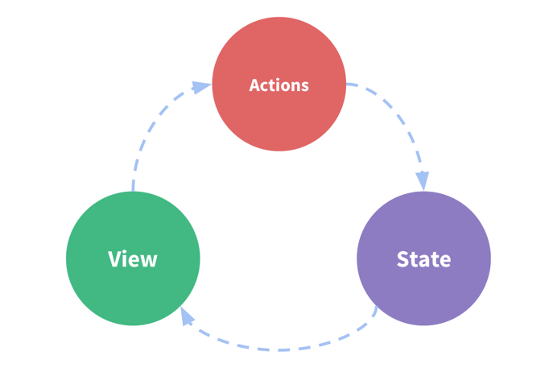
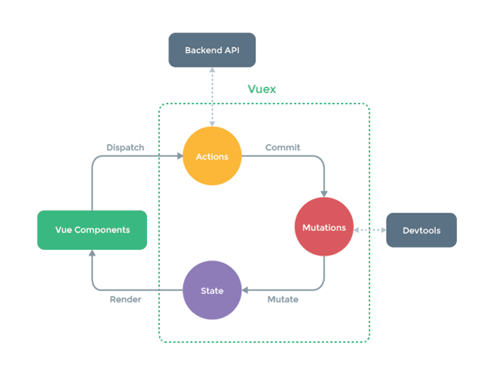

# Vue

## 1 插值操作

## 2 绑定属性

## 3 计算属性

## 4 事件监听

## 5 条件判断

## 6 循环遍历

## 7 阶段案例

## 8 v-model

Vue中使用v-model指令来实现表单元素和数据的双向绑定。


# Vue-Router

## 1 路由

- 路由是一个网络工程里面的术语。
- **路由**（**routing**）就是通过互联的网络把信息从源地址传输到目的地址的活动. --- 维基百科
- 路由器提供了两种机制: 路由和转送.
  - 路由是决定数据包从**来源**到**目的地**的路径.
  - 转送将**输入端**的数据转移到合适的**输出端**.
- 路由中有一个非常重要的概念叫路由表.
  - 路由表本质上就是一个**映射表**, 决定了数据包的指向.
  - 见下图为路由器的大致过程：


## 2 网络发展阶段

### 2.1 后端渲染-后端路由阶段


- 早期的网站开发整个HTML页面是由服务器来渲染的.
  - 服务器直接渲染好对应的HTML页面, 返回给客户端进行展示.
- 但是, 一个网站, 这么多页面服务器如何处理呢?
  - 一个页面有自己对应的网址, 也就是URL.
  - URL会发送到服务器, 服务器会通过正则对该URL进行匹配, 并且最后交给一个**Controller**进行处理.
  - Controller进行各种处理, 最终生成HTML或者数据, 返回给前端.
  - 这就完成了一个IO操作.

上面的这种操作, 就是后端路由.

- 当我们页面中需要请求不同的**路径**内容时, 交给服务器来进行处理, 服务器渲染好整个页面, 并且将页面返回给客户顿.
- 这种情况下渲染好的页面, 不需要单独加载任何的js和css, 可以直接交给浏览器展示, 这样也有利于SEO的优化.
- 后端路由的缺点:
  - 一种情况是整个页面的模块由后端人员来编写和维护的.
  - 另一种情况是前端开发人员如果要开发页面, 需要通过PHP和Java等语言来编写页面代码.
  - 而且通常情况下HTML代码和数据以及对应的逻辑会混在一起, 编写和维护都是非常糟糕的事情.


### 2.2 前端渲染-前后端分离阶段


- 随着Ajax的出现, 有了前后端分离的开发模式.
- 后端只提供API来返回数据, 前端通过Ajax获取数据, 并且可以通过JavaScript将数据渲染到页面中.
- 这样做最大的优点就是前后端责任的清晰, 后端专注于数据上, 前端专注于交互和可视化上.
- 并且当移动端(iOS/Android)出现后, 后端不需要进行任何处理, 依然使用之前的一套API即可.

前后端分离阶段就是我们所说的前端渲染：浏览器中显示的网页中的大部分内容，都是由前端写的js代码在浏览器中执行，最终渲染出来的网页。


### 2.3 单页面富应用阶段（SPA）

SPA全称是 simple page web application，单页面的意思就是整个网页只有一个HTML页面。

SPA仅在 Web 页面初始化时加载相应的 HTML、JavaScript 和 CSS。一旦页面加载完成，SPA 不会因为用户的操作而进行页面的重新加载或跳转；取而代之的是利用**路由机制**实现 HTML 内容的变换，UI 与用户的交互，避免页面的重新加载。其实SPA最主要的特点就是在前后端分离的基础上加了一层**前端路由**，也就是前端来维护一套路由规则.

- 在前后端分离阶段中，静态资源服务器中不同的 url 往往会对应着不同的一套 html+css+js，因此用户输入 url 后，浏览器就会去静态资源服务器请求对应的 html+css+js 资源。
- 在单页面富应用阶段，用户在输入 url 之后，浏览器会去静态资源服务器中下载全部的资源，这些资源往往只有一个index.html+css+js，**但是不会全部执行，而是通过前端路由管理**。
- 前端路由的核心就是**改变URL，但是页面不进行整体的刷新**，不同的URL对应着不同的内容（在Vue里面其实就是组件），这就形成了映射关系。

1. **SPA的设计意义：**

- 用户体验好、快，内容的改变不需要重新加载整个页面，避免了不必要的跳转和重复渲染；

- 基于上面一点，SPA 相对对服务器压力小；

- 前后端职责分离，架构清晰，前端进行交互逻辑，后端负责数据处理；

  

2. **缺点：**

- 初次加载耗时多：为实现单页 Web 应用功能及显示效果，**需要在加载页面的时候将 JavaScript、CSS 统一加载，部分页面按需加载；**
- SEO 难度较大：由于所有的内容都在一个页面中动态替换显示，所以在 SEO 上其有着天然的弱势。


3. **SPA的工作原理：**

- history API

  实现优雅，但是对浏览器有兼容性要求

  history接口是HTML5新增的, 它有五种模式改变URL而不刷新页面：

  - history.pushState()

    ```
    history.pushState({},'','/foo')
    ```

  - history.replaceState()

    ```
    history.replaceState({},'','/foo/bar')
    ```

  - history.go()

    ```
    history.go(-1)
    history.go(1)
    ```

  - history.back() 等价于 history.go(-1)

  - history.forward() 等价于 history.go(1)


- Hash

  Hash的兼容性最好，hash就是锚点（#），本质上是改变window.location的href属性

  我们可以直接赋值location.hash来改变href，但是页面不发生刷新：

  ```
  location.hash = '/foo'
  ```

  


## 3 Vue-Router

Vue-Router 是Vue.js官方的路由插件，它和vue.js是深度集成的，适合用于构建单页面应用。

学习网站：https://router.vuejs.org/zh/


# Vue Cli

## 1 CLI-脚手架

CLI是**Command-Line Interface**, 翻译为**命令行界面**, 但是俗称**脚手架**.

- Vue CLI是一个官方发布 vue.js 项目脚手架

- 使用 vue-cli 可以快速搭建 Vue 开发环境以及对应的 webpack 配置

## 2 Vue-CLI 安装

1. 安装 Node

   - Node环境要求8.9或者更高版本

   - NPM的全称是**Node Package Manager** ，是一个NodeJS包管理和分发工具，已经成为了非官方的发布Node模块（包）的标准。

2. 安装 Webpack

   - Vue.js官方脚手架工具就使用了**webpack模板**

   - 对所有的资源会压缩等优化操作

   - 它在开发过程中提供了一套完整的功能，能够使得我们开发过程中变得高效。

   - Webpack的全局安装

     ```
     npm install webpack -g
     ```

3. **安装Vue脚手架：**

   ```
   npm install -g @vue/cli
   ```

   - **Vue CLI2初始化项目：**

     ```
     vue init webpack my-project
     ```

   - **Vue CLI3初始化项目：**

     ```
     vue create my-project
     ```
     
   - 我遇到过的安装失败的解决方法：
   
     1. webpack全局安装版本不对（还记得上面我们全局安装了webpack@3.6.0 吗，那是适配 vue/cli2 的，不适配 vue/cli3），重新全局安装webpack：
   
        ```
        npm  install -g webpack
        ```
   
     2. 缓存未清：
   
        ```
        npm clean cache -force
        ```
   
        若clean失败，也可以前往指定路径手动清除：
   
        ```
        C:\Users\35729\AppData\Roaming\npm-cache
        ```
   
        

## 3 Vue-CLI 2

### 3.1 Runtime-Compiler 和 Runtime-Only

#### 3.1.1 render函数的使用

1. 方式一：render函数的基本使用：

   ```JavaScript
   new Vue({
     el: '#app',
     // render: createElement => createElement(App)
     render: createElement => {
       return createElement('div',{class: 'box'},'我爱李琳琦')
     }
   })
   ```

2. 方式二：render函数嵌套：

   ```JavaScript
   new Vue({
     el: '#app',
     // render: createElement => createElement(App)
     render: h => {
       return h('div', {class: 'box'}, ['我爱李琳琦', h('h2',['李琳琦大傻逼'])])
     }
   })
   ```

   

3. 方式三：传入一个组件对象

   ```javascript
   new Vue({
     el: '#app',
     // render: createElement => createElement(App)
     render: h => return h(App)
   })
   ```
   
   

#### 3.1.2 区别

先来看一张图：


- 如果需要在客户端编译模板（例如，向template选项传入一个字符串，或者需要将模板中的非DOM的HTML挂载到一个元素），就需要带有编译器的版本（runtime-compiler）

  在Runtime-Compiler中，**template -> 被解析为ast ->render函数处理 -> 虚拟dom -> UI**

- 在使用 vue-loader 或 vueify 时，*.vue 文件中的模板会在构建时（build time）预编译（pre-compile）为 JavaScript，最终生成的 bundle 中不再需要编译器（compiler），因此可以直接使用只含有运行时的构建版本（runtime-only）。

  Runtime-Only版本不仅更加轻量，而且性能更高，因为它省去了template -> ast -> render 的过程。

**简单来说：**

- 如果在之后的开发中，你依然使用template，就需要选择Runtime-Compiler

- 如果在之后的开发中，使用的是.vue文件夹开发，那么可以选择Runtime-only 


### 3.2 vue-cli 2 文件说明


## 4 Vue-CLI 3

### 4.1 vue-cli 3 与 2 的主要区别

1. vue-cli 3 是基于 webpack 4 打造，vue-cli 2 还是 webapck 3
2. vue-cli 3 的设计原则是“**0配置**”，移除了配置文件根目录下的，build和config等目录
3. vue-cli 3 提供了 vue ui 命令，提供了可视化配置，更加人性化
4. 移除了static文件夹，新增了public文件夹，并且index.html移动到public中

### 4.2 vue-cli 3 文件说明


vue-cli 3 隐藏了配置文件，若想找到他们，可以通过路径

```
node_modules/@vue/cli-service/lib/webpack/Service.js
```

找到它们。

### 4.3 vue ui

vue-cli 3 提供了可视化配置，更加人性化，可通过

```
vue ui
```

命令打开。


# Vuex

## 1 Vuex 是什么

- Vuex 是一个专为 Vue.js 应用程序开发的**状态管理模式**。

它采用**集中式存储**管理应用的所有组件的状态，并以相应的规则保证状态以一种可预测的方式发生变化。

Vuex 也集成到 Vue 的官方调试工具 [devtools](https://github.com/vuejs/vue-devtools)[ extension](https://github.com/vuejs/vue-devtools)，提供了诸如零配置的 time-travel 调试、状态快照导入导出等高级调试功能。

- **状态管理**到底是什么？

其实，可以简单的将其看成把需要多个组件共享的变量全部存储在一个对象里面。

然后，将这个对象放在顶层的Vue实例中，让其他组件可以使用。

那么，多个组件就可以共享这个对象中的所有变量属性。

- 为什么官方还要专门出一个插件Vuex呢？难道我们不能自己封装一个对象来管理吗？

当然可以，只是我们要先想想Vue.js带给我们最大的便利是什么呢？就是**响应式**。

如果自己封装实现一个对象能不能保证它里面所有的属性做到响应式呢？当然也可以，只是自己封装可能稍微麻烦一些。


## 2 单界面状态管理

先来看下面这张图：



其中：

- State：就是我们的状态。

- View：视图层，可以针对State的变化，显示不同的信息。

- Actions：这里的Actions主要是用户的各种操作：点击、输入等等，会导致状态的改变。

回想一下之前做过的一个计时器案例，不正是体现了这种状态管理模式吗？

- counter需要某种方式被记录下来，也就是我们的State。
- counter目前的值需要被显示在界面中，也就是我们的View部分。
- 界面发生某些操作时（我们这里是用户的点击，也可以是用户的input），需要去更新状态，也就是我们的Actions


## 3 多界面状态管理

Vue已经帮我们做好了单个界面的状态管理，但是如果是多个界面呢？

- 我们的需求是：多个试图都依赖同一个状态（一个状态改了，多个界面需要进行更新）

- 或是：不同界面的Actions都想修改同一个状态（Home.vue需要修改，Profile.vue也需要修改这个状态）

- 也就是说**对于某些状态(状态1/状态2/状态3)来说只属于我们某一个试图，但是也有一些状态(状态a/状态b/状态c)属于多个试图共同想要维护的**

Vuex背后的基本思想就是将共享的状态抽取出来，统一进行管理。之后，每个视图，按照Vuex**规定好的**规定，进行访问和修改等操作。


## 4 Vuex状态管理

官方给出了Vuex状态管理图例：




