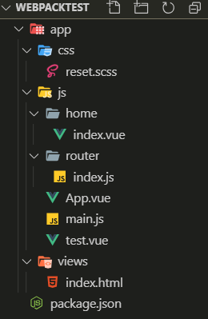

# Webpack 初识

## 一、什么是Webpack

在 Webpack 中文网：www.webpackjs.com 中，对 Webpack 的官方解释如下：

- At its core, **webpack** is a *static module bundler* for modern JavaScript applications. 
- 从本质上来讲，webpack是一个现代的JavaScript应用的静态**模块打包**工具。

我们从两个点来解释上面这句话：**模块** 和 **打包**。

### 1.1 Webpack 中的模块化

- 在 JavaScript 的 ES6 学习中，我们已经了解了前端模块化的思想，包括为什么前端需要模块化，以及常见的一些模块化的方法。
- 目前使用前端模块化的一些方案：AMD、CMD、CommonJS、ES6
- 在ES6之前，我们要想进行模块化开发，就必须借助于其他的工具，让我们可以进行模块化开发。
- 在通过模块化开发完成了项目后，还需要处理模块间的各种依赖，并且将其进行整合打包。
- 而webpack其中一个核心就是让我们可能进行模块化开发，并且会帮助我们处理模块间的依赖关系。
- 而且不仅仅是JavaScript文件，我们的CSS、图片、json文件等等在webpack中都可以被当做模块来使用。

### 1.2 Webpack 中的打包

- 打包就是将webpack中的各种资源模块进行打包合并成一个或多个包(Bundle)。
- 并且在打包的过程中，还可以对资源进行处理，比如压缩图片，将scss转成css，将ES6语法转成ES5语法，将TypeScript转成JavaScript等等操作。

### 1.3 Webpack 和 grunt/gulp 的区别

- grunt/gulp的核心是Task

  - 我们可以配置一系列的task，并且定义task要处理的事务（例如ES6、ts转化，图片压缩，scss转成css）
  - 之后让grunt/gulp来依次执行这些task，而且让整个流程自动化。
  - 所以grunt/gulp也被称为**前端自动化任务管理工具**。

- 我们来看一个gulp的task

  - 下面的task就是将src下面的所有js文件转成ES5的语法。

  - 并且最终输出到dist文件夹中。

    ```javascript
    const gulp = require('gulp');
    const babel = require('gulp-babel');
    
    gulp.task('js', () =>
    	gulp.src('src/*.js')
        	.pipe(babel({
        		presets: ['es2015']
    		}))
            .pipe(gulp.dest('dist'))
        
    )
    ```

    

- 什么时候用 grunt/gulp 呢？

  - 如果你的工程模块依赖非常简单，甚至是没有用到模块化的概念。
  - 只需要进行简单的合并、压缩，就使用grunt/gulp即可。
  - 但是如果整个项目使用了模块化管理，而且相互依赖非常强，我们就可以使用更加强大的webpack了。

- 所以，grunt/gul 和 webpack有什么不同呢？

  - grunt/gulp 更加强调的是**前端流程的自动化**，模块化不是它的核心。
  - webpack  更加强调**模块化开发管理**，而文件压缩合并、预处理等功能，是他附带的功能。


## 二、Webpack 安装

安装webpack首先需要安装Node.js，Node.js自带了软件包管理工具npm

- 查看node版本：

  ```
  node-v
  ```

- 全局安装webpack：（这里指定版本3.6.0，因为vue cli2依赖该版本）

  ```
  npm install webpack@3.6.0 -g
  ```

  其中-g表示全局安装。

- 局部安装：

  ```
  cd 对应目录
  npm install webpack@3.6.0 --save-dev
  ```

  其中 **--save-dev 表示开发依赖**，项目打包后不需要继续使用。（--save 表示运行依赖）

- 为什么全局安装了之后还需要局部安装呢？

  那是因为在真正的项目开发中，不同的项目可能依赖的webpack版本不同。

  在终端直接执行webpack命令，使用的全局安装的webpack。

  当在 package.json 中定义了 scripts 时，其中包含了 webpack 命令，那么使用的是局部 webpack，如：

  ```
  npm run build
  ```


## 三、准备工作

终端进入创建的 webpack 项目文件夹：

```
cd webpack项目目录
```

我们创建如下文件夹和文件：

- dist文件夹：用于存放打包后的文件
- src文件夹：用于存放我们写的源文件
  - css文件夹
  - less文件夹
  - js文件夹
    - math.js：定义了一些数学工具函数，可以在其他地方引用，并且使用
  - img文件夹
  - Vue文件夹
  - main.js：项目的入口文件。
- index.html
- package.json：通过npm init生成的，npm包管理的文件


## 四、Webpack 打包

我们在 math.js 中添加如下代码：

```javascript
function sum(num1, num2) {
  return num1 + num2;
}

function mul(num1, num2) {
  return num1 * num2;
}

module.exports = {
  sum,
  mul
}
```

在 main.js 中添加如下代码：

```javascript
const math = require('./js/math')

console.log(math.sum(20,30));
console.log(math.mul(20,2));
```

- 上面的js文件中使用了 CommonJS 模块化的方式进行开发，他们可以直接使用吗？不可以。

  - 因为如果直接在index.html引入这两个js文件，浏览器并不识别其中的模块化代码。
  - 另外，在真实项目中当有许多这样的js文件时，我们一个个引用非常麻烦，并且后期非常不方便对它们进行管理。

- webpack 指令进行打包：

  ```
  webpack src/main.js dist/bundle.js
  ```

上面代码分别指定了入口文件和出口文件，打包成功后我们即可在dist文件夹下看到打包后生成的bundle.js文件。

bundle.js文件，是webpack处理了项目直接文件依赖后生成的一个js文件，我们只需要将这个js文件在index.html中引入即可：

```html
<script src="./dist/bundle.js"></script>
```

此时index.html可以正常运行。


## 五、Webpack 配置

### 5.1 入口出口配置

- 我们考虑一下，如果每次使用webpack的命令都需要写上入口和出口作为参数，就非常麻烦，有没有一种方法可以将这两个参数写到配置中，在运行时，直接读取呢？

- 当然可以，就是创建一个webpack.config.js文件：

  ```javascript
  //动态获取路径
  const path = require('path')
  
  module.exports = {
    //入口：可以是字符串/数组/对象，这里入口只有一个，所以写一个字符串即可
    entry: './src/main.js',
    //出口：通常是一个对象，里面至少包含两个重要属性，一个是path，通常是绝对路径，一个是filename
    output: {
      //resolve 代表拼接，将当前路径和dist拼接
      path: path.resolve(__dirname, 'dist'),
      filename: 'bundle.js'
    }
  
  }
  ```

  配置完后，我们只需要在终端输入“webpack”指令即可完成上面的打包。


### 5.2 定义自己的执行脚本

通过指令

```
npm --save-dev webpack@版本号
```

局部安装了webpack后，我们通过 package.json 中的 scripts 定义自己的执行脚本：

```json
{
  "name": "meetwebpack",
  "version": "1.0.0",
  "description": "",
  "main": "index.js",
  "scripts": {
    "test": "echo \"Error: no test specified\" && exit 1",
     //自定义build
    "build": "webpack"
  },
  "author": "",
  "license": "ISC"
}

```

package.json中的scripts的脚本在执行时，会按照一定的顺序寻找命令对应的位置：

1. 首先，会寻找本地的node_modules/.bin路径中对应的命令。
2. 如果没有找到，会去全局的环境变量中寻找。

此时，我们只要执行：

```
npm run build
```

就可以执行webpack的打包任务。


## 六、Loaders

### 6.1 loader 初识

- loader是webpack中一个非常核心的概念。
- loader用来做什么呢？
  - 在我们之前的实例中，我们主要是用webpack来处理我们写的js代码，并且webpack会自动处理js之间相关的依赖。
  - 但是，在开发中我们不仅仅有基本的js代码处理，我们也需要加载css、图片，也包括一些高级的将ES6转成ES5代码，将TypeScript转成ES5代码，将scss、less转成css，将.jsx、.vue文件转成js文件等等。
  - 对于webpack本身的能力来说，对于这些转化是不支持的。
  - 那怎么办呢？给webpack扩展对应的loader就可以啦。
- **loader使用过程：**
  - **步骤一：通过npm安装需要使用的loader**
  - **步骤二：在webpack.config.js中的modules关键字下进行配置**
- 大部分loader我们都可以在webpack的官网中找到，并且学习对应的用法。


### 6.2 css-loader 和 style-loader 

我们在项目的css文件夹中创建一个normal.css文件，添加如下代码：

```css
body{
	background-color: red;
}
```

在main.js入口文件中引用：

```javascript
require('./css/normal.css')
```

此时执行build时报错：

```
You may need an appropriate loader to handle this file type.
```

这个错误告诉我们：加载normal.css文件必须有对应的loader。

实际上，我们需要安装和配置 **css-loader** 来加载.css 类型的文件，安装和配置 **style-loader** 来将具体样式嵌入到文件中。

安装 css-loader：

```
npm install --save-dev css-loader
```

安装 style-loader：

```
npm install --save-dev style-loader
```

在webpack.config.js 中进行配置：

```json
module.exports = {
  module: {
    rules: [
      {
        test: /\.css$/,
        use: [ 'style-loader', 'css-loader' ]
      }
    ]
  }
}
```

其中test是正则表达式。

这里需要注意，use 的数组中两个元素顺序不能改变，实际上 css-loader 是先于 style-loader 使用的，但webpack在读取使用loader的过程中，是按照**从右向左**的顺序读取的。

此时再执行build指令：

```
npm run build
```

就不会报错了，并且打开 index.html 可以看到对应的样式。


### 6.3 less-loader

在less文件夹中添加normal.less文件，添加代码：

```less
@fontColor: #ff6700;
@fontSize: 30px;

body{
  color: @fontColor;
  font-size: @fontSize;
}
```

在main.js中引入：

```javascript
require('./less/normal.less')
```

在终端中安装less-loader：

```
npm install --save-dev less-loader less
```

注意：我们这里还安装了less，因为webpack会使用less对less文件进行编译.

修改 webpack.config.js 文件，添加rules 项：

```javascript
{
    test: /\.less$/,
    use: [{
    	loader: "style-loader" // creates style nodes from JS strings
    }, {
    	loader: "css-loader" // translates CSS into CommonJS
    }, {
    	loader: "less-loader" // compiles Less to CSS
    }]
}
```


### 6.4 url-loader 和 file-loader 

在img文件夹中添加两张图片，一张大于25kb的 'hai.jpg' ，一张小于25kb的 'zei.jpg' 。

修改normal.css文件代码，添加背景图：

```css
background: url('../img/zei.jpg');
/* background: url('../img/hai.jpg'); */
```

安装 url-loader：

```
npm install --save-dev url-loader
```

配置 webpack.config.js 文件：

```javascript
{
  test: /\.(png|jpg|gif|jpeg)$/,
  use: [
    {
      loader: 'url-loader',
      options: {
        limit: 25000
      }
    }
  ]
}
```

此时执行build不会报错，index.html可以正常运行。

但如果我们将背景图切换为大于25kb的图片：

```css
/* background: url('../img/zei.jpg'); */
background: url('../img/hai.jpg');
```

此时再执行build，发现报错：

```
Module build failed: Error: Cannot find module 'file-loader'
```

这就告诉我们需要安装和配置 file-loader。

实际上，我们可以在 url-loader 的配置中通过options 属性的 limit 设置文件大小上界：

- 在文件大小（单位 byte）低于指定的限制 limit 时，可以返回一个 **DataURL**，对图片进行base64编码，此时不需要 file-loader；
- 在文件大小高于 limit 时，就需要使用 file-loader 了。

安装 file-loader ：

```
npm install --save-dev file-loader
```

再次打包，鼓舞人心的是并没有报错，但现在高兴似乎太早，因为当我打开 index.html 的时候，发现程序并没有显示我想要的背景图片，更可怕的是console日志中并没有报错。

仔细观察后，我发现在项目的 dist 文件夹下多出了一个图片文件，这个图片文件有一个非常长的名字，它是webpack自动生成的一个32位hash值，目的是防止名字重复。打开chrome的调试工具，我发现url引用的正是这张图片，但是图片使用的路径不正确。默认情况下，webpack会将生成的路径直接返回给使用者，但是，我们整个程序是打包在dist文件夹下的，所以这里我们需要在路径下再添加一个dist/，此时页面即可显示背景图片。

配置webpack.config.js文件的output属性，添加一个publicPath：

```javascript
output: {
  path: path.resolve(__dirname, 'dist'),
  filename: 'bundle.js',
  publicPath: 'dist/'
},
```

这样打包时url路径就会自动添加 “dist/”。

真实开发中，我们可能对打包的图片名字有一定的要求，比如，将所有的图片放在一个文件夹中，跟上图片原来的名称，同时也要防止重复。因此，我们可以对url-loader配置的options添加name配置：

```javascript
options: {
  limit: 25000,
  name: 'img/[name].[hash:8].[ext]'
}
```

其中：

- img：文件要打包到的文件夹
- name：获取图片原来的名字，放在该位置
- hash:8：为了防止图片名称冲突，依然使用hash，但是我们只保留8位
- ext：使用图片原来的扩展名


### 6.5 babel-loader

如果仔细阅读webpack打包的js文件，发现写的ES6语法并没有转成ES5，那么就意味着可能一些对ES6还不支持的浏览器没有办法很好的运行我们的代码。

如果希望将ES6的语法转成ES5，那么就需要使用babel。

安装babel-loader：

```
npm install --save-dev babel-loader@7 babel-core babel-preset-es2015
```

配置 webpack.config.js ：

```javascript
{
  test: /\.m?js$/,
  exclude: /(node_modules|bower_components)/,
  use: {
    loader: 'babel-loader',
    options: {
      presets: ['es2015']
    }
  }
}
```

 重新打包，查看bundle.js文件，发现其中的内容变成了ES5的语法。


## 七、Webpack 配置 Vue

### 7.1 webpack 中的 vue 安装和配置

后续项目中，我们会使用 Vuejs 进行开发，而且会以 .vue 文件来组织vue的组件。

所以，下面我们来学习一下如何在我们的 webpack 环境中集成 Vuejs

现在，我们希望在项目中使用 Vuejs，那么必然需要对其有依赖，所以需要先安装 vue：

```
npm install --save vue
```

注：因为我们后续是在实际项目中也会使用vue的，所以并不是开发时依赖，而是运行时依赖。

安装成功后，在main,js导入vue：

```javascript
import Vue from 'vue'
```

接下来就是行云流水般的写入Vue代码：

```javascript
new Vue({
  el: '#app',
  data: {
    message: '我是一个小天才'
  }
})
```

在index.html 中添加：

```html
<div id="app">
  {{message}}
</div>
```

重新打包发现没有报错，非常开心地运行 index.html，

然而，事与愿违，我们发现console日志发来了报错信息：

```
You are using the runtime-only build of Vue where the template compiler is not available. Either pre-compile the templates into render functions, or use the compiler-included build.
```

这个错误说的是我们使用的是 runtime-only 版本的Vue，具体原因在于runtime-only 和 runtime-compiler 中我们已经提到了，这里给出解决方案：

修改webpack的配置，添加如下内容：

```javascript
resolve: {
  alias: {
    'vue$': 'vue/dist/vue.esm.js'
  }
}
```

再怀着忐忑的心重新打包并打开index.html，发现我们已经成功了。


### 7.2 定义template属性

革命尚未成功，同志们仍需努力。

正常运行之后，我们来考虑另外一个问题：

- 如果我们希望将data中的数据显示在界面中，就必须是修改index.html
- 如果我们后面自定义了组件，也必须修改index.html来使用组件
- 但是html模板在之后的开发中，我并不希望手动的来频繁修改，是否可以做到呢？

答案是可以的，在前面的Vue实例中，我们定义了**el属性**，用于和index.html中的**#app**进行绑定，让Vue实例之后可以管理它其中的内容。这里，我们可以将div元素中的{{message}}内容删掉，只保留一个基本的id为div的元素：

```html
<div id="app">
</div>
```

但是如果我依然希望在其中显示{{message}}的内容，应该怎么处理呢？

我们可以再定义一个template属性，代码如下：

```javascript
new Vue({
  el: '#app',
  template: `
  <div id="app">
    <h2>{{message}}</h2>
  </div>
  `,
  data: {
    message: '我是一个小天才'
  }
})
```

重新打包，运行程序，显示一样的结果和HTML代码结构。

这就很神奇，原理是什么呢？实际上：

- 在我们之前的学习中，我们知道el用于指定Vue要管理的DOM，可以帮助解析其中的指令、事件监听等等。
- 而如果Vue实例中同时指定了template，那么template模板的内容会**替换掉挂载的对应el的模板**。
- 这样做之后的好处：我们就不需要在以后的开发中再次操作index.html，只需要在template中写入对应的标签即可


### 7.3 组件化开发

Vue开发过程中，我们都会采用**组件化开发**的思想。

我们可以将代码写成这样：

```javascript
import Vue from 'vue'

const App = {
  template: `
  <div>
    <h2>{{message}}</h2>
  </div>
  `,
  data() {
    return {
      message: '我真是个天才'
    }
  }
}

new Vue({
  el: '#app',
  template: `<App/>`,
  components: {
    App
  }
})
```

但是一个组件以一个js对象的形式进行组织和使用的时候是非常不方便的：

- 一方面编写template模块非常的麻烦，不像我们在html中写得那么行云流水
- 另外一方面如果有样式的话，我们写在哪里比较合适呢？

综上所述，如果我们想要更加舒服、更加有效率地进行开发，那就需要以一种全新的方式来组织一个vue的组件：

在项目的 Vue 文件夹中添加 App.vue 文件，我们可以在里面定义三大模块：

1. template 模板
2. script 脚本
3. style

代码如下：

```vue
<template>
  <div>
    <h2 class="title">{{message}}</h2>
    <button @click="btnClick">按钮</button>
  </div>
</template>

<script>
export default {
  name: 'App',
  data() {
    return {
      message: '我真是一个小天才'
    }
  },
  methods: {
    btnClick() {
      console.log('btnCilck');
    }
  }
}
</script>

<style scoped>
  .title{
    color: green;
  }
</style>
```

注意：

- script 块这里使用**ES6模块化**默认导出App，这样我们在入口文件 main.js 可以直接导入：

  ```javascript
  import App from './Vue/App.vue'
  ```

- style 标签中需要添加 scoped 属性。

显而易见，现在重新打包肯定会报错，毕竟我们还没有安装可以识别 .vue 文件的 loder。那么又是熟悉的两步走：

1. 安装 vue-loader 和 vue-template-compiler：

```
npm install vue-loader vue-template-compiler --save-dev
```

2. 配置 webpack.config.js：

```javascript
{
  test: /\.vue$/,
  use: ['vue-loader']
}
```

然后就是激动人心的

```
npm run build
```

但是，终端依旧不给面子的报出了错误：

```
Module build failed: Error: Cannot find module 'webpack/lib/RuleSet'
```

那是因为vue-loader从14开始的版本，如果想要使用都要额外安装一个插件，如果不想安装插件，可以用版本较低的 vue-loader，即在package.json 中修改：

```json
"vue-loader": "^13.0.0",
```

一旦版本手动改过，就要在终端重新执行：

```
npm install
```

然后再重新打包，没有报错，index.html 正常运行。


## 八、plugin

### 8.1 plugin是什么？

- plugin是插件的意思，通常是用于对某个现有的架构进行扩展。
- webpack中的插件，就是对webpack现有功能的各种扩展，比如打包优化，文件压缩等等。

### 8.2 loader和plugin区别

- loader主要用于转换某些类型的模块，它是一个转换器。
- plugin是插件，它是对webpack本身的扩展，是一个扩展器。

### 8.3 plugin的使用过程：

- 步骤一：通过npm安装需要使用的plugins(某些webpack已经内置的插件不需要安装)
- 步骤二：在webpack.config.js中的plugins中配置插件。

### 8.4 webpack内置plugin——BannerPlugin

我们先来使用一个最简单的插件，为打包的文件添加版权声明

该插件名字叫BannerPlugin，属于webpack自带的插件，因此无需安装，只需要在 webpack.config.js 文件中导入：

```javascript
const webpack = require('webpack')
```

再在module.exports 中配置plugins：

```javascript
  plugins: [
    new webpack.BannerPlugin('最终版权归xxx所有')
  ],
```

重新打包，可以在bundle.js的开头看见注释：

```javascript
/*! 最终版权归xxx所有 */
```


### 8.5 HtmlWebpackPlugin 

目前，我们的index.html文件是存放在项目的根目录下的。我们知道，在真实发布项目时，发布的是dist文件夹中的内容，但是dist文件夹中如果没有index.html文件，那么打包的js等文件也就没有意义了。

所以，我们需要将index.html文件打包到dist文件夹中，这个时候就可以使用HtmlWebpackPlugin插件。

- HtmlWebpackPlugin插件可以为我们做这些事情：

1. 自动生成一个index.html文件(可以指定模板来生成）

2. 将打包的js文件，自动通过script标签插入到body中

   因此我们可以将我们自己创建的 index.html 中的script块删除

- 安装 HtmlWebpackPlugin：

  ```
  npm install html-webpack-plugin --save-dev
  ```

- 导入：

  ```javascript
  const HtmlWebpackPlugin = require('html-webpack-plugin')
  ```

- 配置：

  ```javascript
    plugins: [
      new HtmlWebpackPlugin({
        template: 'index.html'
      })
    ],
  ```

  这里的template表示根据什么模板来生成index.html。

注意，我们需要删除之前在output中添加的 publicPath 属性，否则插入的script标签中的src可能会有问题：

```javascript
  output: {
    //resolve 代表拼接，将当前路径和dist拼接
    path: path.resolve(__dirname, 'dist'),
    filename: 'bundle.js',
    // publicPath: 'dist/'
  },
```

### 8.6 js压缩plugin——UglifyjsWebpackPlugin

在项目发布之前，我们必然需要对js等文件进行压缩处理

这里，我们就对打包的bundle.js文件进行压缩：

1. 我们安装一个第三方的插件uglifyjs-webpack-plugin，并且版本号指定1.1.1，和CLI2保持一致：

```
npm install --save-dev uglifyjs-webpack-plugin@1.1.1
```

2. 导入：

   ```javascript
   const UglifyjsWebpackPlugin = require('uglifyjs-webpack-plugin')
   ```

3. 配置：

   ```javascript
    new UglifyjsWebpackPlugin()
   ```

重新打包，此时 bundle.js 已经被压缩了。


## 九、搭建本地服务器

nwebpack提供了一个可选的本地开发服务器，这个本地服务器基于node.js搭建，内部使用express框架，可以实现我们想要的让浏览器自动刷新显示我们修改后的结果。

不过它是一个单独的模块，在webpack中使用之前需要先安装它：

```nodejs
npm install --save-dev webpack-dev-server@2.9.3
```

- devserver也是作为webpack中的一个选项，选项本身可以设置如下属性：
  - contentBase：为哪一个文件夹提供本地服务，默认是根文件夹，我们这里要填写./dist
  - port：端口号
  - inline：页面实时刷新
  - historyApiFallback：在SPA页面中，依赖HTML5的history模式

在webpack.config.js 中配置：

```javascript
  devserver: {
    contentBase: './dist',
    inline: true
  }
```

在 package.json 中配置dev指令：

```json
  "scripts": {
    "test": "echo \"Error: no test specified\" && exit 1",
    "build": "webpack",
    "dev": "webpack-dev-server"
  },
```

此时，在终端中输入：

```
npm run dev
```

运行成功后，可以在终端中点击http://localhost:8080/打开我们在dist文件夹中的index.html文件。

如果想让其在运行完成后自动打开，只需要在package.json 中的dev配置中加入--open参数即可：

```json
"dev": "webpack-dev-server --open"
```


## 十、配置文件的分离

在前面我们进行webpack.config.js文件配置的时候：

- 一些配置是开发时依赖的，比如搭建本地服务器 webpack-dev-server 的配置
- 有一些配置是发布时依赖的，比如压缩js的 uglifyjs-webpack-plugin 的配置
- 而剩下的配置则是公共的

那么我们就可以对配置文件进行公共、开发、发布三部分的分离：

1. 首先，在项目根目录下创建build文件夹，在build中分别创建 base.config.js 、dev.config.js 、prod.config.js 文件，分别表示公共、开发、发布的配置文件

2. 将开发依赖的配置写入dev.config.js：

   ```javascript
   module.exports = {
     devServer: {
       contentBase: './dist',
       inline: true
     }
   }
   ```

3. 将发布以来的配置写入prod.config.js：

   ```javascript
   const UglifyjsWebpackPlugin = require('uglifyjs-webpack-plugin')
   
   module.exports = {
     plugins: [
       new UglifyjsWebpackPlugin()
     ]
   }
   ```

4. 将webpack.config.js中剩余的配置写入base.config.js（即删去上面两种配置）

5. 删去根目录下的webpack.config.js

6. 安装**webpack-merge**：

   ```
   npm --save-dev webpack-merge
   ```

   webpack-merge 用于对配置文件进行合并，我们需要将公共的配置合并到开发的和发布的：

   - 开发的dev.config.js:

     ```javascript
     const webpackMerge = require('webpack-merge')
     const baseConfig = require('./base.config')
     
     module.exports = webpackMerge(baseConfig,{
       devServer: {
         contentBase: './dist',
         inline: true
       }
     })
     ```

     

   - 发布的prod.config.js：

     ```javascript
     const UglifyjsWebpackPlugin = require('uglifyjs-webpack-plugin')
     const baseConfig = require('./base.config')
     const webpackMerge = require('webpack-merge')
     
     module.exports = webpackMerge(baseConfig, {
       plugins: [
         new UglifyjsWebpackPlugin()
       ]
     })
     ```

     

显而易见，此时不论执行

```
npm run build
```

还是执行

```
npm run dev
```

都会报错：

```
No configuration file found
```

毕竟我们已经残忍删去了webpack.config.js，现在我们需要在package.json中指定build和dev指令的配置文件路径：

```json
"build": "webpack --config ./build/prod.config.js",
"dev": "webpack-dev-server --open --config ./build/dev.config.js"
```

此时我们就可以欣慰的发现，build指令和dev指令都可以正常运行了。

然而，革命尚未成功，我们突然想起一个问题，之前我们为了得到打包出口的路径，是将配置文件的路径和dist进行拼接，现在我们配置文件已经被我们放在build文件夹中了，那么如果我们不修改这个拼接，必然会将打包的文件打包到build文件夹中去。我们展开build文件夹，事情果然不出我们所料。于是我们对出口path进行修改：

```javascript
path: path.resolve(__dirname, '../dist'),
```


# 从零构建项目（Webpack）


1. 创建项目文件夹webpacktest

2. 在项目目录下执行：

   ```
   npm init
   ```

   得到一个package.json

   然后当然要先安装webpack：

   ```
   npm install webpack -D
   ```

   

3. 创建业务文件：

   

4. 根目录下创建配置文件：webpack.config.js

   1. 基础配置：

      entry/module/plugins/output

      ```js
      const path = require('path');
      
      module.exports = {
        entry: {
          app: './app/main.js'
        },
        module: {
          loader: [{
            test: /\.html$/,
            loader: 'html-loader'
          }, {
            test: /\.vue$/,
            loader: 'vue-loader'
          }, {
            test: /\.scss$/,
            loader: 'style-loader!css-loader!sass-loader'
          }]
        },
        plugins: [],
        output: {
          filename: '[name].min.js',
          //这句话的意思是在当前目录下创建dist目录，然后将filename文件放到dist目录下
          path: path.resolve(__dirname, 'dist')
        }
      }
      ```

      当然了，上面加入的这些loader都要安装：

      ```
          npm install vue-loader style-loader css-loader sass-loader -D
      ```

      

   2. 进阶配置：

      resolve/devtools/dev-server

      - dev-server的使用：可以去官方文档查看它的使用方式，将下面这段代码放在与entry同级：

        ```js
        devServer: {
        //静态资源文件放在哪里
          contentBase: path.join(__dirname, "dist"),
          compress: true,
          port: 9000
        }
        ```

      - 安装 webpack-dev-server：

        ```
        npm install --save-dev webpack-dev-server
        ```

5. 填写文件：

   - reset.scss:

     ```scss
     h1 {
       color: #f00;
     
       .title {
         color: yellow;
       }
     }
     ```

     

   - home/index.vue:

     ```vue
     <template>
       <div class="home">
         <h1>李琳琦<span class="title">我爱你</span></h1>
       </div>
     </template>
     
     <script>
     export default {
     }
     </script>
     
     <style lang="scss">
     .home {
       color: blue;
       .title {
         color: green;
       }
     }
     </style>
     ```

     

   - router/index.js:

     ```js
     import Vue from 'vue'
     import Router from 'vue-router'
     import Home from '../home/index.vue'
     
     Vue.use(Router)
     
     export default new Router({
       routes:[{
         path:'/home',
         name:'home',
         component:Home
       }]
     })
     ```

     当然，不要忘记安装vue和vue-router：

     ```
     npm install vue vue-router
     ```

     

   - App.vue:

     ```vue
     <template>
       <div id="app">
         <router-view></router-view>
       </div>
     </template>
     
     <script>
     export default {
       name: 'app'
     }
     </script>
     
     <style>
     </style>
     ```

     

   - main.js:

     ```js
     import Vue from 'vue'
     import App from './App.vue'
     import router from './router/index.js'
     
     //声明当前不是生产环境
     Vue.config.productionTip = false
     
     new Vue({
       el: '#app',
       router,
       components: {
         App
       },
       template: '<App></App>'
     })
     ```

   - 添加插件：

     ```js
     const HtmlWebpackPlugin = require('html-webpack-plugin');
     const CleanWebpackPlugin = require('clean-webpack-plugin');
     ```

     ```js
       plugins: [
         new CleanWebpackPlugin(['dist']),
         new HtmlWebpackPlugin({
           title: 'Development'
         })
       ],
     ```

     

   - 

